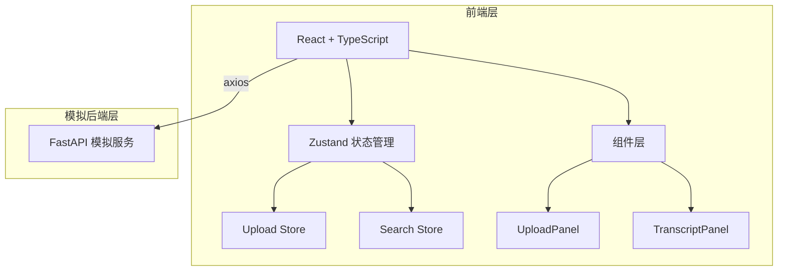
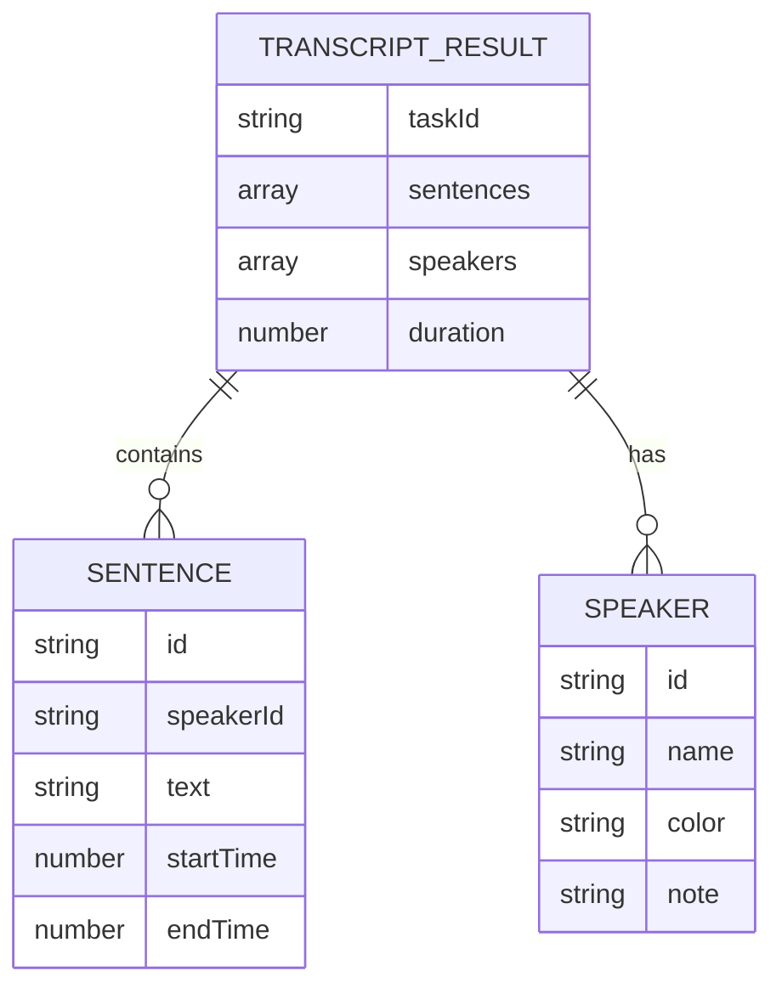

## 1. 架构设计



## 2. 技术说明

- **前端**：React@18 + TypeScript + Vite
- **状态管理**：zustand
- **HTTP 客户端**：axios
- **样式方案**：CSS Modules / 内联样式（按用户需求，不使用 Tailwind）
- **后端**：FastAPI（模拟）
- **数据存储**：localStorage（本地持久化）

## 3. 路由定义

| 路由 | 用途 |
|------|------|
| / | 主页面，包含上传和转写展示 |

## 4. API 定义（模拟后端）

### 4.1 类型定义

```typescript
// 说话人信息
interface Speaker {
  id: string;
  name: string;
  color: string;
  note?: string;
}

// 转写句子
interface TranscriptSentence {
  id: string;
  speakerId: string;
  text: string;
  startTime: number; // 秒
  endTime: number;
}

// 转写结果
interface TranscriptResult {
  sentences: TranscriptSentence[];
  speakers: Speaker[];
  duration: number;
}
```

### 4.2 接口定义

| 接口 | 方法 | 描述 |
|------|------|------|
| /api/upload | POST | 上传音频文件，返回任务ID |
| /api/transcribe/{taskId} | GET | 获取转写进度和结果 |

## 5. 数据模型

### 5.1 数据模型定义



### 5.2 本地存储

- `transcript_data`：转写结果和说话人信息
- `speaker_remarks`：说话人备注和重命名映射

## 6. 文件结构

```
src/
├── main.tsx              # 应用入口
├── App.tsx               # 根组件
├── stores/
│   ├── uploadStore.ts    # 上传和转写状态
│   └── searchStore.ts    # 搜索和高亮状态
├── components/
│   ├── UploadPanel.tsx   # 上传面板组件
│   └── TranscriptPanel.tsx # 转写文本面板组件
├── types/
│   └── index.ts          # 类型定义
└── utils/
    └── mockApi.ts        # 模拟API和数据
```
