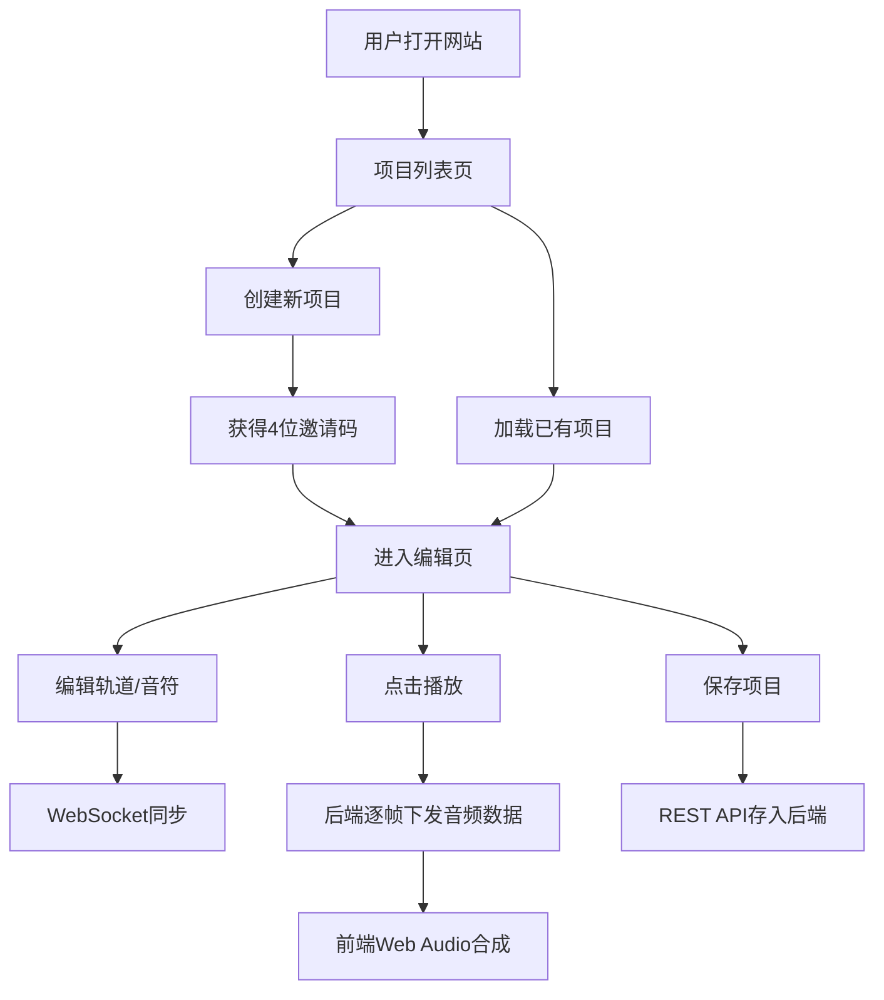

## 1. 产品概述
在线协同音乐Demo创作平台，支持音乐制作人和爱好者实时协作创作8小节循环音乐片段。
- 核心功能：多用户实时协作编辑轨道与音符、Web Audio API实时音频合成、项目保存与分享
- 目标用户：音乐制作人、音乐爱好者、音乐教育工作者
- 产品价值：降低多人音乐协作门槛，提供即时听觉反馈的创作体验

## 2. 核心特性

### 2.1 用户角色
本系统为无需注册的开放式协作平台，所有用户权限相同。

### 2.2 功能模块
1. **项目编辑页**：钢琴卷帘网格、轨道控制、播放控制、邀请码分享
2. **项目列表页**：已保存项目卡片展示、项目加载、创建新项目

### 2.3 页面详情
| 页面名称 | 模块名称 | 功能描述 |
|-----------|-------------|---------------------|
| 项目编辑页 | 项目控制面板 | 项目信息展示、播放/停止按钮、保存按钮、邀请码显示与复制、加入房间输入框 |
| 项目编辑页 | 钢琴卷帘网格 | 8×16 Canvas网格、音符点击添加/删除、当前播放位置红色指示线、音符淡蓝色高亮与缩放动画 |
| 项目编辑页 | 轨道列表与控制 | 轨道名称自定义、音量滑块(0-100)、声像旋钮(L-R)、效果器开关（金色边框+晃动动画）、轨道增删、波形类型选择 |
| 项目列表页 | 项目卡片网格 | 卡片展示项目名/创建人/创建时间、加载按钮、创建新项目入口 |

## 3. 核心流程

### 3.1 创建与加入项目流程
用户创建项目 → 后端生成4位邀请码 → 分享邀请码 → 其他用户输入邀请码 → 加入同一房间 → 实时协作

### 3.2 播放流程
点击播放 → 后端按20FPS广播当前活跃音符 → 前端Web Audio API合成音频 → 红色指示线同步移动 → 所有用户同步收听

### 3.3 协作同步流程
用户操作（加音符/改参数）→ 本地更新状态 → WebSocket发送消息 → 后端广播至房间 → 其他用户更新UI → Toast提示

## 4. 用户界面设计

### 4.1 设计风格
- 主色调：#1a1a2e（深蓝黑）、#16213e（深靛蓝）
- 强调色：#0f3460（暗蓝）、#e94560（珊瑚红）
- 高亮色：#90caf9（淡蓝音符）、#ffd700（金色效果器）
- 按钮风格：圆角矩形，悬停时阴影+上移2px（0.2s ease）
- 字体：JetBrains Mono等宽字体（代码感）+ 现代无衬线字体
- 布局：三栏式（左侧控制面板 | 中央钢琴卷帘 | 右侧轨道列表）
- 背景：深色径向渐变，营造沉浸感

### 4.2 页面设计概述
| 页面名称 | 模块名称 | UI元素 |
|-----------|-------------|-------------|
| 项目编辑页 | 项目控制面板 | 深色卡片、霓虹发光按钮、玻璃拟态输入框、邀请码复制带成功反馈 |
| 项目编辑页 | 钢琴卷帘网格 | Canvas绘制浅灰网格线、圆角音符方块带内阴影、红色半透明指示线带发光效果 |
| 项目编辑页 | 轨道列表与控制 | 横条轨道项、悬停#0f3460高亮、音量滑块自定义轨道、声像SVG旋钮、效果器开关带晃动动画 |
| 项目列表页 | 项目卡片网格 | 悬浮3D卡片、交错入场动画、渐变边框、加载按钮发光效果 |

### 4.3 响应式
- 桌面端优先（≥1280px），三栏布局
- 平板端（768-1279px）：左右面板可折叠
- 移动端（<768px）：单列堆叠，钢琴卷帘可横向滚动

### 4.4 交互动效
- 音符添加：0.2s缩放淡入（scale 0.8→1.05→1）
- 效果器开启：边框变金色+左右轻微晃动（0.3s摆动×2）
- Toast提示：顶部滑入+2秒后淡出
- 按钮悬停：translateY(-2px)+阴影扩散
- 播放指示线：平滑过渡而非跳变
