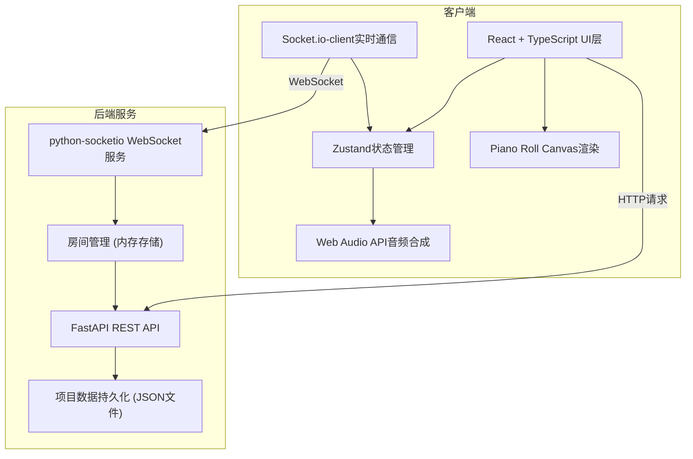
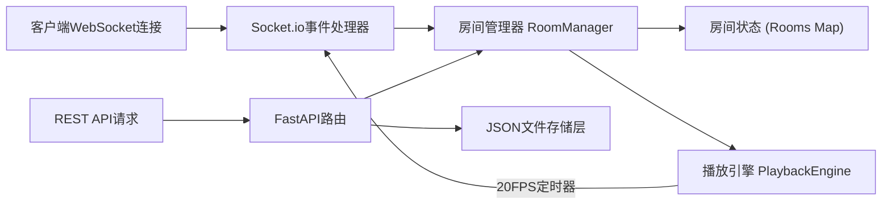
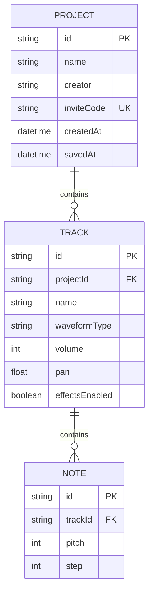

## 1. 架构设计



## 2. 技术描述
- **前端框架**：React@18 + TypeScript@5 + Vite@5
- **状态管理**：zustand@4（轻量级状态管理）
- **HTTP客户端**：axios@1
- **WebSocket客户端**：socket.io-client@4
- **后端框架**：FastAPI@0.109
- **WebSocket服务端**：python-socketio@5 + uvicorn@0.27
- **数据验证**：pydantic@2
- **数据持久化**：JSON文件存储（无需数据库）

## 3. 路由定义

| 路由 | 组件/用途 |
|-------|---------|
| `/` | 项目列表页 - ProjectList组件 |
| `/editor/:projectId` | 项目编辑页 - Editor组件 |

## 4. API定义

### 4.1 REST API

```typescript
// 创建项目
POST /api/project/create
Request: { name: string, creator: string }
Response: { id: string, inviteCode: string, name: string, creator: string, createdAt: string }

// 通过邀请码加入项目
POST /api/project/join
Request: { inviteCode: string }
Response: { id: string, name: string, creator: string, createdAt: string, tracks: Track[] }

// 获取项目详情
GET /api/project/{id}
Response: { id: string, name: string, creator: string, createdAt: string, tracks: Track[] }

// 保存项目
PUT /api/project/{id}/save
Request: { tracks: Track[] }
Response: { success: boolean, savedAt: string }

// 获取所有项目列表
GET /api/projects
Response: Array<{ id: string, name: string, creator: string, createdAt: string }>
```

### 4.2 WebSocket消息类型

```typescript
// 消息类型定义
type SyncMessage =
  | { type: 'join_room'; roomId: string; userId: string; userName: string }
  | { type: 'user_joined'; userId: string; userName: string }
  | { type: 'user_left'; userId: string }
  | { type: 'add_note'; trackId: string; pitch: number; step: number; userId: string }
  | { type: 'remove_note'; trackId: string; pitch: number; step: number; userId: string }
  | { type: 'update_track'; trackId: string; params: Partial<TrackParams>; userId: string }
  | { type: 'add_track'; track: Track; userId: string }
  | { type: 'remove_track'; trackId: string; userId: string }
  | { type: 'play'; startFrame: number; userId: string }
  | { type: 'stop'; userId: string }
  | { type: 'audio_frame'; frame: number; notes: ActiveNote[] }; // 后端推送 20FPS

interface TrackParams {
  name: string;
  type: 'sine' | 'sawtooth' | 'square' | 'triangle';
  volume: number; // 0-100
  pan: number; // -1 (L) to 1 (R)
  effectsEnabled: boolean;
}

interface Note {
  pitch: number; // 0-7, 对应8行
  step: number; // 0-15, 对应16列
}

interface Track {
  id: string;
  params: TrackParams;
  notes: Note[];
}

interface ActiveNote {
  midiNumber: number;
  velocity: number; // 0-127
  trackId: string;
}
```

## 5. 服务端架构



## 6. 数据模型

### 6.1 数据模型定义



### 6.2 JSON文件存储结构

```json
// data/projects.json
{
  "projects": [
    {
      "id": "uuid",
      "name": "我的Demo",
      "creator": "用户A",
      "inviteCode": "AB12",
      "createdAt": "2026-01-01T00:00:00Z",
      "savedAt": "2026-01-01T00:05:00Z",
      "tracks": [
        {
          "id": "track-uuid",
          "params": {
            "name": "鼓",
            "type": "square",
            "volume": 80,
            "pan": 0,
            "effectsEnabled": false
          },
          "notes": [
            { "pitch": 4, "step": 0 },
            { "pitch": 4, "step": 4 }
          ]
        }
      ]
    }
  ]
}
```

## 7. 文件结构

```
auto129/
├── package.json
├── index.html
├── vite.config.js
├── tsconfig.json
├── server/
│   ├── requirements.txt
│   ├── main.py
│   └── data/
│       └── projects.json (自动创建)
└── src/
    ├── main.tsx
    ├── types.ts
    ├── store.ts
    ├── App.tsx
    ├── services/
    │   ├── syncService.ts
    │   └── audioService.ts
    ├── pages/
    │   ├── ProjectList.tsx
    │   └── Editor.tsx
    └── components/
        ├── ProjectPanel.tsx
        ├── PianoRoll.tsx
        ├── TrackList.tsx
        └── Toast.tsx
```

## 8. 性能指标
- 动画帧率：≥30FPS
- WebSocket同步延迟：平均<200ms
- 页面首屏加载：<2秒（不含音频资源）
- 音频帧推送频率：20FPS（每50ms一帧）
- 参数同步频率：1秒一次（音量/声像节流）
