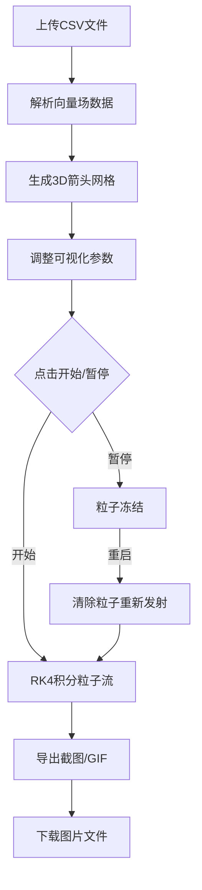

## 1. 产品概述

3D流场动画设计器是一款浏览器端的实时可视化工具，允许用户上传CSV格式的二维向量场数据，通过交互式参数调整，观察粒子沿流线运动的动态3D效果，并支持截图与GIF导出。目标用户为科研人员、数据可视化工程师及创意开发者。

## 2. 核心功能

### 2.1 用户角色

| 角色 | 注册方式 | 核心权限 |
|------|----------|----------|
| 普通用户 | 无需注册 | 上传数据、调整参数、导出图片/GIF |

### 2.2 功能模块

1. **主页面**：3D流场视口、控制面板、导出工具栏

### 2.3 页面详情

| 页面名称 | 模块名称 | 功能描述 |
|----------|----------|----------|
| 主页面 | 3D流场视口 | 居中显示3D场景，包含箭头网格和粒子流，支持鼠标拖拽旋转和滚轮缩放 |
| 主页面 | 左侧控制面板 | 可折叠面板，包含CSV文件上传、颜色映射选择、密度/时间步长/箭头缩放滑块、开始/暂停/重启按钮 |
| 主页面 | 右侧导出工具栏 | 垂直排列，截图按钮和录制GIF按钮 |

## 3. 核心流程

1. 用户上传CSV文件 → 系统解析向量场数据 → 生成3D箭头网格
2. 用户调整可视化参数 → 箭头大小/颜色/密度实时更新
3. 用户点击「开始」→ 粒子从网格点发射 → RK4积分沿流线运动 → 轨迹1秒后消失
4. 用户点击「暂停」→ 粒子冻结 → 点击「重启」→ 清除粒子重新发射
5. 用户点击截图 → 导出当前帧为PNG → 点击录制 → 导出动效为GIF

## 4. 用户界面设计

### 4.1 设计风格

- 主色：深蓝(#050510)到黑紫(#1a0a2e)径向渐变背景
- 辅色：毛玻璃效果面板 rgba(10,10,30,0.7)，边框 rgba(100,140,255,0.2)
- 强调色：蓝色发光效果
- 按钮风格：圆角矩形，悬停时发光背景动画
- 字体：Noto Sans SC，控制面板内标签14px，数值12px
- 布局风格：左侧浮动控制面板 + 中央3D视口 + 右侧浮动导出工具栏
- 图标风格：线性图标，细线条

### 4.2 页面设计概览

| 页面名称 | 模块名称 | UI元素 |
|----------|----------|--------|
| 主页面 | 3D流场视口 | 宽度70%，高度100vh，深蓝到黑紫径向渐变背景，Three.js Canvas渲染 |
| 主页面 | 左侧控制面板 | 宽度280px，毛玻璃背景，12px模糊，可折叠（0→280px过渡0.3s缓出），文件拖拽上传区，5种颜色映射选择器，3个参数滑块，2个操作按钮 |
| 主页面 | 右侧导出工具栏 | 垂直排列，rgba(10,10,30,0.6)背景，8px模糊，截图按钮+录制GIF按钮，截图时闪光效果0.4s |

### 4.3 响应式

- 桌面优先设计，1080p为基准分辨率
- 控制面板和导出工具栏浮动叠加在3D视口上
- 最小支持1280px宽度

### 4.4 3D场景指引

- 环境：深色背景，无HDRI，径向渐变作底色
- 灯光：环境光 + 方向光，确保箭头颜色清晰可见
- 相机：透视相机，支持鼠标拖拽绕Y轴旋转，滚轮缩放0.5-4倍
- 构图：平面网格居中，适配视口80%范围
- 交互：OrbitControls绕Y轴旋转，粒子动画持续循环
- 后处理：无额外后处理，保持30fps以上性能
- 性能预算：粒子数上限10000个，目标30fps@1080p
