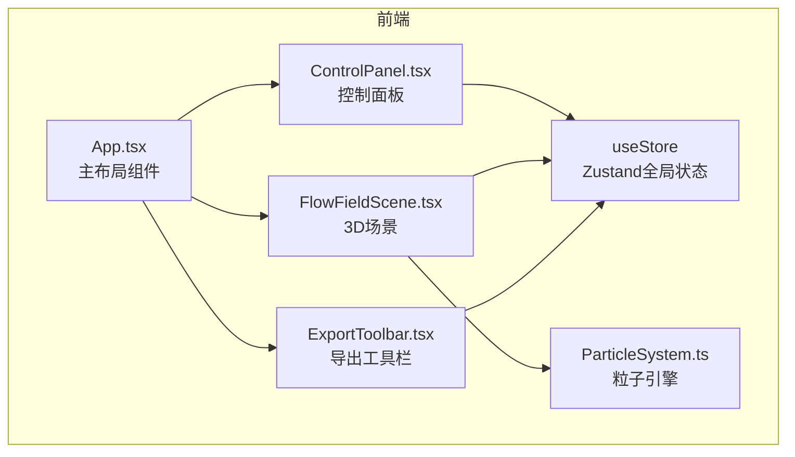
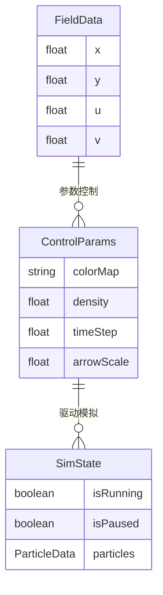

## 1. 架构设计

## 2. 技术说明

- 前端：React@18 + TypeScript + Vite
- 初始化工具：vite-init (react-ts模板)
- 3D渲染：Three.js + @react-three/fiber + @react-three/drei
- 状态管理：Zustand
- CSV解析：d3-dsv
- GIF录制：gifshot
- 后端：无
- 数据库：无

## 3. 路由定义

| 路由 | 用途 |
|------|------|
| / | 主页面，包含3D流场视口、控制面板和导出工具栏 |

## 4. API定义

无后端API，所有逻辑在前端完成。

## 5. 服务器架构图

无后端服务。

## 6. 数据模型

### 6.1 数据模型定义

### 6.2 数据定义

- **FieldData**：CSV解析后的向量场数据，每条记录包含坐标(x,y)和向量分量(u,v)
- **ControlParams**：用户可调参数，colorMap(颜色映射)、density(密度10%-100%)、timeStep(时间步长0.01-0.1)、arrowScale(箭头缩放0.5-2.0)
- **SimState**：模拟运行状态，isRunning(是否运行中)、isPaused(是否暂停)、particles(粒子数据数组)
- **Store State**：Zustand全局状态，组合以上数据模型，提供setFieldData、setParam、start、pause、reset等actions
