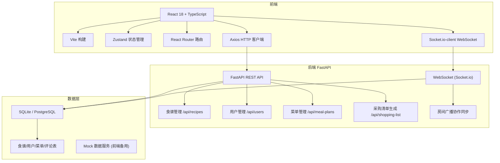
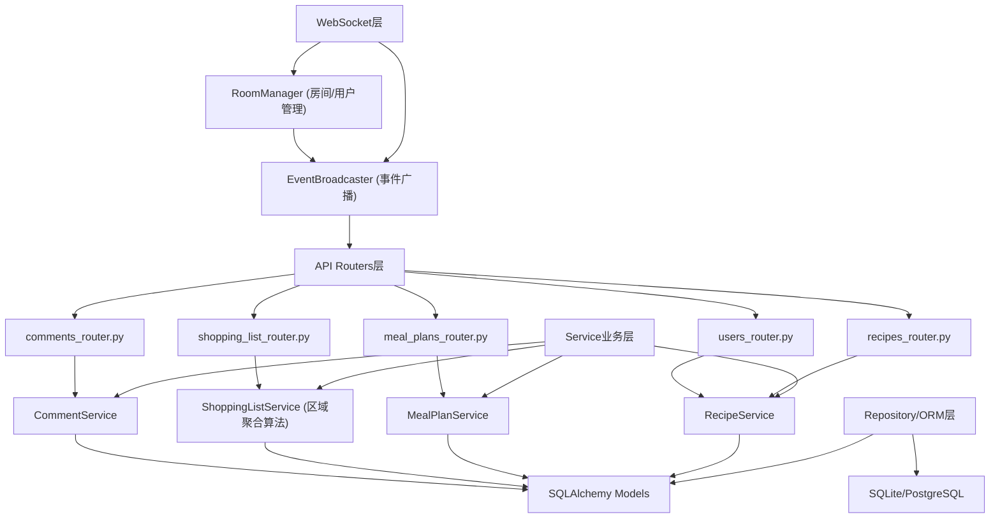
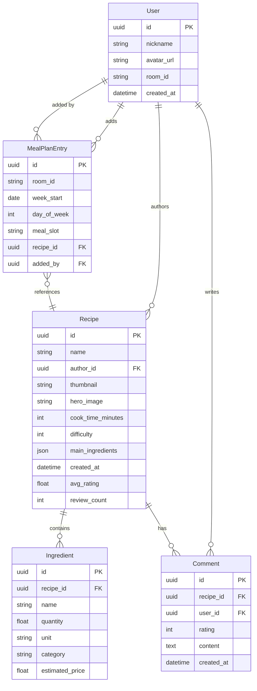

## 1. 架构设计



## 2. 技术选型说明

- **前端框架**：React 18 + TypeScript (strict模式)，类型安全保证协作数据一致性
- **构建工具**：Vite，HMR快速迭代，构建性能优秀
- **状态管理**：Zustand，轻量API简洁，跨模块共享状态无需Provider嵌套
- **路由**：React Router DOM，按URL参数区分房间ID (inviteCode)
- **HTTP请求**：Axios，拦截器统一处理认证和错误
- **实时协作**：Socket.io-client，WebSocket长连接广播房间内变更
- **后端API**：FastAPI (Python)，高性能异步，自动生成OpenAPI文档
- **实时通信**：python-socketio 与前端 socket.io-client 互通
- **数据库**：SQLite开发/PostgreSQL生产，存储食谱用户菜单评论
- **后端Mock方案**：前端内置Mock数据+模拟WebSocket，无后端时可演示

## 3. 路由定义

| 路由 | 页面组件 | 用途 |
|------|----------|------|
| `/room/:inviteCode/recipes` | RecipeHome | 食谱浏览主页（房间内） |
| `/room/:inviteCode/recipes/:id` | RecipeDetail | 食谱详情页 |
| `/room/:inviteCode/meal-planner` | MealPlanner | 每周菜单规划 |
| `/room/:inviteCode/shopping-list` | ShoppingList | 智能采购清单 |
| `/` | Redirect to default room | 重定向到默认演示房间 |

## 4. API 接口定义（TypeScript Schema）

```typescript
// 核心实体类型
interface User {
  id: string;
  nickname: string;
  avatarUrl: string;
}

interface Ingredient {
  id: string;
  name: string;
  quantity: number;
  unit: string;
  category: 'vegetable' | 'meat' | 'spice' | 'dairy' | 'grain' | 'seafood' | 'other';
  estimatedPrice?: number;
}

interface Recipe {
  id: string;
  name: string;
  authorId: string;
  author?: User;
  thumbnail?: string;
  heroImage?: string;
  cookTimeMinutes: number;
  difficulty: 1 | 2 | 3;
  mainIngredients: string[];
  ingredients: Ingredient[];
  steps: string[];
  avgRating: number;
  reviewCount: number;
  createdAt: string;
}

interface Comment {
  id: string;
  recipeId: string;
  userId: string;
  user?: User;
  rating: 1 | 2 | 3 | 4 | 5;
  content: string;
  createdAt: string;
}

type MealSlot = 'breakfast' | 'lunch' | 'dinner';
type WeekDay = 0 | 1 | 2 | 3 | 4 | 5 | 6;

interface MealPlanEntry {
  day: WeekDay;
  slot: MealSlot;
  recipeId: string;
  recipe?: Recipe;
  addedBy: string;
}

interface ShoppingItem {
  ingredientId: string;
  name: string;
  totalQuantity: number;
  unit: string;
  category: Ingredient['category'];
  supermarketZone: SupermarketZone;
  estimatedPrice?: number;
  purchased: boolean;
  purchasedBy?: string;
}

type SupermarketZone =
  | 'produce'        // 蔬菜水果区
  | 'meat_seafood'   // 肉类海鲜区
  | 'dairy_eggs'     // 乳制品及蛋类
  | 'seasoning'      // 调味品区
  | 'staples'        // 粮油干货区
  | 'other';         // 其他

interface ShoppingList {
  weekStartDate: string;
  items: ShoppingItem[];
  lastUpdatedAt: string;
  updatedBy: string;
}

// WebSocket 事件
interface WsEvents {
  'meal-plan:updated': { entry: MealPlanEntry | null; action: 'add' | 'remove' | 'move'; by: User };
  'shopping-list:checked': { ingredientId: string; purchased: boolean; by: User };
  'comment:new': { comment: Comment };
  'room:join': { userId: string; nickname: string };
  'toast:notify': { message: string; type: 'info' | 'success' | 'warning' };
}

// REST API
// GET  /api/recipes?search=&page=1&limit=20  -> { recipes: Recipe[], total: number }
// GET  /api/recipes/:id                     -> Recipe & { comments: Comment[] }
// POST /api/recipes/:id/comments            -> Comment
// GET  /api/meal-plans/:weekStartDate       -> MealPlanEntry[]
// PUT  /api/meal-plans                      -> MealPlanEntry[] (批量更新)
// GET  /api/shopping-list/:weekStartDate    -> ShoppingList
// POST /api/shopping-list/sync              -> ShoppingList
```

## 5. 后端服务架构（FastAPI）



## 6. 数据模型

### 6.1 ER 图



### 6.2 核心表 DDL（SQLite）

```sql
CREATE TABLE users (
    id TEXT PRIMARY KEY,
    nickname TEXT NOT NULL,
    avatar_url TEXT,
    room_id TEXT NOT NULL,
    created_at TEXT DEFAULT (datetime('now'))
);

CREATE TABLE recipes (
    id TEXT PRIMARY KEY,
    name TEXT NOT NULL,
    author_id TEXT NOT NULL REFERENCES users(id),
    thumbnail TEXT,
    hero_image TEXT,
    cook_time_minutes INTEGER NOT NULL,
    difficulty INTEGER NOT NULL CHECK (difficulty IN (1,2,3)),
    main_ingredients TEXT NOT NULL,
    steps TEXT NOT NULL,
    avg_rating REAL DEFAULT 0,
    review_count INTEGER DEFAULT 0,
    created_at TEXT DEFAULT (datetime('now'))
);

CREATE TABLE ingredients (
    id TEXT PRIMARY KEY,
    recipe_id TEXT NOT NULL REFERENCES recipes(id) ON DELETE CASCADE,
    name TEXT NOT NULL,
    quantity REAL NOT NULL,
    unit TEXT NOT NULL,
    category TEXT NOT NULL,
    estimated_price REAL
);

CREATE TABLE comments (
    id TEXT PRIMARY KEY,
    recipe_id TEXT NOT NULL REFERENCES recipes(id) ON DELETE CASCADE,
    user_id TEXT NOT NULL REFERENCES users(id),
    rating INTEGER NOT NULL CHECK (rating BETWEEN 1 AND 5),
    content TEXT NOT NULL,
    created_at TEXT DEFAULT (datetime('now'))
);

CREATE TABLE meal_plan_entries (
    id TEXT PRIMARY KEY,
    room_id TEXT NOT NULL,
    week_start TEXT NOT NULL,
    day_of_week INTEGER NOT NULL CHECK (day_of_week BETWEEN 0 AND 6),
    meal_slot TEXT NOT NULL CHECK (meal_slot IN ('breakfast','lunch','dinner')),
    recipe_id TEXT NOT NULL REFERENCES recipes(id),
    added_by TEXT NOT NULL REFERENCES users(id),
    UNIQUE(room_id, week_start, day_of_week, meal_slot)
);

-- 食材类别到超市区域映射表（可配置）
CREATE TABLE zone_mappings (
    category TEXT PRIMARY KEY,
    supermarket_zone TEXT NOT NULL
);
INSERT INTO zone_mappings (category, supermarket_zone) VALUES
    ('vegetable', 'produce'),
    ('fruit', 'produce'),
    ('meat', 'meat_seafood'),
    ('seafood', 'meat_seafood'),
    ('dairy', 'dairy_eggs'),
    ('eggs', 'dairy_eggs'),
    ('spice', 'seasoning'),
    ('sauce', 'seasoning'),
    ('grain', 'staples'),
    ('oil', 'staples'),
    ('other', 'other');
```
