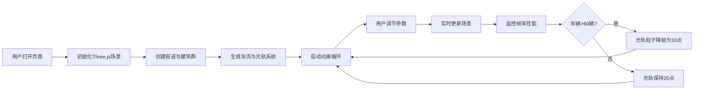

## 1. 产品概述

城市街道夜间车流3D交互可视化工具，为前端开发者提供轻量可交互的车流模拟预览，用于智慧城市大屏和动态壁纸的视觉效果调试。

- 核心价值：解决开发者缺乏车流模拟工具来预览和调试动态光轨视觉效果的问题
- 目标用户：前端开发者、智慧城市大屏设计师、动态壁纸创作者
- 产品定位：轻量级、高性能、可实时调节参数的3D车流可视化工具

## 2. 核心功能

### 2.1 功能模块

1. **3D场景模块**：双向四车道街道、低多边形建筑群、窗户灯光脉冲动画
2. **车流模拟模块**：车辆生成与运动、车头/尾灯点光源、动态光轨拖尾效果
3. **参数控制模块**：交通密度滑块、车速滑块、灯光颜色选择器、暂停/继续按钮、重置视角按钮
4. **性能监控模块**：实时帧率显示、车辆数量超阈值时光轨自动降级
5. **相机交互模块**：轨道控制器支持旋转和缩放

### 2.2 页面详情

| 页面名称 | 模块名称 | 功能描述 |
|---------|---------|---------|
| 主页面 | 3D场景视口 | 800x600 Three.js渲染场景，包含街道、建筑、车流和光轨效果 |
| 主页面 | 右侧控制面板 | 半透明毛玻璃设计，包含参数滑块、控制按钮和帧率显示 |
| 主页面 | 帧率指示器 | 面板底部实时显示FPS，绿色正常/红色警告 |

## 3. 核心流程

用户打开页面 → 自动初始化3D场景并开始车流模拟 → 用户通过右侧面板调节参数（密度/速度/灯光颜色）→ 场景实时响应更新 → 用户可暂停/继续动画或重置视角 → 系统自动监控帧率并在高负载时降级光轨质量

## 4. 用户界面设计

### 4.1 设计风格
- **主色调**：深色科技风，背景深灰#1a1a2e
- **辅助色**：控制面板半透明黑rgba(30,30,30,0.8)，毛玻璃模糊效果
- **强调色**：滑块#ffa726（橙色），按钮#42a5f5（蓝色），帧率正常#66bb6a（绿色），警告#ef5350（红色）
- **文字颜色**：浅灰#e0e0e0
- **按钮风格**：圆角矩形（border-radius: 8px），hover加深，点击缩放0.95倍
- **滑块风格**：自定义竖条带圆形手柄
- **面板风格**：毛玻璃效果（backdrop-filter: blur(8px)）

### 4.2 页面设计概述

| 页面名称 | 模块名称 | UI元素 |
|---------|---------|-------|
| 主页面 | 3D视口 | 居中800x600画布，深色背景，可旋转缩放 |
| 主页面 | 控制面板 | 右侧固定240px宽，半透明毛玻璃，垂直排列控件 |
| 主页面 | 滑块控件 | 标签+数值显示+自定义橙色滑块 |
| 主页面 | 按钮控件 | 圆角蓝色按钮，带hover和点击动效 |
| 主页面 | 帧率显示 | 面板底部，绿/红颜色动态变化 |

### 4.3 响应式
- 桌面端优先设计，场景视口固定800x600
- 控制面板固定在右侧240px宽度
- 不考虑移动端适配

### 4.4 3D场景指导
- **环境**：夜间城市街道，深灰背景，营造科技感
- **灯光**：环境光+建筑窗户自发光+车辆点光源
- **相机**：默认俯视45度角，支持OrbitControls旋转缩放
- **构图**：街道贯穿场景中心，建筑对称分布两侧
- **动画**：车辆匀速行驶，光轨渐隐拖尾，窗户灯光脉冲
- **后处理**：无需额外后处理，依靠点光源和材质自发光实现视觉效果
- **性能**：建筑使用合并几何体，光轨根据车辆数自动降级
