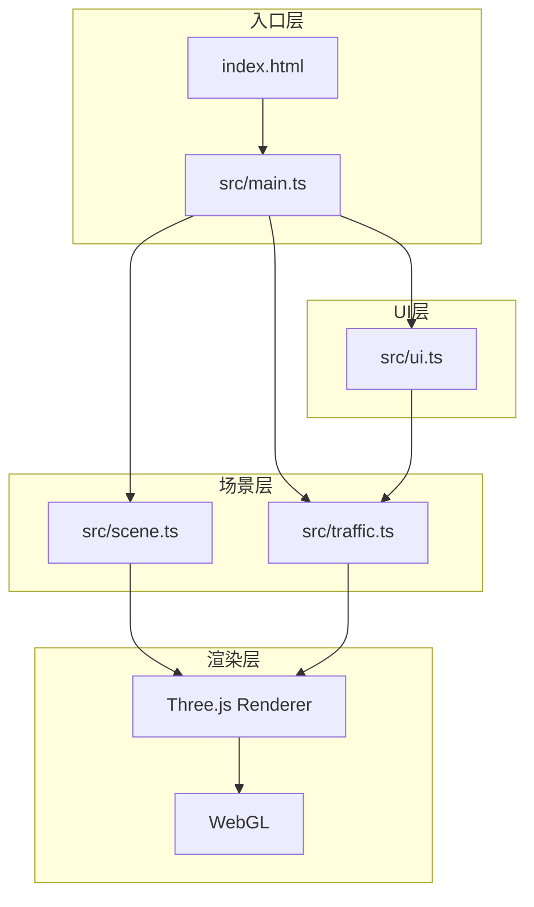

## 1. 架构设计



## 2. 技术说明

- **前端框架**：原生 TypeScript + Three.js（不使用React，保持轻量）
- **构建工具**：Vite 5.x
- **3D引擎**：Three.js 最新版
- **类型支持**：@types/three
- **编程语言**：TypeScript 5.x（strict模式，target ES2020）

### 核心依赖
- three: Three.js 3D渲染引擎
- @types/three: Three.js TypeScript类型定义
- typescript: TypeScript编译器
- vite: 开发服务器与构建工具

## 3. 文件结构

```
auto131/
├── package.json          # 项目依赖与脚本
├── index.html            # 入口HTML页面
├── tsconfig.json         # TypeScript配置
├── vite.config.js        # Vite构建配置
└── src/
    ├── main.ts           # 主入口，整合所有模块
    ├── scene.ts          # 静态场景（街道、建筑、车道线）
    ├── traffic.ts        # 车流模拟与光轨系统
    └── ui.ts             # 控制面板UI与事件绑定
```

## 4. 模块设计

### 4.1 main.ts - 主入口模块
- 初始化Three.js场景、相机、渲染器
- 配置OrbitControls轨道控制器
- 整合scene、traffic、ui模块
- 管理动画循环（requestAnimationFrame）
- 处理窗口大小变化

### 4.2 scene.ts - 场景模块
- createStreet(): 创建双向四车道路面和白色虚线车道线
- createBuildings(): 创建两侧低多边形建筑群（合并几何体优化）
- createWindowLights(): 创建建筑窗户随机亮灯效果（脉冲动画）
- 返回THREE.Group供主场景使用

### 4.3 traffic.ts - 车流模块
- Car类：车辆实体（车身立方体+头灯/尾灯点光源+光轨）
- TrafficSystem类：车流管理系统
  - start(): 启动模拟
  - stop(): 停止模拟
  - setDensity(n): 设置车辆数量
  - setSpeed(v): 设置车速
  - setHeadlightColor(color): 设置车头灯颜色
  - update(delta): 每帧更新车辆位置和光轨
- 光轨实现：LineSegments + 顶点颜色渐变透明度
- 性能降级：车辆>60时光轨从20点降为10点

### 4.4 ui.ts - UI控制模块
- 绑定滑块事件（密度、速度、灯光颜色）
- 绑定按钮事件（暂停/继续、重置视角）
- 帧率监控与显示
- 提供回调接口与traffic模块通信

## 5. 关键技术点

### 5.1 光轨实现
- 使用THREE.Line + BufferGeometry
- 每帧更新顶点位置，头部添加新位置，尾部移除旧位置
- 顶点颜色从1.0透明度渐变到0.0
- 光轨长度随车速动态调整

### 5.2 性能优化
- 建筑使用mergeGeometries合并减少Draw Call
- 车辆数量超60时光轨粒子数自动降级
- 复用几何体和材质
- 使用BufferGeometry而非Geometry

### 5.3 窗户灯光脉冲
- 每盏灯独立相位的sin函数动画
- 材质emissive强度在0.6-1.0之间循环
- 周期1.5秒

## 6. 性能指标
- 60辆车并发时帧率 ≥ 30FPS
- 控制面板调节响应时间 < 50ms
- 场景视口尺寸：800 x 600
