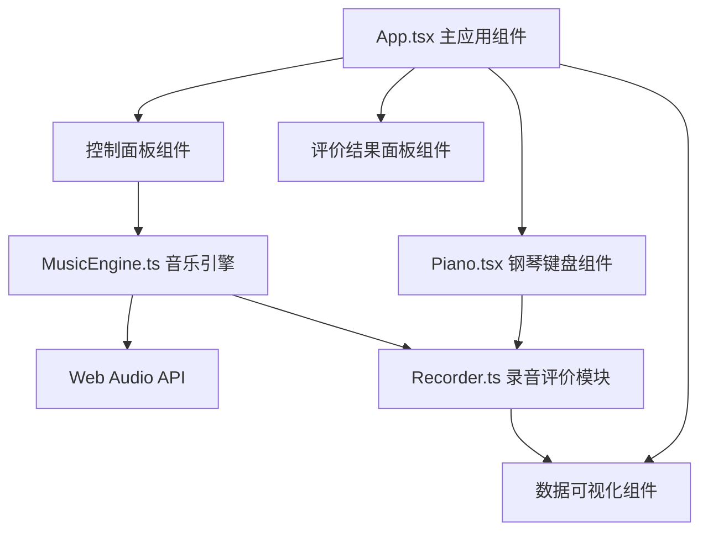

## 1. 架构设计

纯前端单页应用，采用 React 组件化架构，核心逻辑模块化分离。



## 2. 技术描述

- **前端框架**：React 18 + TypeScript 5（strict模式）
- **构建工具**：Vite 5
- **音频处理**：Tone.js + Howler.js + Web Audio API
- **状态管理**：React Hooks（useState, useRef, useEffect, useCallback）
- **样式方案**：内联 CSS（styled-components / CSS Modules 风格）
- **图表渲染**：原生 Canvas API / SVG 绘制散点图和折线图

## 3. 文件结构

```
d:\P\tasks\auto136\
├── package.json              # 依赖配置（react, react-dom, typescript, vite, tone, howler）
├── index.html                # 入口HTML页面
├── tsconfig.json             # TypeScript配置（strict模式）
├── vite.config.js            # Vite构建配置
└── src/
    ├── main.tsx              # React入口，渲染App组件
    ├── App.tsx               # 主应用组件（新增）
    ├── components/
    │   └── Piano.tsx         # 钢琴键盘组件（88键可交互）
    ├── core/
    │   ├── MusicEngine.ts    # 音乐引擎（音符生成、乐谱解析、播放控制）
    │   └── Recorder.ts       # 录音评价模块（对比计算准确率）
    └── styles/
        └── global.css        # 全局样式（新增）
```

## 4. 核心模块设计

### 4.1 数据类型定义

```typescript
interface Note {
  pitch: string;      // 音高，如 "C4", "F#5"
  midi: number;       // MIDI音符号 (21-108 for 88 keys)
  startTime: number;  // 起始时间（秒）
  duration: number;   // 持续时间（秒）
}

interface Score {
  id: string;
  name: string;
  notes: Note[];
  totalDuration: number;
}

interface RecordedNote {
  midi: number;
  pitch: string;
  timestamp: number;  // 毫秒级时间戳
}

interface EvaluationResult {
  totalNotes: number;
  correctNotes: number;
  wrongNotes: number;
  missedNotes: number;
  accuracy: number;   // 百分比 0-100
  deviations: { noteIndex: number; deviation: number; isCorrect: boolean }[];
  meanDeviation: number;
  stdDeviation: number;
}

interface PracticeSession {
  sectionId: string;
  timestamp: number;
  accuracy: number;
}
```

### 4.2 MusicEngine 模块接口

```typescript
class MusicEngine {
  playNote(midi: number, duration?: number): void;   // 播放单个音符
  loadScore(score: Score): void;                      // 加载乐谱
  getScore(): Score | null;                           // 获取当前乐谱
  playScore(onNoteStart?: (midi: number) => void, onComplete?: () => void): void;
  stopPlayback(): void;
  getCurrentTime(): number;
  setVolume(volume: number): void;
}
```

### 4.3 Recorder 模块接口

```typescript
class Recorder {
  startRecording(score: Score): void;
  stopRecording(): EvaluationResult;
  recordNote(midi: number, pitch: string): void;
  evaluate(score: Score, recorded: RecordedNote[]): EvaluationResult;
  clear(): void;
}
```

### 4.4 Piano 组件 Props

```typescript
interface PianoProps {
  onKeyPress: (midi: number, pitch: string) => void;
  highlightedMidis: number[];     // 当前高亮的音符（乐谱进度）
  activeMidis: number[];          // 当前按下的音符（视觉反馈）
  compactMode?: boolean;          // 移动端61键模式
}
```

### 4.5 键盘映射（中央C附近）

| 键盘按键 | 对应音高 | MIDI编号 |
|---------|---------|---------|
| A | C4 (中央C) | 60 |
| W | C#4 | 61 |
| S | D4 | 62 |
| E | D#4 | 63 |
| D | E4 | 64 |
| F | F4 | 65 |
| T | F#4 | 66 |
| G | G4 | 67 |
| Y | G#4 | 68 |
| H | A4 | 69 |
| U | A#4 | 70 |
| J | B4 | 71 |
| K | C5 | 72 |
| ... | 扩展映射更多八度 | ... |

## 5. 评价算法

音符匹配规则：
1. 按时间顺序遍历标准乐谱的每个音符
2. 在用户录制数据中查找匹配：
   - 音高相同（MIDI编号一致）
   - 时间误差在 ±0.15秒（150ms）内
3. 每个用户音符只能匹配一次标准音符
4. 统计正确、错误、漏按数量
5. 准确率 = 正确音符数 / 标准总音符数 × 100%

节奏偏差计算：
- 偏差 = 用户按键时间戳 - 标准音符起始时间（转换为相同时间基准）
- 均值 = 所有正确匹配偏差的算术平均
- 标准差 = 偏差数据的统计标准差
