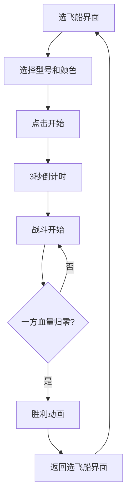

## 1. 产品概述

双人分屏弹幕射击对战游戏，两名玩家在同一设备上通过分屏模式实时控制飞船、发射子弹并躲避弹幕，同时记录胜负数据。

- 主要用途：提供本地双人对战的街机弹幕射击体验
- 解决问题：为双人玩家提供即时对战的弹幕射击游戏，无需网络连接
- 目标用户：喜欢经典街机射击游戏的双人玩家

## 2. 核心功能

### 2.1 用户角色
| 角色 | 注册方式 | 核心权限 |
|------|----------|----------|
| 玩家1 | 本地键盘(WASD+空格) | 控制左侧飞船，参与对战 |
| 玩家2 | 本地键盘(方向键+回车) | 控制右侧飞船，参与对战 |

### 2.2 功能模块
1. **选飞船界面**：飞船型号选择、颜色选择、开始按钮
2. **对战界面**：分屏游戏区域、飞船状态显示、比分显示
3. **胜负判定**：血量系统、计分系统、胜利动画
4. **数据持久化**：历史比分记录（localStorage）

### 2.3 页面详情
| 页面名称 | 模块名称 | 功能描述 |
|---------|----------|----------|
| 选飞船界面 | 型号选择 | 三种飞船型号：快速型、均衡型、重装型 |
| 选飞船界面 | 颜色选择 | 玩家从调色板选取飞船颜色 |
| 选飞船界面 | 开始按钮 | 渐变按钮，点击后3秒倒计时开始 |
| 对战界面 | 分屏区域 | 垂直分为左右两区域，中间动态闪烁分隔线 |
| 对战界面 | 飞船系统 | 移动、射击、血量、无敌时间 |
| 对战界面 | 子弹系统 | 自动射击、拖尾效果、碰撞检测 |
| 对战界面 | 粒子系统 | 爆炸效果、庆祝粒子 |
| 对战界面 | 状态显示 | 血条、分数、型号图标 |
| 对战界面 | 比分板 | 历史胜负记录，localStorage持久化 |
| 结束界面 | 胜利动画 | 胜者飞船放大旋转、金色粒子、背景渐变 |

## 3. 核心流程

玩家进入选飞船界面 → 选择飞船型号和颜色 → 点击开始按钮 → 3秒倒计时 → 战斗开始 → 飞船自动射击，玩家控制移动躲避 → 一方血量归零 → 显示胜利动画 → 返回选飞船界面

## 4. 用户界面设计

### 4.1 设计风格
- 主色调：#0a0a2e 深空蓝
- 辅色调：#00f0ff 青色霓虹、#ff007a 粉色霓虹
- 背景：深蓝到黑紫径向渐变（#060612 到 #1a0a2e）
- 按钮风格：圆角矩形，#00f0ff 到 #ff007a 渐变，悬停亮度增加20%
- 字体：Courier New 加粗（标题），等宽字体
- 布局：游戏区域居中，占80%宽度，两侧各10%装饰区
- 视觉风格：赛博朋克风格，霓虹发光效果

### 4.2 页面设计概述
| 页面名称 | 模块名称 | UI元素 |
|---------|----------|--------|
| 选飞船界面 | 标题 | 霓虹发光文字，#00f0ff，阴影#ff007a |
| 选飞船界面 | 飞船选择卡 | 三种型号，几何图形表示，可选中状态 |
| 选飞船界面 | 颜色调色板 | 多个颜色选项，圆形色块 |
| 选飞船界面 | 开始按钮 | 渐变圆角按钮，悬停效果 |
| 对战界面 | 分屏线 | 动态闪烁，#ff007a 到 #00f0ff 循环，2px宽度 |
| 对战界面 | 星空背景 | 随机星点，1-2px，#ffffff40 |
| 对战界面 | 飞船 | 几何图形（三角形/六边形/圆形），玩家自定义颜色 |
| 对战界面 | 子弹 | 亮色圆形，4px直径，白色拖尾 |
| 对战界面 | 血条 | 条形进度条，红色血量 |
| 对战界面 | 比分板 | 右上角，白底圆角，半透明毛玻璃效果 |
| 胜利界面 | 胜利文字 | 放大动画，金色 |
| 胜利界面 | 庆祝粒子 | 金色星形粒子 #ffd700 |

### 4.3 响应性
- 桌面端优先设计
- 游戏区域为固定比例Canvas
- 两侧装饰区自适应宽度

### 4.4 音效设计
- 使用 AudioContext 生成简单波形
- 击中音效：频率从800Hz到400Hz递减的锯齿波
- 倒计时音效：短促提示音
- 按钮点击音效
