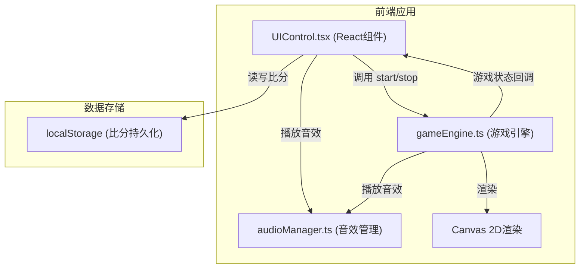

## 1. 架构设计



## 2. 技术说明

- 前端框架：React 18 + TypeScript
- 构建工具：Vite 5
- 渲染方式：Canvas 2D API
- 状态管理：React useState/useRef + 游戏引擎内部状态
- 数据持久化：localStorage
- 音频：Web Audio API (AudioContext)

## 3. 项目结构

```
d:\P\tasks\auto14/
├── index.html                 # 入口HTML
├── package.json               # 项目依赖
├── vite.config.js             # Vite配置
├── tsconfig.json              # TypeScript配置
└── src/
    ├── main.tsx               # React入口
    ├── App.tsx                # 根组件
    ├── UIControl.tsx          # UI控制组件
    ├── gameEngine.ts          # 游戏引擎
    └── audioManager.ts        # 音效管理
```

## 4. 核心模块设计

### 4.1 游戏引擎 (gameEngine.ts)

**职责**：负责Canvas渲染、游戏主循环、碰撞检测、粒子系统、飞船和子弹管理

**导出函数**：
- `startGame(config: GameConfig): void` - 开始游戏
- `stopGame(): void` - 停止游戏
- `getGameState(): GameState` - 获取当前游戏状态
- `onStateChange(callback: (state: GameState) => void): void` - 状态变化回调

**核心类/接口**：
- `Ship` - 飞船类（位置、速度、血量、类型、颜色、无敌时间）
- `Bullet` - 子弹类（位置、速度、所属玩家、拖尾）
- `Particle` - 粒子类（位置、速度、颜色、生命周期）
- `SpatialHash` - 空间哈希碰撞检测（20x20网格）

**游戏循环**：
- requestAnimationFrame 驱动
- 60FPS 目标帧率
- 固定时间步长更新逻辑
- 插值渲染

### 4.2 UI控制 (UIControl.tsx)

**职责**：React组件，处理用户输入、显示游戏界面、管理游戏状态

**子组件**：
- 选飞船界面（ShipSelect）
- 计分板（ScoreBoard）
- 倒计时（Countdown）
- 胜利界面（VictoryScreen）

**状态管理**：
- 游戏阶段：select / countdown / playing / victory
- 玩家配置（型号、颜色）
- 历史比分数据

### 4.3 音效管理 (audioManager.ts)

**职责**：使用 AudioContext 生成游戏音效

**导出函数**：
- `playHit(): void` - 击中音效（锯齿波，800Hz→400Hz）
- `playCountdown(): void` - 倒计时音效
- `playClick(): void` - 按钮点击音效
- `playVictory(): void` - 胜利音效

### 4.4 数据模型

```typescript
// 飞船类型
type ShipType = 'fast' | 'balanced' | 'heavy';

// 飞船配置
interface ShipConfig {
  type: ShipType;
  color: string;
  speed: number;
  maxHealth: number;
  shape: 'triangle' | 'hexagon' | 'circle';
}

// 游戏状态
interface GameState {
  phase: 'countdown' | 'playing' | 'victory';
  player1: {
    health: number;
    score: number;
    ship: Ship | null;
  };
  player2: {
    health: number;
    score: number;
    ship: Ship | null;
  };
  countdown: number;
  winner: 1 | 2 | null;
}

// 历史比分
interface ScoreRecord {
  player1Wins: number;
  player2Wins: number;
  draws: number;
}
```

### 4.5 性能优化

- **空间哈希碰撞检测**：将战场划分为20x20网格，只检测相邻网格内的物体
- **粒子池**：粒子数量上限200个，超出回收最早生成的粒子
- **requestAnimationFrame**：使用浏览器原生动画帧
- **Canvas分层**：背景和前景分离渲染（可选）
- **对象池**：子弹和粒子对象复用，减少GC
