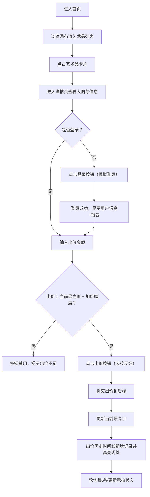

## 1. 产品概述

ArtBid 艺术竞拍平台是一个面向艺术品收藏爱好者的在线竞拍网站，提供艺术品浏览、实时竞价、出价历史追踪等功能，致力于打造温暖、优雅的艺术品交易体验。

- 核心目标：为用户提供流畅的艺术品浏览与竞拍体验，通过暖色调木纹风格营造高端艺术氛围
- 目标用户：艺术品收藏家、艺术爱好者、投资者

## 2. 核心功能

### 2.1 用户角色

| 角色 | 注册方式 | 核心权限 |
|------|----------|----------|
| 普通用户 | 用户名登录（模拟） | 浏览艺术品、参与竞拍、查看出价历史 |
| 访客 | 无需登录 | 浏览艺术品及详情、查看竞拍状态 |

### 2.2 功能模块

1. **首页**：顶部导航栏、瀑布流艺术品卡片列表、圆形倒计时组件
2. **详情页**：艺术品大图展示、详细信息面板、出价交互区、出价历史时间线

### 2.3 页面详情

| 页面名称 | 模块名称 | 功能描述 |
|----------|----------|----------|
| 首页 | 导航栏 | 应用名称+拍卖锤图标、登录按钮/用户信息+钱包余额、毛玻璃半透明效果 |
| 首页 | 瀑布流卡片 | 艺术品图片（4:3比例+淡入加载）、作品名称、当前最高价、圆形倒计时（<1小时红色脉冲）、悬停上浮+阴影增强 |
| 详情页 | 大图区域 | 艺术品大图、点击放大查看原图、懒加载 |
| 详情页 | 信息面板 | 创作者、起拍价、加价幅度、当前最高出价者信息展示 |
| 详情页 | 出价区 | 出价输入框、出价按钮（低于最高价禁用灰色，满足条件深橙色渐变+波纹） |
| 详情页 | 时间线 | 出价历史记录（头像+金额+时间）、新出价高亮闪烁动画 |

## 3. 核心流程

用户核心竞拍流程：进入首页 → 浏览瀑布流艺术品 → 点击感兴趣的卡片 → 进入详情页查看信息 → 输入出价金额 → 点击出价按钮 → 出价成功后时间线更新并高亮 → 倒计时结束竞拍完成

## 4. 用户界面设计

### 4.1 设计风格

- **主色调**：暖米白色背景 `#f5f0e8`，深棕色标题区域 `#3e2723`，浅棕边框 `#d7ccc8`
- **点缀色**：深橙色按钮 `#e65100`，红色脉冲警告 `#e53935`，灰色禁用态 `#bdbdbd`
- **按钮风格**：圆角矩形，深橙色带渐变，点击波纹反馈，悬停轻微放大
- **字体**：使用优雅的衬线字体（Playfair Display）作为标题，无衬线字体（Noto Sans SC）作为正文
- **布局风格**：卡片式布局，瀑布流排列，顶部导航栏毛玻璃效果
- **动效**：卡片悬停上浮4px+阴影增强，图片淡入加载，按钮缩放过渡，倒计时脉冲，时间线高亮闪烁
- **图标**：使用简洁的线性图标，拍卖锤作为品牌标识

### 4.2 页面设计概述

| 页面名称 | 模块名称 | UI 元素 |
|----------|----------|----------|
| 首页 | 导航栏 | 半透明毛玻璃 `rgba(245,240,232,0.8)`，8px模糊，左logo右用户，登录按钮悬停`scale(1.05) 0.2s` |
| 首页 | 卡片 | 16px圆角，白色背景`#ffffff`，1px浅棕边框，悬停`translateY(-4px)` + 阴影`0 8px 25px rgba(0,0,0,0.15)` |
| 首页 | 倒计时 | 圆形进度条（circular progress），<1小时红色脉冲动效 |
| 详情页 | 大图 | 4:3比例，懒加载淡入，点击放大 |
| 详情页 | 出价按钮 | 禁用态灰色`#bdbdbd`，正常态深橙`#e65100`渐变 + 点击波纹 |
| 详情页 | 时间线 | 左侧竖线，圆点节点，新记录`flash`高亮动画 |

### 4.3 响应式设计

- 桌面端（≥768px）：多列瀑布流布局，完整导航栏
- 移动端（<768px）：单列瀑布流，导航栏汉堡菜单，卡片间距缩小
- 触摸优化：按钮最小触控区域 44px，卡片点击区域足够大

### 4.4 性能指标

- 首屏渲染时间 ≤ 2秒
- 图片懒加载，瀑布流按需渲染
- 竞拍状态轮询间隔：5秒
- 所有动画使用 CSS transform/opacity，确保 GPU 加速流畅
