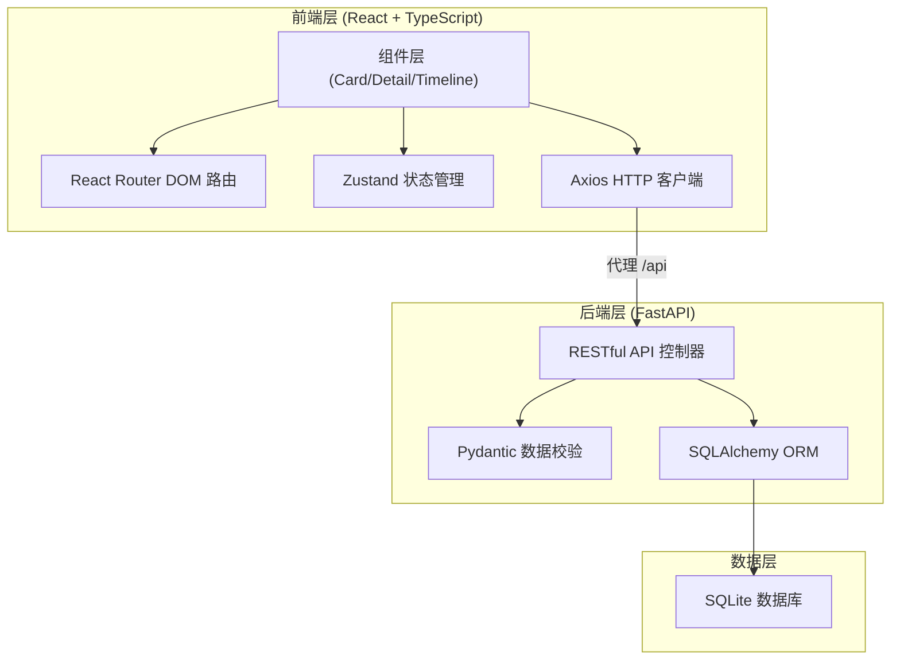
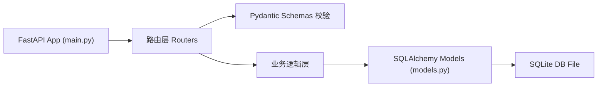
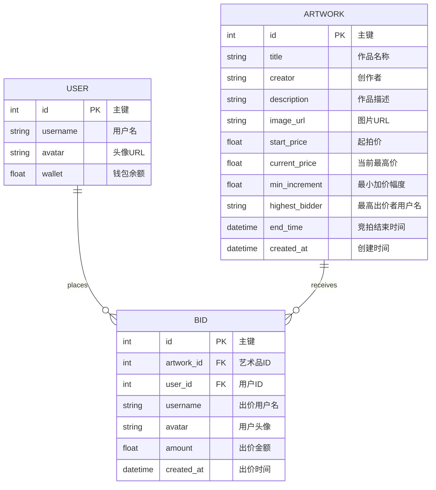

## 1. 架构设计



## 2. 技术说明

- **前端框架**：React 18 + TypeScript 5，严格模式
- **构建工具**：Vite 5，HMR 热更新，代理 `/api` 到后端 8000 端口
- **路由管理**：react-router-dom 6，BrowserRouter 模式
- **状态管理**：zustand 4，管理用户登录状态、钱包余额、竞拍数据
- **HTTP 请求**：axios 1.x，统一封装请求拦截器，错误处理
- **后端框架**：FastAPI 0.100+，自动生成 OpenAPI 文档
- **数据校验**：Pydantic v2，严格类型校验
- **ORM**：SQLAlchemy 2.0，异步/同步模式
- **数据库**：SQLite 3，零配置嵌入式数据库，文件存储
- **启动脚本**：前端 `npm run dev` (Vite 5173端口)，后端 `uvicorn main:app --reload` (8000端口)

## 3. 路由定义

| 路由 | 页面组件 | 用途 |
|------|----------|------|
| `/` | HomePage（内嵌瀑布流） | 首页，展示所有竞拍品卡片 |
| `/auction/:id` | DetailPage | 艺术品详情页，含出价交互与时间线 |
| `*` | 404 重定向到 `/` | 未匹配路由处理 |

## 4. API 定义

### TypeScript 类型定义

```typescript
interface User {
  id: number;
  username: string;
  avatar: string;
  wallet: number;
}

interface Artwork {
  id: number;
  title: string;
  creator: string;
  description: string;
  imageUrl: string;
  startPrice: number;
  currentPrice: number;
  minIncrement: number;
  highestBidder: string | null;
  endTime: string; // ISO date
  createdAt: string;
}

interface Bid {
  id: number;
  artworkId: number;
  userId: number;
  username: string;
  avatar: string;
  amount: number;
  createdAt: string;
}
```

### 接口列表

| 方法 | 路径 | 请求参数 | 响应 | 说明 |
|------|------|----------|------|------|
| GET | `/api/artworks` | 无 | `Artwork[]` | 获取所有竞拍艺术品列表 |
| GET | `/api/artworks/:id` | path: id | `Artwork` | 获取单个艺术品详情 |
| GET | `/api/artworks/:id/bids` | path: id | `Bid[]` | 获取艺术品的出价历史 |
| POST | `/api/auth/login` | body: `{username}` | `User` | 模拟用户登录，返回用户信息 |
| POST | `/api/bids` | body: `{artworkId, userId, amount}` | `Bid` | 提交新出价，校验金额合法性 |
| GET | `/api/artworks/:id/poll` | path: id, query: `since?` | `{artwork, bids: Bid[]}` | 轮询接口，每5秒调用获取最新状态 |

## 5. 服务端架构



### 目录结构

```
backend/
├── main.py        # FastAPI 入口，路由注册，CORS 中间件，初始化数据
└── models.py      # SQLAlchemy ORM 模型定义：User, Artwork, Bid
```

## 6. 数据模型

### 6.1 ER 图



### 6.2 初始化数据

- **默认用户**：`user001` ~ `user003`，内置头像和钱包余额
- **模拟艺术品**：5-6 件艺术品，包含名称、创作者、图片URL、起拍价等
- **模拟出价记录**：每件艺术品预置 3-5 条出价历史
- **结束时间**：所有竞拍结束时间设置为未来 2 小时 ~ 48 小时之间
