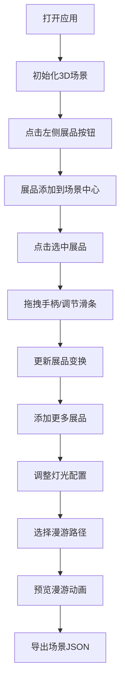

## 1. 产品概述

在线虚拟展览馆3D展品布展与漫游预览应用，为策展人提供自由组合3D展品、调节灯光和摄像机路径的沉浸式体验创作工具。

- 主要目的：让策展人能够在虚拟3D空间中自由布置展品、调整光照和设置漫游路径，创建沉浸式参观体验
- 目标用户：博物馆策展人、艺术展览设计师、3D内容创作者
- 市场价值：降低实体展览布展成本，提供数字化预览和沉浸式体验创作能力

## 2. 核心功能

### 2.1 用户角色

| 角色 | 注册方式 | 核心权限 |
|------|----------|----------|
| 策展人 | 无需注册，直接使用 | 添加/删除展品、调整展品变换、配置灯光、设置摄像漫游路径、导出/导入场景 |

### 2.2 功能模块

1. **展品创建模块**：左侧悬浮面板，6种展品类型一键添加到场景
2. **3D场景渲染模块**：中央视口，展示所有展品、灯光和摄像机视角
3. **展品变换模块**：三轴拖拽手柄（平移/旋转模式切换），右侧属性面板精确调节
4. **灯光控制模块**：环境光 + 三个可拖拽点光源，支持颜色和强度调节
5. **摄像机漫游模块**：三种预设路径动画（环绕、直线推进、蛇形巡视），gsap驱动
6. **场景导入导出模块**：JSON格式保存和恢复布展状态

### 2.3 页面详情

| 页面名称 | 模块名称 | 功能描述 |
|---------|---------|----------|
| 主页面 | 顶部导航栏 | 显示应用名称"虚拟策展台"，使用说明按钮，导入导出按钮 |
| 主页面 | 左侧展品面板 | 6种展品类型圆形按钮，点击添加到场景中心 |
| 主页面 | 中央3D视口 | Three.js渲染场景，支持鼠标旋转/缩放，展品选中与拖拽 |
| 主页面 | 右侧属性面板 | 选中展品时显示位置、旋转、缩放滑条，实时调节 |
| 主页面 | 灯光控制面板 | 环境光强度调节，三个点光源颜色/强度/位置调节 |
| 主页面 | 摄像机路径面板 | 三种漫游路径按钮，开始/暂停控制 |

## 3. 核心流程

### 3.1 展品布展流程

用户打开应用 → 从左侧面板选择展品类型 → 展品出现在场景中心 → 点击选中展品 → 使用手柄拖拽或右侧面板调节位置/旋转/缩放 → 添加更多展品 → 调整灯光效果 → 设置漫游路径 → 导出场景JSON

### 3.2 流程图

## 4. 用户界面设计

### 4.1 设计风格

- **主题**：深色典雅风格，沉浸式展览氛围
- **主色调**：深灰到黑紫色渐变背景 (#14141e → #0a0a14)
- **强调色**：青绿色 (#00ffaa) 用于选中状态和交互反馈
- **辅助色**：柔和蓝紫色用于面板边框和光晕效果
- **按钮风格**：圆形图标按钮，48px直径，悬停半透明背景，点击下沉效果
- **字体**：现代无衬线字体，清晰可读
- **布局风格**：三栏布局（左侧面板 + 中央视口 + 右侧面板）+ 顶部导航
- **毛玻璃效果**：面板使用 rgba 半透明背景 + backdrop-filter 模糊
- **图标风格**：简约线性图标，与深色背景对比清晰

### 4.2 页面设计概览

| 页面名称 | 模块名称 | UI元素 |
|---------|---------|--------|
| 主页面 | 顶部导航栏 | 40px高度，半透明黑色背景，应用标题，说明按钮，导入导出按钮 |
| 主页面 | 左侧展品面板 | 240px宽度，毛玻璃背景，6个圆形展品按钮垂直排列，悬停展开提示 |
| 主页面 | 中央3D视口 | 占约75%宽度，100%高度，Three.js Canvas渲染 |
| 主页面 | 右侧属性面板 | 260px宽度，毛玻璃背景，展品选中时显示，滑条组，数值显示 |
| 主页面 | 灯光控制 | 集成在右侧面板或浮动面板，色轮选择器，强度滑条 |
| 主页面 | 摄像机路径 | 底部或右侧浮动，三个路径按钮，播放/暂停控制 |

### 4.3 响应式设计

- **桌面端**（≥1024px）：完整三栏布局，左右面板全宽显示
- **平板/窄屏**（<1024px）：左右面板缩窄为60px仅显示图标，悬停或点击展开
- **移动端**（触屏）：单指旋转视角，双指缩放
- **加载状态**：顶部白色细线进度条，2秒动画后消失

### 4.4 3D场景指引

- **环境**：深灰紫渐变背景，营造沉浸式夜晚展览氛围
- **光照设置**：环境光（强度0.4）+ 三个可调节点光源（暖黄、冷蓝、粉红）
- **摄像机设置**：默认PerspectiveCamera，fov 60，初始位置(0, 3, 10)，lookAt原点
- **构图**：展品分布在中心区域，地面可选网格辅助线
- **交互**：OrbitControls 鼠标旋转/缩放/平移，点击选中展品
- **后处理**：可选Bloom效果增强发光展品和灯光光晕
- **资源**：程序化生成纹理（抽象画作），几何体使用Three.js内置类型
