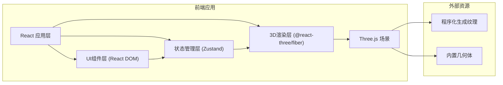

## 1. 架构设计



## 2. 技术选型说明

- **前端框架**：React 18 + TypeScript
- **构建工具**：Vite 5
- **3D渲染**：Three.js + @react-three/fiber + @react-three/drei
- **状态管理**：Zustand
- **动画库**：GSAP (用于摄像机动画)
- **样式方案**：原生CSS + CSS变量 (无需Tailwind，保持轻量)
- **后端**：无 (纯前端应用)
- **数据持久化**：JSON文件导入/导出

### 技术选型理由

1. **@react-three/fiber**：React声明式Three.js渲染，组件化开发3D场景
2. **@react-three/drei**：提供常用Three.js组件（OrbitControls, Text, Grid等），减少重复代码
3. **Zustand**：轻量级状态管理，简单直接，适合中小型应用
4. **GSAP**：专业动画库，流畅的时间线控制，适合摄像漫游路径动画
5. **TypeScript**：类型安全，减少运行时错误，提升可维护性

## 3. 文件结构

```
├── index.html                    # 入口HTML
├── package.json                  # 项目依赖和脚本
├── vite.config.js                # Vite构建配置
├── tsconfig.json                 # TypeScript配置
└── src/
    ├── main.tsx                  # React渲染入口
    ├── App.tsx                   # 根应用组件
    ├── store/
    │   └── sceneStore.ts         # Zustand状态管理
    ├── components/
    │   ├── SceneViewer.tsx       # 3D场景视口组件
    │   ├── ExhibitCreator.tsx    # 左侧展品创建面板
    │   ├── ExhibitPanel.tsx      # 右侧展品属性面板
    │   ├── LightingSystem.tsx    # 灯光控制系统
    │   ├── CameraController.tsx  # 摄像机动画控制
    │   ├── ExhibitMesh.tsx       # 单个展品3D网格组件
    │   └── TopNavbar.tsx         # 顶部导航栏
    ├── utils/
    │   ├── exhibitPresets.ts     # 展品预设配置
    │   ├── textureGenerator.ts   # 程序化纹理生成
    │   └── sceneIO.ts            # 场景导入导出工具
    └── types/
        └── scene.ts              # TypeScript类型定义
```

### 文件调用关系和数据流向

```
main.tsx
    ↓ 渲染
App.tsx
    ├→ 读取 sceneStore (状态)
    ├→ 调用 sceneStore actions (修改状态)
    │
    ├→ TopNavbar.tsx
    │     └→ 调用 exportScene / importScene
    │
    ├→ ExhibitCreator.tsx
    │     └→ 调用 addExhibit
    │
    ├→ SceneViewer.tsx (3D Canvas)
    │     ├→ 读取 exhibits, selectedId, lights, cameraPath
    │     ├→ 调用 selectExhibit, updateTransform
    │     │
    │     ├→ LightingSystem.tsx
    │     │     └→ 读取 lights, 调用 updateLight
    │     │
    │     ├→ CameraController.tsx
    │     │     ├→ 读取 cameraPath
    │     │     └→ 调用 setCameraPath, gsap动画控制
    │     │
    │     └→ ExhibitMesh.tsx (多个)
    │           ├→ 读取 exhibit 数据
    │           └→ 调用 selectExhibit, updateTransform
    │
    └→ ExhibitPanel.tsx
          ├→ 读取 selectedExhibit
          └→ 调用 updateTransform, removeExhibit
```

## 4. 数据模型

### 4.1 类型定义

```typescript
// 展品类型
type ExhibitType = 'pedestal_sculpture' | 'hanging_painting' | 'glass_relic' 
                   | 'glowing_sphere' | 'particle_column' | 'mirror_plane';

// 展品变换
interface Transform {
  position: { x: number; y: number; z: number };
  rotation: { x: number; y: number; z: number };
  scale: number;
}

// 展品数据
interface Exhibit {
  id: string;
  type: ExhibitType;
  transform: Transform;
  color?: string;
  name: string;
}

// 点光源
interface PointLightData {
  id: string;
  position: { x: number; y: number; z: number };
  color: string;
  intensity: number;
}

// 灯光配置
interface LightingConfig {
  ambientIntensity: number;
  ambientColor: string;
  pointLights: PointLightData[];
}

// 摄像机路径类型
type CameraPathType = 'orbit' | 'linear' | 'snake' | 'none';

// 场景状态
interface SceneState {
  exhibits: Exhibit[];
  selectedId: string | null;
  transformMode: 'translate' | 'rotate';
  lighting: LightingConfig;
  cameraPath: CameraPathType;
  isAnimating: boolean;
}
```

### 4.2 Zustand Store Actions

- `addExhibit(type: ExhibitType)`: 添加展品
- `removeExhibit(id: string)`: 删除展品
- `selectExhibit(id: string | null)`: 选中展品
- `updateTransform(id: string, transform: Partial<Transform>)`: 更新展品变换
- `setTransformMode(mode: 'translate' | 'rotate')`: 设置变换模式
- `updatePointLight(id: string, data: Partial<PointLightData>)`: 更新点光源
- `setAmbientIntensity(intensity: number)`: 设置环境光强度
- `setCameraPath(path: CameraPathType)`: 设置摄像机路径
- `toggleAnimation()`: 切换动画播放状态
- `exportScene(): string`: 导出场景JSON
- `importScene(json: string)`: 导入场景

## 5. 关键实现方案

### 5.1 展品渲染方案

每种展品类型使用不同的Three.js几何体和材质组合：

| 展品类型 | 几何体 | 材质 | 特殊属性 |
|---------|--------|------|----------|
| 底座雕塑 | BoxGeometry | MeshStandardMaterial | roughness: 0.6, metalness: 0.3 |
| 悬挂画作 | PlaneGeometry | MeshBasicMaterial | 程序化抽象画纹理 |
| 玻璃柜文物 | BoxGeometry | MeshPhysicalMaterial | transparent, opacity: 0.3, roughness: 0.1 |
| 发光球体 | SphereGeometry | MeshStandardMaterial | emissive, emissiveIntensity: 2 |
| 动态粒子柱 | BufferGeometry + Points | PointsMaterial | 250个随机粒子，大小0.05 |
| 镜像平面 | PlaneGeometry | MeshStandardMaterial | metalness: 1.0, roughness: 0.0 |

### 5.2 选中与拖拽方案

- 点击展品：使用Three.js Raycaster检测鼠标交点
- 选中状态：显示半透明包围盒边框 + 三轴手柄
- 平移手柄：红X、绿Y、蓝Z三个方向箭头，拖拽沿单轴移动
- 旋转手柄：三个环状手柄，绕对应轴旋转
- 键盘切换：T键平移模式，R键旋转模式
- 移动范围限制：X轴 -8~8，Y轴 0~6，Z轴 -8~8

### 5.3 摄像机动画方案

使用GSAP Timeline控制摄像机位置和lookAt点的平滑过渡：

- **环绕旋转**：绕Y轴圆周运动，半径8，周期30秒
- **直线推进**：从(0,3,12)到(0,3,-4)，15秒，EaseInOut
- **蛇形巡视**：左右摆动+前进，幅度4，周期25秒
- 动画期间OrbitControls暂停，可手动暂停/恢复

### 5.4 场景导入导出

- 导出：序列化展品列表、灯光配置、摄像机路径为JSON，触发浏览器下载
- 导入：读取JSON文件，验证格式，重建store状态
- 文件名格式：`exhibit_YYYYMMDD_HHMMSS.json`

## 6. 性能优化

- 展品数量限制：≤20个保持55fps以上
- 几何体复用：同类型展品共享几何体
- 材质实例化：相同材质参数共享材质实例
- 粒子系统：使用BufferGeometry批量渲染
- 状态更新：Zustand选择器避免不必要重渲染
- 响应式：根据屏幕尺寸调整渲染分辨率
