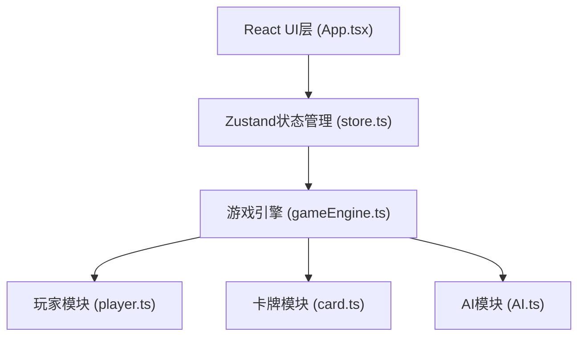

## 1. 架构设计



## 2. 技术描述

- **前端框架**：React 18 + TypeScript
- **构建工具**：Vite
- **状态管理**：Zustand
- **样式方案**：原生CSS + CSS变量（深色奇幻主题）
- **动画方案**：CSS Transitions + Keyframes动画

## 3. 路由定义

| 路由 | 用途 |
|-------|---------|
| / | 游戏主界面（包含游戏进行和结束状态） |

## 4. 核心数据结构

### 4.1 卡牌类型定义

```typescript
type CardType = 'minion' | 'spell' | 'weapon';

interface BaseCard {
  id: string;
  name: string;
  cost: number;
  type: CardType;
  description: string;
  image?: string;
}

interface MinionCard extends BaseCard {
  type: 'minion';
  attack: number;
  health: number;
  taunt?: boolean;  // 嘲讽
}

interface SpellCard extends BaseCard {
  type: 'spell';
  effect: SpellEffect;
}

interface WeaponCard extends BaseCard {
  type: 'weapon';
  attack: number;
  durability: number;
}

type Card = MinionCard | SpellCard | SpellCard;
```

### 4.2 战场随从

```typescript
interface BoardMinion {
  instanceId: string;
  cardId: string;
  name: string;
  attack: number;
  maxHealth: number;
  currentHealth: number;
  canAttack: boolean;
  taunt?: boolean;
}
```

### 4.3 玩家状态

```typescript
interface PlayerState {
  id: 'player' | 'ai';
  hero: {
    health: number;
    maxHealth: number;
    attack: number;
  };
  mana: {
    current: number;
    max: number;
  };
  weapon: {
    attack: number;
    durability: number;
  } | null;
  hand: Card[];
  deck: Card[];
  board: (BoardMinion | null)[][];  // 3行 x 4列
}
```

### 4.4 游戏状态

```typescript
interface GameState {
  turn: number;
  currentPlayer: 'player' | 'ai';
  phase: 'draw' | 'main' | 'combat' | 'end';
  player: PlayerState;
  ai: PlayerState;
  selectedCardIndex: number | null;
  selectedMinion: { row: number; col: number } | null;
  gameOver: boolean;
  winner: 'player' | 'ai' | null;
  isAiThinking: boolean;
}
```

## 5. 模块职责

### 5.1 card.ts
- 定义卡牌类型接口
- 提供15+张预设卡牌数据
- 定义法术效果接口

### 5.2 player.ts
- 玩家状态创建与初始化
- 手牌管理（抽牌、弃牌）
- 法力水晶管理
- 生命值、武器状态管理
- 战场格子管理

### 5.3 gameEngine.ts
- 回合流程控制
- 出牌验证与执行
- 随从攻击结算
- 法术效果执行
- 胜负判定
- 事件触发机制

### 5.4 AI.ts
- 基于评分的出牌决策
- 攻击目标选择策略
- 1秒思考延迟

### 5.5 store.ts
- Zustand全局状态管理
- 封装状态更新方法
- 提供选择器

### 5.6 App.tsx
- 战场区域渲染（双方3x4格子）
- 手牌区渲染与交互
- 英雄信息面板
- 用户点击事件处理
- 动画效果实现
