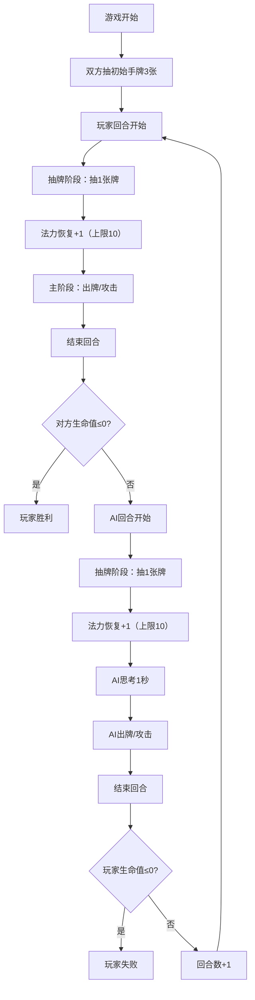

## 1. 产品概述

一款基于Web的回合制卡牌对战游戏，玩家与AI对手轮流出牌、召唤随从、使用法术和武器，以将对方英雄生命值降至0为目标获取胜利。

- 核心玩法：策略卡牌对战，融合随从召唤、法术施放、武器装备等机制
- 目标用户：喜欢策略类卡牌游戏的休闲玩家

## 2. 核心功能

### 2.1 用户角色

| 角色 | 说明 | 核心权限 |
|------|------|----------|
| 玩家 | 人类玩家，对战AI | 出牌、召唤随从、发动攻击、结束回合 |
| AI | 计算机对手 | 自动决策出牌和攻击策略 |

### 2.2 功能模块

1. **游戏主界面**：战场渲染、手牌区、英雄信息面板、法力水晶显示
2. **卡牌系统**：随从卡、法术卡、武器卡，共15+种不同效果卡牌
3. **回合系统**：抽牌阶段、主阶段、战斗阶段、结束阶段
4. **战斗系统**：随从攻击、英雄攻击、伤害计算、随从消灭
5. **AI系统**：基于评分策略的自动决策
6. **游戏状态管理**：生命值、手牌、战场、法力、牌库状态同步
7. **胜负判定**：游戏结束、胜利/失败画面、重新开始

### 2.3 页面详情

| 页面名称 | 模块名称 | 功能描述 |
|-----------|-------------|---------------------|
| 游戏主界面 | 英雄信息区 | 显示双方英雄头像、生命值、法力水晶、武器状态 |
| 游戏主界面 | 战场区域 | 双方各3x4格子棋盘，显示已召唤随从 |
| 游戏主界面 | 手牌区 | 扇形展开的手牌，点击选中后可使用 |
| 游戏主界面 | 回合信息 | 当前回合数、当前回合玩家指示 |
| 游戏结束界面 | 结果展示 | 胜利/失败画面及重新开始按钮 |

## 3. 核心流程

玩家与AI轮流进行回合，每回合包含：抽牌→法力恢复+成长→主阶段（出牌/攻击）→结束回合。当一方生命值降至0时游戏结束。

## 4. 用户界面设计

### 4.1 设计风格
- **主色调**：深紫到黑色渐变背景(#1a0a2e → #0a0a1a)
- **己方边框**：亮蓝色(#3b82f6)
- **对方边框**：暗红色(#dc2626)
- **选中高亮**：金色边框
- **整体风格**：深色奇幻风，神秘魔法氛围

### 4.2 页面设计概览

| 页面名称 | 模块名称 | UI元素 |
|-----------|-------------|-------------|
| 游戏主界面 | 英雄信息 | 圆形头像带彩色边框，生命值数字滚动动画，法力水晶蓝色圆点 |
| 游戏主界面 | 战场格子 | 3x4网格，蓝色/红色边框，hover高亮，放置随从时显示卡牌缩略图 |
| 游戏主界面 | 手牌区 | 扇形展开，卡牌悬浮放大，选中金色边框，出牌飞行动画 |
| 游戏主界面 | 攻击效果 | 屏幕震动，伤害数字，随从消灭动画 |
| 游戏结束界面 | 结果页 | 居中大标题（胜利/失败），发光效果，重新开始按钮 |

### 4.3 响应式设计
- 桌面优先设计，适配1920x1080和1440x900
- 使用CSS Grid和Flexbox实现自适应布局
- 卡牌尺寸、字体大小根据视口宽度动态调整
