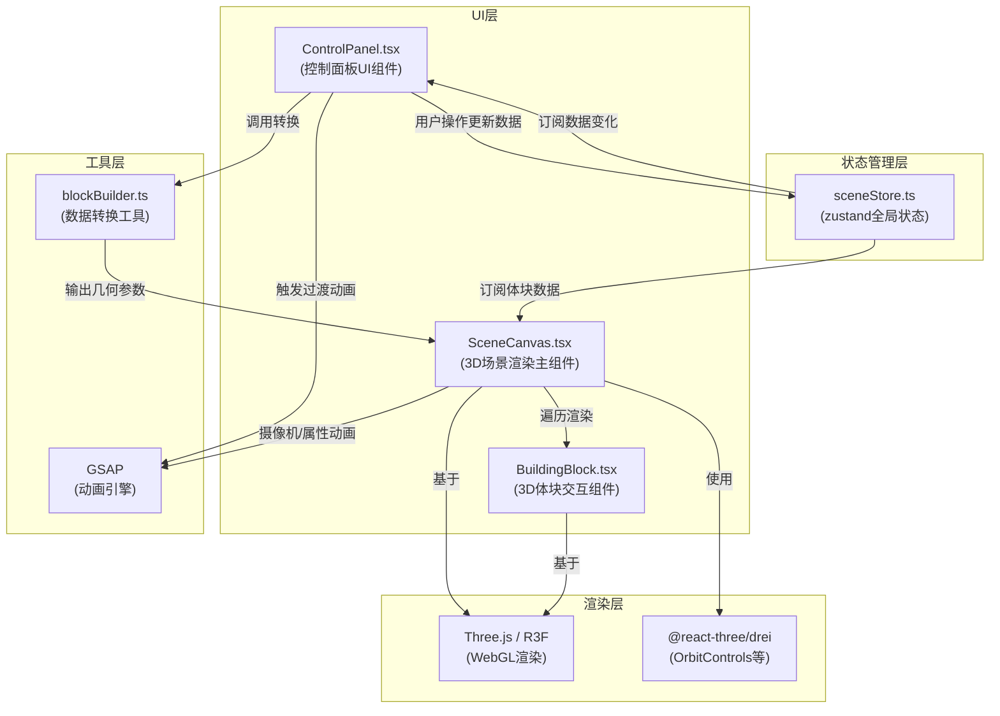
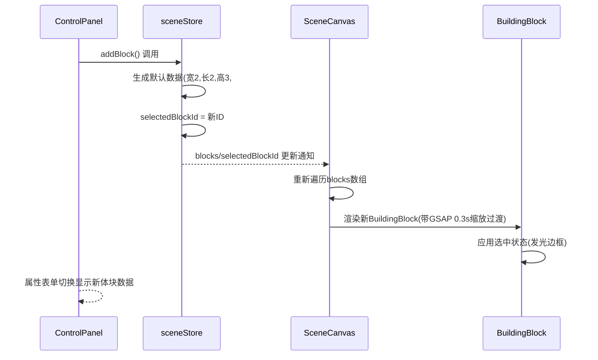
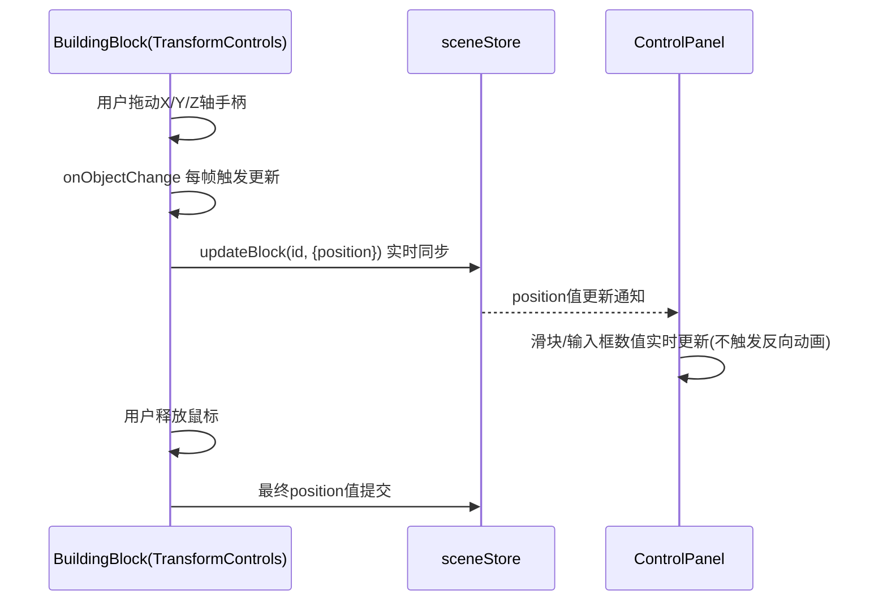

## 1. 架构设计



## 2. 技术说明

- **前端框架**: React 18 + TypeScript 5 (严格模式)
- **构建工具**: Vite 5
- **3D渲染引擎**: three@^0.160.0
- **React 3D绑定**: @react-three/fiber@^8.15.0, @react-three/drei@^9.92.0
- **状态管理**: zustand@^4.4.0
- **动画引擎**: gsap@^3.12.0
- **样式方案**: 原生CSS + CSS变量（不使用Tailwind，因需精细自定义滑块/毛玻璃效果）
- **无后端**: 纯前端应用，数据仅保存在内存store中

## 3. 文件结构定义

```
auto22/
├── package.json              # 依赖与脚本配置
├── vite.config.js            # Vite构建配置
├── tsconfig.json             # TypeScript严格模式配置
├── index.html                # 入口HTML(标题+加载动画)
└── src/
    ├── main.tsx              # React入口
    ├── App.tsx               # 根组件(布局容器)
    ├── App.css               # 全局样式(CSS变量+响应式)
    ├── store/
    │   └── sceneStore.ts     # zustand状态管理(体块数据/选中ID/视角)
    ├── components/
    │   ├── SceneCanvas.tsx   # 3D场景主组件(灯光/相机/网格/体块遍历)
    │   ├── ControlPanel.tsx  # 控制面板(列表/属性/批量操作)
    │   └── BuildingBlock.tsx # 单体块3D组件(边框/选中高亮/标签)
    └── utils/
        └── blockBuilder.ts   # 数据转换工具(属性→几何参数/颜色插值)
```

## 4. 数据模型

### 4.1 核心数据结构

```typescript
// 建筑体块数据模型
interface BuildingBlockData {
  id: string;              // UUID唯一标识
  name: string;            // 体块名称(可编辑)
  position: { x: number; y: number; z: number };  // 空间位置(-10~10)
  dimensions: { width: number; length: number; height: number };  // 尺寸(宽0.5-5,长0.5-5,高0.5-10)
  color: string;           // 十六进制颜色值
  opacity: number;         // 透明度(默认0.85)
  isSelected?: boolean;    // 是否选中(计算属性)
}

// 摄像机视角参数
interface CameraView {
  position: [number, number, number];
  target: [number, number, number];
}

// Store状态
interface SceneState {
  // 数据
  blocks: BuildingBlockData[];
  selectedBlockId: string | null;
  isPanelCollapsed: boolean;
  
  // 增删改操作
  addBlock: (block?: Partial<BuildingBlockData>) => string;
  updateBlock: (id: string, updates: Partial<BuildingBlockData>) => void;
  deleteBlock: (id: string) => void;
  duplicateBlock: (id: string) => void;
  selectBlock: (id: string | null) => void;
  
  // 面板操作
  togglePanel: () => void;
  setPanelCollapsed: (v: boolean) => void;
  
  // 批量操作
  applyHeightColorMapping: () => void;
}
```

## 5. 关键数据流与交互时序

### 5.1 新建体块数据流


### 5.2 拖拽变换数据流


### 5.3 按高度着色流程
```mermaid
algorithm "按高度着色"
    input: blocks数组(含各体块height)
    output: 更新每个block的color属性
    
    1. 遍历blocks找出minHeight和maxHeight
    2. 若maxHeight === minHeight,全部使用中间色#2ecc71,结束
    3. 定义色带控制点:
       - t=0 → #3498db(蓝)
       - t=0.5 → #2ecc71(绿)
       - t=1 → #e74c3c(红)
    4. 对每个block:
       a. t = (height - minHeight) / (maxHeight - minHeight)
       b. 根据t所在区间在相邻两色间线性插值RGB
       c. updateBlock(id, {color: 插值结果})
end
```

## 6. 性能优化策略

| 优化点 | 方案 |
|--------|------|
| 体块数量限制 | Store中`addBlock`前校验`blocks.length < 50`，超限提示 |
| 减少重渲染 | BuildingBlock使用`React.memo`，仅当自身数据变化时更新 |
| 动画性能 | GSAP直接操作Three.js对象矩阵，不触发React重渲染 |
| 拖拽节流 | TransformControls使用R3F原生事件，每帧update而非setState |
| 材质复用 | 相同颜色/透明度的体块共享MeshStandardMaterial实例 |
| 几何复用 | 相同尺寸体块共享BoxGeometry实例（可选优化） |

## 7. 依赖版本锁定

```json
{
  "react": "^18.2.0",
  "react-dom": "^18.2.0",
  "three": "^0.160.0",
  "@react-three/fiber": "^8.15.12",
  "@react-three/drei": "^9.92.7",
  "zustand": "^4.4.7",
  "gsap": "^3.12.4",
  "@types/react": "^18.2.43",
  "@types/react-dom": "^18.2.17",
  "@types/three": "^0.160.0",
  "typescript": "^5.3.3",
  "vite": "^5.0.8"
}
```
