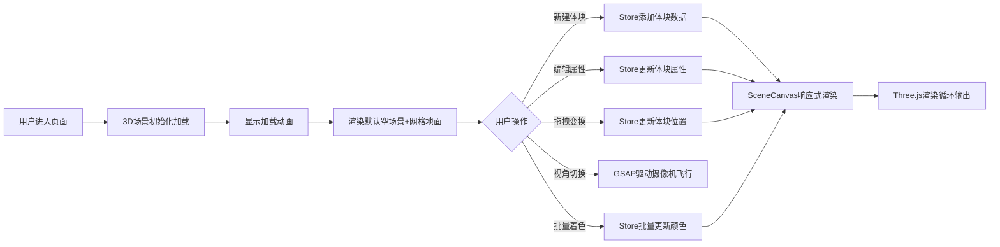

## 1. 产品概述

3D城市建筑体块编辑器是一款面向城市规划设计师和建筑可视化从业者的在线工具，用于快速将BIM或GIS数据中的建筑体块在三维场景中按空间位置排列，并通过动态调整高度和颜色展示容积率或用途分区。产品旨在提供直观、高效的体块编辑与场景漫游体验，降低规划方案可视化的门槛。

## 2. 核心特性

### 2.1 功能模块
1. **场景渲染模块**：基于Three.js的3D视口，支持建筑体块渲染、光源设置、地面网格、视角控制
2. **数据编辑模块**：建筑体块的增删改查、属性编辑、批量颜色映射
3. **交互操作模块**：拖拽变换手柄、场景漫游、预设视角切换
4. **控制面板UI**：体块列表管理、属性表单、操作按钮、响应式布局

### 2.2 页面详情

| 页面名称 | 模块名称 | 功能描述 |
|-----------|-------------|---------------------|
| 主编辑器页面 | 3D视口 | 占页面70%宽度、100%高度，暗紫灰色背景，半透明浅色网格地面，渲染所有建筑体块 |
| 主编辑器页面 | 左侧控制面板 | 300px宽毛玻璃面板，可折叠，包含应用名、新建/导入按钮、体块列表、属性编辑、批量操作 |
| 主编辑器页面 | 视角控制区 | 三个预设视角按钮（俯视/侧视/前视），OrbitControls鼠标拖拽旋转+滚轮缩放 |
| 主编辑器页面 | 体块交互层 | 选中体块显示XYZ拖拽手柄、悬浮标签（名称+高度）、选中高亮发光效果 |

## 3. 核心流程

### 3.1 体块创建与编辑流程
用户进入页面 → 点击"新建体块" → 场景原点生成默认灰色立方体并自动选中 → 面板中显示属性表单 → 修改名称/位置/尺寸/颜色 → 3D体块实时平滑更新

### 3.2 场景交互流程
用户拖拽旋转视角 / 滚轮缩放 → OrbitControls响应 → 场景更新 → 点击体块选中 → 显示拖拽手柄和标签 → 拖动手柄移动体块 → 位置数值同步到面板

### 3.3 批量操作流程
点击"按高度着色" → 计算所有体块高度比例 → 映射到三段色带（蓝→绿→红）→ 更新每个体块颜色 → 面板体块列表颜色同步

## 4. 用户界面设计

### 4.1 设计风格
- **主色调**：暗紫灰色背景 `#1c1c2e`，科技感暗色主题
- **强调色**：蓝色 `#4a90d9`（默认体块色）、亮蓝色 `#00d4ff`（选中高亮）、三色带 `#3498db / #2ecc71 / #e74c3c`
- **按钮风格**：圆角8px，白色文字，悬停微透明变化，毛玻璃面板背景 `rgba(28,28,46,0.85)` 带10px模糊
- **字体**：系统无衬线字体 `system-ui, sans-serif`，默认13px
- **体块列表卡片**：上下内边距12px，左边框3px体块色指示条，悬停背景 `rgba(255,255,255,0.05)`

### 4.2 页面设计概览

| 区域 | 模块 | UI元素 |
|-----------|-------------|-------------|
| 3D视口 (70%宽) | 场景画布 | 半透明网格地面、方向光+环境光、建筑体块立方体、选中高亮边框发光、轴向拖拽手柄、悬浮标签、加载动画 |
| 控制面板 (300px) | 顶部栏 | 应用名"体块编辑器"、新建体块按钮、导入按钮、折叠切换按钮 |
| 控制面板 | 视角快捷栏 | 俯视/侧视/前视三个图标按钮，圆角8px |
| 控制面板 | 体块列表 | 可滚动卡片列表，每张卡片含名称、颜色指示条、复制/删除图标按钮 |
| 控制面板 | 属性编辑区 | 名称输入框、X/Y/Z/宽/长/高数值滑块（0.5-10范围）、颜色选择器（20预设+自定义） |
| 控制面板 | 批量操作区 | "按高度着色"按钮、三段色带预览条 |

### 4.3 响应式设计
- **桌面端 (>1024px)**：控制面板左侧固定300px宽，3D视口占剩余70%宽度
- **移动端/平板 (<=1024px)**：控制面板改为底部弹出式抽屉，高度35vh，顶部圆角16px，可上下滑动
- **触控优化**：滑块加大触控区域，按钮最小尺寸44px

### 4.4 3D场景指引
- **环境氛围**：暗紫灰夜色感，低饱和整体色调，体块颜色作为视觉焦点
- **灯光设置**：一盏方向光（模拟太阳，白色，强度0.8）+ 半球环境光（天空色`#87ceeb`/地面色`#2c3e50`，强度0.4）+ 选中体块的点光源发光
- **摄像机设置**：PerspectiveCamera，初始位置`(10,10,10)`看向原点，OrbitControls缩放范围1-20单位
- **合成与焦点**：体块边缘细线边框增强轮廓感，选中时边缘发光`#00d4ff`，地面网格半透明增强空间感
- **交互动画**：所有属性变更使用GSAP 0.3s平滑过渡，删除体块0.4s ease-out缩放至0消失，视角切换0.8s power2-out缓动
- **性能预算**：最多50个体块同时渲染，帧率稳定60fps，拖拽响应延迟<50ms
