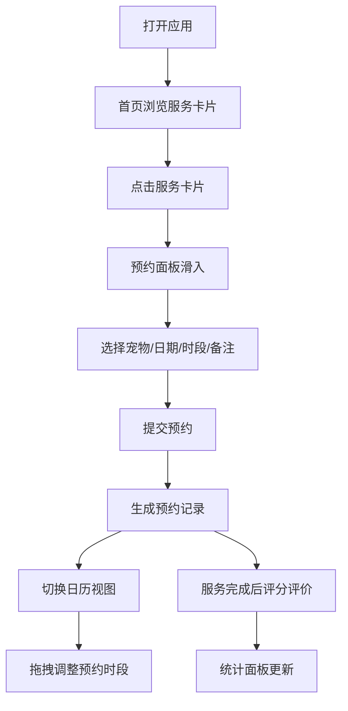

## 1. 产品概述

宠物美容服务预约管理应用是一款面向宠物主人的在线预约与协作管理工具，解决宠物主人难以统一管理不同美容店项目、预约时间和评价反馈的问题。用户可以浏览美容服务、预约时间、管理多只宠物档案、查看日历视图并进行评价。

## 2. 核心功能

### 2.1 用户角色
| 角色 | 注册方式 | 核心权限 |
|------|---------|----------|
| 普通用户 | 无需注册，本地使用 | 浏览服务、预约管理、宠物档案管理、评价提交 |

### 2.2 功能模块
1. **首页服务浏览**：6种常见美容服务卡片展示，点击弹出预约面板
2. **预约面板**：半屏弹出，选择日期/时段/备注，提交生成预约
3. **日历视图**：7天周视图展示预约，支持拖拽调整时段
4. **宠物档案管理**：侧栏网格展示，支持增删改，查看历史预约与评价
5. **评价与统计**：1-5星打分评价，首页展示统计面板（服务次数、平均评分、最近评价）

### 2.3 页面详情
| 页面名称 | 模块名称 | 功能描述 |
|---------|---------|----------|
| 首页 | 服务卡片展示 | 6种美容服务卡片（名称/图片/价格/时长），hover上浮放大效果 |
| 首页 | 预约面板 | 右侧滑入半屏面板，日期选择（未来7天）、时段选择（9-18点/小时）、备注输入 |
| 首页 | 统计面板 | 总计服务次数、平均评分、最近3条评价预览 |
| 日历页 | 周视图 | 7天×时段网格，预约卡片展示，拖拽调整时段 |
| 全局 | 侧栏宠物档案 | 网格卡片展示宠物列表，点击查看详情和历史预约 |
| 全局 | 顶部导航栏 | 浅木纹色毛玻璃，项目名称居左，首页/日历切换 |

## 3. 核心流程

用户打开应用 → 首页浏览6种美容服务 → 点击服务卡片弹出预约面板 → 选择宠物、日期、时段、填写备注 → 提交预约 → 切换到日历视图查看/拖拽调整 → 服务完成后评分评价 → 首页统计面板更新。

## 4. 用户界面设计

### 4.1 设计风格
- 主背景色：米白色 #fef9f2
- 导航栏：浅木纹色 rgba(232,220,204,0.85)，毛玻璃效果 backdrop-filter: blur(8px)
- 卡片：白底 #ffffff，浅灰边框 #e0d6c8，圆角 12px
- 已完成预约背景：淡绿色 #e8f5e9，未完成：浅橙色 #fff3e0
- 强调色：#4caf50（绿色）用于完成状态、边框
- 交互：hover上浮3px阴影+scale1.02，0.3s过渡；按钮点击水波纹效果
- 字体：选用温馨优雅的无衬线字体

### 4.2 页面设计概览
| 页面名称 | 模块名称 | UI元素 |
|---------|---------|--------|
| 首页 | 服务卡片 | 12px圆角、白底浅灰边、hover上浮放大、色块占位图 |
| 首页 | 预约面板 | 右侧translateX滑入(0.35s)、半透明遮罩#00000040 |
| 首页 | 统计面板 | 暖色调卡片，展示次数、评分、评价列表 |
| 日历页 | 周视图 | 7天网格，时段列，拖拽跟随副本(8px圆角/#4caf50边/白底) |
| 全局 | 侧栏 | 280px宽，宠物档案网格，<1024px折叠为底部导航🐾 |
| 全局 | 顶部导航 | 毛玻璃木纹色，居左项目名，导航切换 |

### 4.3 响应式设计
- 桌面优先设计（Desktop-first）
- 宽度范围：768px - 1920px 良好适配
- 断点 <1024px：侧栏折叠为底部导航栏（🐾图标）
- 主内容区自适应剩余宽度
- 日历视图最多50条预约，使用虚拟列表/分批渲染保持60FPS

