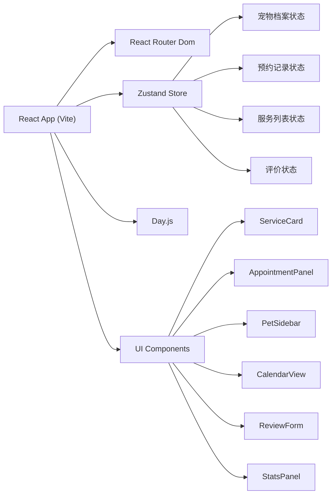
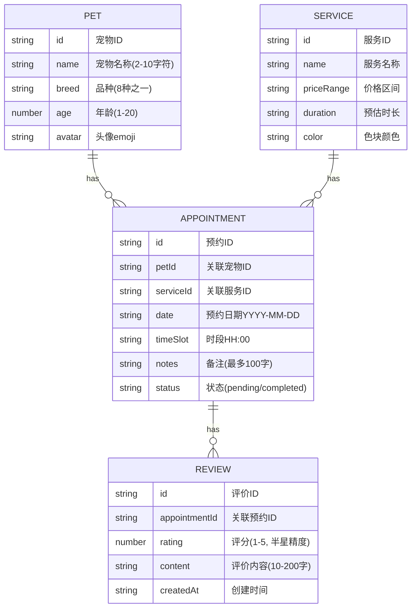

## 1. 架构设计



## 2. 技术描述
- 前端：React@18 + TypeScript + Vite
- 路由：react-router-dom
- 状态管理：zustand
- 日期处理：dayjs
- 样式：原生CSS（CSS Modules / 全局样式），CSS变量管理主题色
- 无后端，使用本地状态模拟数据

## 3. 路由定义
| 路由 | 用途 |
|-----|------|
| / | 首页，展示服务卡片和统计面板 |
| /calendar | 日历视图，7天周预约展示 |

## 4. 数据模型

### 4.1 数据模型定义



### 4.2 TypeScript 类型定义
```typescript
type Breed = '泰迪' | '金毛' | '英短' | '布偶' | '比熊' | '柯基' | '美短' | '哈士奇';
type AvatarEmoji = '🐶' | '🐱' | '🐰' | '🐹';

interface Pet {
  id: string;
  name: string;
  breed: Breed;
  age: number;
  avatar: AvatarEmoji;
}

interface Service {
  id: string;
  name: string;
  priceRange: string;
  duration: string;
  color: string;
}

interface Appointment {
  id: string;
  petId: string;
  serviceId: string;
  date: string;
  timeSlot: string;
  notes: string;
  status: 'pending' | 'completed';
}

interface Review {
  id: string;
  appointmentId: string;
  rating: number;
  content: string;
  createdAt: string;
}
```

## 5. 项目文件结构
```
d:\P\tasks\auto23/
├── package.json
├── index.html
├── tsconfig.json
├── vite.config.js
└── src/
    ├── main.tsx
    ├── App.tsx
    ├── store/
    │   └── petStore.ts
    ├── components/
    │   ├── ServiceCard.tsx
    │   ├── AppointmentPanel.tsx
    │   ├── PetSidebar.tsx
    │   ├── CalendarView.tsx
    │   ├── ReviewForm.tsx
    │   ├── StatsPanel.tsx
    │   └── StarRating.tsx
    ├── pages/
    │   ├── HomePage.tsx
    │   └── CalendarPage.tsx
    ├── types/
    │   └── index.ts
    └── styles/
        └── global.css
```

## 6. 性能优化
- 日历视图：使用CSS transform优化拖拽动画，避免重排
- 预约列表：最多50条预约，使用分批渲染策略
- 响应式：使用CSS媒体查询，<1024px侧栏折叠
- 动画：使用CSS transition/transform而非JS动画，保持60FPS
- 状态管理：zustand轻量级，避免不必要的重渲染
