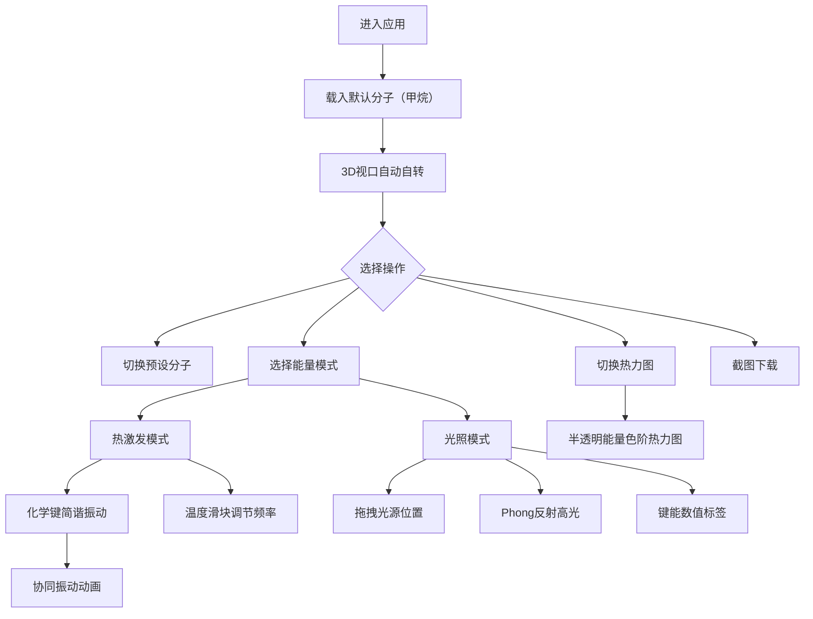

## 1. 产品概述

分子振子（MoleculeVibrator）是一个浏览器端3D分子结构可视化应用，让用户以交互方式观察分子的化学键振动与能量分布。目标用户为化学教育工作者、学生及科研人员，通过直观的3D动画与热力图叠加，帮助理解分子振动和光照效应。

## 2. 核心功能

### 2.1 用户角色

| 角色 | 注册方式 | 核心权限 |
|------|----------|----------|
| 访客 | 无需注册 | 浏览所有分子模型、切换能量模式、截图下载 |

### 2.2 功能模块

1. **3D分子视口页面**：中央3D渲染区域、左侧应用标题、右侧控制面板

### 2.3 页面详情

| 页面名称 | 模块名称 | 功能描述 |
|----------|----------|----------|
| 主页面 | 3D分子视口 | 渲染原子球体、化学键圆柱、热力图叠加，支持鼠标拖拽旋转与滚轮缩放，分子自动缓慢自转 |
| 主页面 | 控制面板 | 分子预设选择（甲烷/苯环/咖啡因）、能量模式切换（热激发/光照）、温度滑块、热力图开关、截图下载按钮 |
| 主页面 | 光源指示器 | 光照模式下可拖拽的黄色光点，实时更新Phong反射高光与键能数值标签 |
| 主页面 | 应用标题 | 左上角"分子振子"标题，细黑字体加蓝色发光描边 |

## 3. 核心流程

用户进入应用后，3D视口自动载入甲烷分子并缓慢自转。用户可通过右侧控制面板切换预设分子（甲烷、苯环、咖啡因），选择能量模式（热激发或光照）后激活对应动画。热激发模式下化学键做简谐振动，温度滑块控制频率；光照模式下可拖拽光源位置，实时计算Phong反射与键能变化。热力图开关可叠加半透明能量色阶在分子表面。用户可随时截图下载PNG。

## 4. 用户界面设计

### 4.1 设计风格

- **主色调**：深色科技蓝主题，背景径向渐变 #0b0e1a → #0a0e1a
- **强调色**：#00bfff（蓝色发光）、#00f0ff（青色高亮）
- **文本色**：白色 / #e0e0e0（浅灰）
- **按钮风格**：悬停蓝色发光描边（0.5px #00bfff，0.3s线性过渡），点击收缩动画（scale 0.95，0.15s）
- **字体**：细黑（Light weight）+ 发光描边效果
- **布局**：左侧标题 + 中央3D视口（70%宽）+ 右侧毛玻璃控制面板（280px宽）
- **面板风格**：毛玻璃效果 rgba(10,14,26,0.85) + 12px模糊，左边框 1px #00bfff40

### 4.2 页面设计概览

| 页面名称 | 模块名称 | UI元素 |
|----------|----------|--------|
| 主页面 | 应用标题 | 细黑字体、蓝色#00bfff发光描边、左上角定位 |
| 主页面 | 3D分子视口 | 深色背景、彩色原子球体、白色半透明化学键圆柱、热力图叠加层 |
| 主页面 | 控制面板 | 毛玻璃背景、分子载入卡片（带icon）、能量模式切换、温度滑块、热力图开关、截图按钮、可折叠为窄边 |
| 主页面 | 光源指示器 | 黄色发光圆点（半径12px）、柔光阴影、可拖拽 |

### 4.3 响应式

桌面优先设计，3D视口占70%宽度，控制面板280px固定宽度浮于右侧。小屏幕下面板可折叠收起。

### 4.4 3D场景指引

- **环境**：深色径向渐变背景，无HDRI，纯色场景
- **光照**：环境光 + 定向光基础照明；光照模式下增加用户可拖拽点光源
- **相机**：透视相机，初始距离3单位，鼠标拖拽旋转，滚轮缩放0.5-5倍
- **构图**：分子自动居中，Y轴缓慢自转（0.3 rad/s）
- **交互**：鼠标拖拽旋转、滚轮缩放、光源拖拽
- **动画**：热激发简谐振动（60FPS，低于30FPS自动降精度）、光照Phong反射实时更新
- **后处理**：发光描边效果通过CSS实现，无额外后处理通道
- **性能预算**：原子数≤24时保持60FPS

## 5. 分子数据规格

| 分子 | 化学式 | 原子数 | 化学键数 |
|------|--------|--------|----------|
| 甲烷 | CH₄ | 5 | 4 |
| 苯环 | C₆H₆ | 12 | 12 |
| 咖啡因 | C₈H₁₀N₄O₂ | 24 | 25 |
