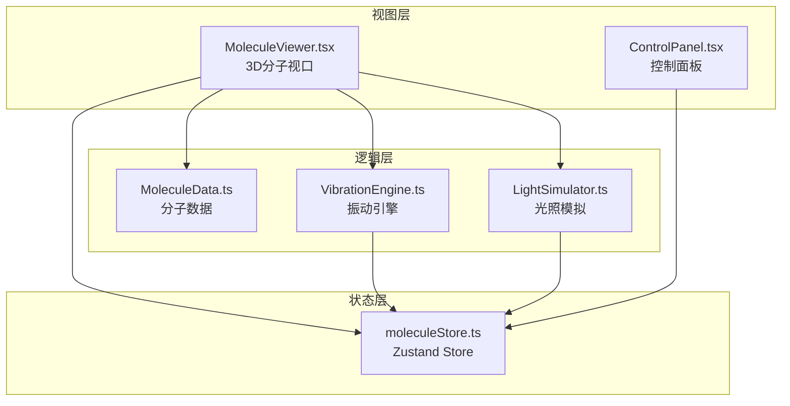

## 1. 架构设计



## 2. 技术说明

- **前端框架**：React 18 + TypeScript（严格模式）
- **3D渲染**：Three.js + @react-three/fiber + @react-three/drei
- **状态管理**：Zustand
- **构建工具**：Vite + @vitejs/plugin-react
- **样式方案**：CSS-in-JS（内联样式 + CSS模块）
- **后端**：无
- **数据库**：无

## 3. 路由定义

| 路由 | 用途 |
|------|------|
| / | 单页应用主页面，包含3D视口与控制面板 |

## 4. 数据模型

### 4.1 核心数据结构

```typescript
interface Atom {
  id: string;
  element: string;
  position: [number, number, number];
  radius: number;
  color: string;
}

interface Bond {
  id: string;
  atomAId: string;
  atomBId: string;
  order: number;
  equilibriumLength: number;
  energy: number;
}

interface MoleculePreset {
  id: string;
  name: string;
  formula: string;
  atoms: Atom[];
  bonds: Bond[];
}
```

### 4.2 Store状态定义

```typescript
interface MoleculeState {
  currentMoleculeId: string;
  energyMode: 'thermal' | 'light' | 'none';
  temperature: number;
  heatmapEnabled: boolean;
  lightPosition: [number, number];
  panelCollapsed: boolean;
  setCurrentMolecule: (id: string) => void;
  setEnergyMode: (mode: 'thermal' | 'light' | 'none') => void;
  setTemperature: (temp: number) => void;
  setHeatmapEnabled: (enabled: boolean) => void;
  setLightPosition: (pos: [number, number]) => void;
  setPanelCollapsed: (collapsed: boolean) => void;
}
```

## 5. 文件结构

```
project/
├── package.json
├── index.html
├── tsconfig.json
├── vite.config.ts
└── src/
    ├── main.tsx
    ├── App.tsx
    ├── view/
    │   ├── MoleculeViewer.tsx
    │   └── ControlPanel.tsx
    ├── logic/
    │   ├── MoleculeData.ts
    │   ├── VibrationEngine.ts
    │   └── LightSimulator.ts
    └── store/
        └── moleculeStore.ts
```

## 6. 模块职责

### MoleculeViewer.tsx
- 初始化Three.js场景、透视相机、环境光与定向光
- 渲染原子球体（SphereGeometry + MeshStandardMaterial）
- 渲染化学键圆柱（CylinderGeometry + 半透明白色材质）
- 渲染能量热力图（半透明球壳，颜色映射蓝→绿→红）
- 处理鼠标拖拽旋转（OrbitControls）与滚轮缩放（0.5-5倍）
- 驱动每帧动画循环（requestAnimationFrame）
- 暴露截图方法（renderer.domElement.toDataURL）

### ControlPanel.tsx
- 分子预设选择卡片（甲烷/苯环/咖啡因，带icon）
- 能量模式切换按钮（热激发/光照）
- 温度滑块（0.5Hz-3Hz）
- 热力图开关
- 截图下载按钮
- 面板折叠/展开功能

### MoleculeData.ts
- 定义Atom、Bond、MoleculePreset数据结构
- 原子半径映射表（C: 0.4, H: 0.25, O: 0.35, N: 0.35）
- 原子颜色映射表（C: #808080, H: #ffffff, O: #ff0000, N: #0000ff）
- 预设分子生成函数：createMethane()、createBenzene()、createCaffeine()

### VibrationEngine.ts
- 简谐振动计算：position = equilibrium + amplitude * sin(2π * frequency * t + phase)
- 每个键随机振幅（0.05-0.2）和相位
- 频率由温度滑块控制（0.5-3Hz）
- 协同振动：相邻同类型原子的相位差形成波传递效果
- FPS自适应：低于30FPS时降低振动计算精度
- 输出 Map<原子ID, Vector3偏移量>

### LightSimulator.ts
- 光源位置跟踪（2D屏幕坐标转3D空间方向）
- Phong光照模型计算（环境光 + 漫反射 + 镜面反射）
- 键能随光照角度变化计算
- 能量阈值判定（超过阈值返回红色闪烁标记）
