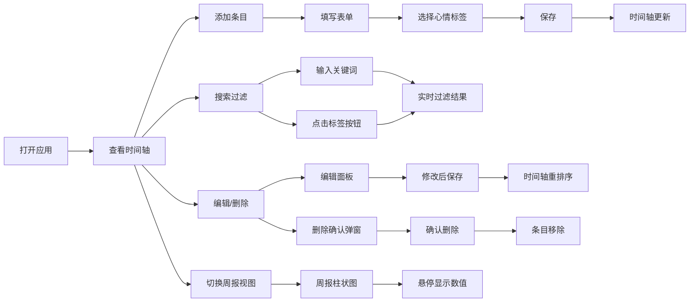

## 1. 产品概述

数字足迹日记本是一款轻量级的个人数字生活记录工具，帮助用户系统地回顾和记录每日浏览的网页、观看的视频和阅读的文章。通过日历化的时间轴视图和心情标签系统，用户可以捕捉每日数字生活的精华片段，并以周报形式洞察自己的数字消费习惯。

- **核心价值**：解决信息过载时代用户难以沉淀和回顾数字消费内容的痛点
- **目标用户**：经常浏览网络内容、希望记录和反思自己数字生活的人群
- **产品定位**：极简风格的个人数字生活日记本

## 2. 核心功能

### 2.1 功能模块

1. **时间轴视图**：按月分组展示数字足迹条目，支持搜索和标签过滤
2. **条目管理**：添加、编辑、删除数字足迹条目（标题、来源、摘要、心情标签）
3. **周报统计**：以柱状图展示本周每天各心情标签的出现频率
4. **内容渲染**：支持Markdown语法渲染摘要内容

### 2.2 页面详情

| 页面名称 | 模块名称 | 功能描述 |
|-----------|-------------|---------------------|
| 主页面 | 时间轴列表 | 纵向时间轴展示所有条目，按月分组，支持卡片展开/收起 |
| 主页面 | 搜索过滤栏 | 关键词搜索和心情标签过滤按钮组 |
| 主页面 | 添加条目浮窗 | 右侧浮窗表单，填写标题、来源网址、Markdown摘要、心情标签 |
| 主页面 | 编辑面板 | 半屏弹出式编辑面板，修改条目内容 |
| 周报页面 | 心情统计柱状图 | 本周（周一至周日）每天各心情标签出现次数统计 |
| 全局 | 导航栏 | 顶部导航，切换时间轴/周报视图，添加条目按钮 |

## 3. 核心流程

### 3.1 添加条目流程
用户点击右上角"添加"按钮 → 右侧浮窗展开 → 填写标题、来源网址、Markdown摘要 → 选择心情标签（兴奋/沉思/无聊/焦虑）→ 点击保存 → 条目按日期自动排序加入时间轴

### 3.2 搜索过滤流程
用户在搜索框输入关键词 → 实时过滤标题和摘要中包含该词的条目 → 点击标签过滤按钮 → 仅显示该标签的条目 → 再次点击取消过滤

### 3.3 编辑删除流程
用户点击卡片上的编辑按钮 → 半屏编辑面板弹出 → 修改内容后保存 → 时间轴自动重新排序；点击删除按钮 → 二次确认弹窗 → 确认后条目移除

### 3.4 周报查看流程
用户点击导航栏"周报" → 切换到统计视图 → 显示本周每天各心情标签的柱状图 → 鼠标悬停显示具体数值

## 4. 用户界面设计

### 4.1 设计风格
- **整体风格**：日式极简风格，柔和温暖的视觉感受
- **主背景色**：米白色 #faf8f5
- **卡片背景**：纯白色 #ffffff，边框 #e8e4e0，圆角 12px
- **主色调**：蓝色 #4a90d9（用于时间节点、搜索框焦点）
- **心情标签配色**：兴奋#ff6b6b（红）、沉思#4ecdc4（青）、无聊#ffe66d（黄）、焦虑#a29bfe（紫）
- **字体**：选用优雅的无衬线字体，标题加粗，正文轻盈
- **动效**：所有过渡 0.2s ease-out，卡片悬停上浮 2px + 浅阴影
- **卡片状态**：悬停 transform: translateY(-2px)，box-shadow: 0 4px 12px rgba(0,0,0,0.05)

### 4.2 页面设计概述

| 页面名称 | 模块名称 | UI Elements |
|-----------|-------------|-------------|
| 主页面 | 时间轴列表 | 纵向时间轴，左侧直径8px蓝色圆形节点，按月分组（月份标题加粗+2px下划线#d4cfc8），条目间距1.5rem |
| 主页面 | 条目卡片 | 日期显示在左上角，标题加粗，摘要3行截断+"显示更多"按钮，底部彩色心情圆点 |
| 主页面 | 搜索过滤栏 | 无边框下沉式搜索框（背景#f0ece8，内阴影inset 0 2px 4px rgba(0,0,0,0.04)，圆角8px，焦点时2px蓝色边框），标签按钮组 |
| 主页面 | 添加浮窗 | 右侧滑入浮窗，表单包含标题输入、网址输入、Markdown文本域、心情标签选择器、保存按钮 |
| 主页面 | 编辑面板 | 底部半屏弹出，表单与添加浮窗一致 |
| 周报页面 | 统计图表 | 纯CSS柱状图，渐变填充+圆角，四色区分标签，按最大值等比例缩放，悬停显示tooltip |

### 4.3 响应式设计
- **桌面端**：时间轴占据左侧主要区域，添加浮窗在右侧
- **移动端（<768px）**：时间轴和统计图垂直堆叠，卡片宽度100%，搜索框和标签按钮在顶部固定
- **触摸优化**：按钮点击区域不小于44x44px，移除悬停效果，改用点击反馈

## 5. 性能要求

- **列表渲染**：超过50条条目时，首次渲染在200ms内完成（使用React.memo和useMemo优化）
- **搜索响应**：关键词搜索输入延迟不超过50ms（使用debounce，延迟200ms）
- **动画流畅**：所有过渡动画保持60fps
