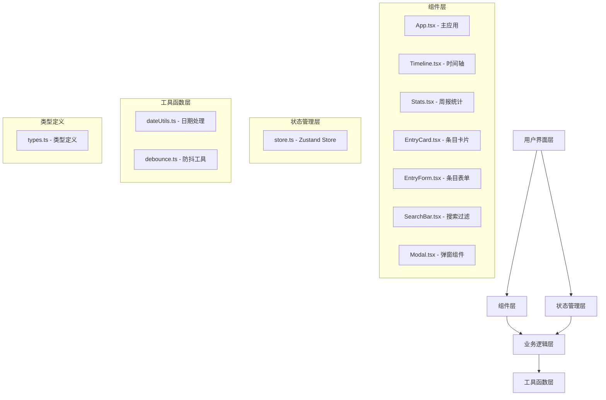

## 1. 架构设计



## 2. 技术描述

- **前端框架**：React 18 + TypeScript
- **构建工具**：Vite
- **状态管理**：Zustand
- **Markdown渲染**：react-markdown
- **日期处理**：date-fns
- **样式方案**：纯CSS（CSS Modules）
- **代码规范**：TypeScript strict模式

## 3. 文件结构与调用关系

```
d:\P\tasks\auto26\
├── index.html                           # 入口HTML
├── package.json                         # 依赖配置
├── vite.config.js                       # Vite配置 (@别名)
├── tsconfig.json                        # TypeScript配置
└── src\
    ├── main.tsx                         # 应用入口 → 渲染App.tsx
    ├── App.tsx                          # 主应用 → 路由/视图切换，分发store数据
    ├── store.ts                         # Zustand状态 → entries数组 + CRUD方法
    ├── types.ts                         # 全局类型定义
    ├── utils\
    │   ├── dateUtils.ts                 # 日期处理工具
    │   └── debounce.ts                  # 防抖工具
    └── components\
        ├── Timeline.tsx                 # 时间轴组件 → 读取store.entries，渲染列表
        ├── Stats.tsx                    # 周报统计 → 读取store.entries，按标签计数
        ├── EntryCard.tsx                # 条目卡片 → 接收entry数据，调用store.update/delete
        ├── EntryForm.tsx                # 条目表单 → 调用store.addEntry/updateEntry
        ├── SearchBar.tsx                # 搜索过滤 → 关键词搜索，标签过滤
        └── Modal.tsx                    # 通用弹窗 → 删除确认等
```

**数据流向**：
- `main.tsx` → `App.tsx`（入口渲染）
- `App.tsx` → `Timeline.tsx` / `Stats.tsx`（分发store数据）
- 所有组件 → `store.ts`（读写状态）
- `Timeline.tsx` → `EntryCard.tsx`（传递entry数据）
- `EntryForm.tsx` → `store.addEntry/updateEntry`（写入数据）

## 4. 数据模型

### 4.1 类型定义

```typescript
// types.ts
export type Mood = 'excited' | 'thoughtful' | 'bored' | 'anxious';

export interface Entry {
  id: string;
  title: string;
  source: string;
  summary: string;
  mood: Mood;
  createdAt: string; // ISO date string
  updatedAt: string; // ISO date string
}

export interface StoreState {
  entries: Entry[];
  addEntry: (entry: Omit<Entry, 'id' | 'createdAt' | 'updatedAt'>) => void;
  updateEntry: (id: string, updates: Partial<Omit<Entry, 'id' | 'createdAt'>>) => void;
  deleteEntry: (id: string) => void;
  getEntriesByMonth: () => Map<string, Entry[]>;
}
```

### 4.2 心情标签配置

```typescript
export const MOOD_CONFIG: Record<Mood, { label: string; color: string }> = {
  excited: { label: '兴奋', color: '#ff6b6b' },
  thoughtful: { label: '沉思', color: '#4ecdc4' },
  bored: { label: '无聊', color: '#ffe66d' },
  anxious: { label: '焦虑', color: '#a29bfe' },
};
```

## 5. 核心模块设计

### 5.1 Zustand Store (store.ts)
- **entries**：存储所有条目数组，按createdAt降序排列
- **addEntry**：生成唯一ID，添加createdAt和updatedAt，插入并排序
- **updateEntry**：根据ID更新条目，设置updatedAt，重新排序
- **deleteEntry**：根据ID删除条目
- **getEntriesByMonth**：将entries按月份分组，返回Map

### 5.2 Timeline组件
- 使用`useMemo`对entries进行过滤（搜索关键词+标签）
- 使用`useMemo`按月份分组
- 使用`React.memo`包装EntryCard避免不必要重渲染
- 实现月份标题、时间轴节点、条目卡片的布局

### 5.3 Stats组件
- 使用`useMemo`计算本周（周一至周日）每天各心情标签的计数
- 纯CSS实现柱状图，按最大值等比例缩放高度
- 悬停显示具体数值的tooltip

### 5.4 性能优化
- **列表渲染**：`React.memo(EntryCard)` + `useMemo`过滤/分组
- **搜索防抖**：自定义`useDebounce` hook，延迟200ms执行过滤
- **状态选择**：使用zustand的selector避免不必要重渲染

## 6. 路由定义

| 视图 | 触发方式 | 描述 |
|-------|---------|------|
| 时间轴 | 默认 / 点击"时间轴"导航 | 显示按月分组的数字足迹列表 |
| 周报 | 点击"周报"导航 | 显示本周心情统计柱状图 |

## 7. 初始化数据

应用启动时预置一些示例数据，方便用户快速了解功能：
- 近2周的数字足迹条目，覆盖4种心情标签
- 包含不同类型的来源（文章、视频、网页）
- 摘要内容包含Markdown格式示例
