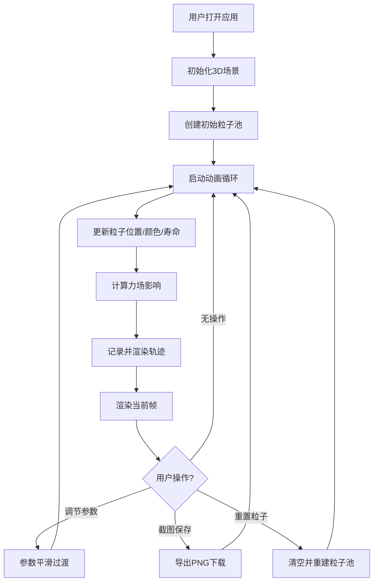

## 1. 产品概述
星云粒子系统3D可视化应用 - 基于Three.js和WebGL的浏览器端实时粒子物理模拟与可视化平台。
- 面向对物理模拟、3D可视化、创意编程感兴趣的用户，提供高度可交互的粒子系统体验
- 通过直观的UI控制面板调节粒子参数和力场，实时观察粒子在引力场与风力场中的运动轨迹，支持截图保存功能

## 2. 核心特性

### 2.1 用户角色
无需登录注册，所有访客均可直接使用全部功能。

| 角色 | 注册方式 | 核心权限 |
|------|----------|----------|
| 访客用户 | 无需注册 | 调节所有参数、重置粒子系统、截图保存 |

### 2.2 功能模块
1. **3D视口模块**：全屏Three.js场景，深空渐变背景，实时渲染60000+粒子
2. **粒子系统模块**：粒子池管理、发射控制、生命周期、颜色衰减、大小变化
3. **力场交互模块**：3个可拖拽引力点、2个可调节涡旋风力场
4. **轨迹可视化模块**：粒子过去1秒的位置轨迹，半透明渐隐线条
5. **UI控制面板模块**：左侧浮出半透明毛玻璃面板，包含所有参数滑块与按钮
6. **背景装饰模块**：500个随机闪烁星点增强深空氛围
7. **截图功能模块**：一键保存当前3D场景状态为PNG图片

### 2.3 页面详情
| 页面名称 | 模块名称 | 功能描述 |
|----------|----------|----------|
| 主页面 | 3D视口 | 全屏黑色到暗紫径向渐变背景，居中渲染3D粒子场景 |
| 主页面 | 引力点显示 | 3个半透明发光球体（粉/绿/蓝），支持鼠标拖拽移动 |
| 主页面 | 涡旋场显示 | 2个半透明旋转线条环（橙色），示意风力范围 |
| 主页面 | 粒子轨迹 | 每帧更新的半透明渐隐轨迹线 |
| 主页面 | 控制面板 | 左侧280px宽毛玻璃面板，包含所有交互控件 |
| 主页面 | 背景星点 | 500个随机位置的微弱闪烁白色星点 |

## 3. 核心流程
用户打开应用后自动开始粒子发射，可随时调节参数观察变化：
1. 应用加载 → 初始化Three.js场景、相机、渲染器
2. 创建1000个初始粒子，从随机位置发射
3. 启动60fps动画循环，每帧更新粒子位置、颜色、寿命
4. 应用力场计算（引力吸引 + 涡旋切向力）
5. 记录粒子轨迹并渲染
6. 用户调节控制面板参数 → 平滑过渡到新参数值
7. 用户点击截图 → Canvas导出为PNG并下载
8. 用户点击重置 → 所有粒子重置为初始状态

## 4. 用户界面设计

### 4.1 设计风格
- **主色调**：深空黑 (#000010) → 暗紫 (#1a0a2e) 径向渐变背景
- **强调色**：粉紫 (#ff00aa)、青蓝 (#00ffff)、橙红 (#ff6644)、银白 (#e8e8ff)
- **控制面板**：背景 rgba(10,10,20,0.7)，10px 模糊毛玻璃，1px rgba(255,255,255,0.1) 边框
- **按钮风格**：圆角 6px，背景 rgba(255,255,255,0.08)，hover 时背景变亮，0.3s 过渡
- **滑块风格**：自定义轨道，彩色滑块指示器，0.3s 过渡动画
- **字体**：使用系统无衬线字体 (Segoe UI, system-ui)，字号 12-14px
- **整体氛围**：深色科幻风，高对比度，发光粒子效果，动态感强烈

### 4.2 页面设计概览
| 页面名称 | 模块名称 | UI元素 |
|----------|----------|--------|
| 主页面 | 3D视口 | 全屏Canvas、径向渐变背景、3D透视相机、鼠标拖动旋转视角 |
| 主页面 | 控制面板 | 左侧悬浮、半透明毛玻璃、8组控件（滑块+下拉+按钮）、标签+数值显示 |
| 主页面 | 引力点 | 发光球体 (MeshStandardMaterial + emissive)、颜色分别为粉/绿/蓝 |
| 主页面 | 涡旋场 | 旋转半透明圆环 (LineSegments)、橙色、动画旋转 |
| 主页面 | 背景星点 | 随机位置Points、大小1-2px、颜色#ffffff40、轻微闪烁 |

### 4.3 响应式
桌面端优先设计，控制面板固定左侧280px宽度。窗口缩放时3D视口自适应调整，控制面板保持位置。

### 4.4 3D场景指导
- **环境氛围**：深空黑色到暗紫径向渐变背景，营造宇宙深空感
- **光照设置**：环境光 (0x404040) + 半球光 (天空色0x1a0a2e, 地面色0x000000)，引力点自发光
- **相机设置**：PerspectiveCamera (fov 75°)，初始位置 (0, 0, 25)，OrbitControls 支持旋转缩放平移
- **构图与焦点**：粒子云团居中，引力点分布在粒子云周围，视线吸引向粒子密集区
- **交互与动画**：粒子持续运动，引力点可拖拽，涡旋环旋转，参数变化0.3s平滑过渡
- **后处理效果**：可考虑Bloom后期让发光效果更柔和（性能优先时可省略）
- **性能预算**：60000粒子时≥30fps，5000粒子时≥60fps
