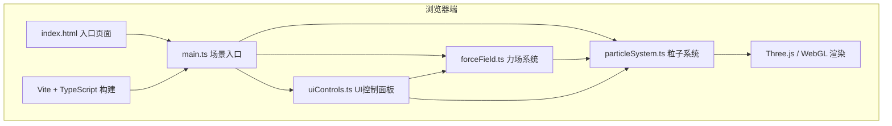

## 1. 架构设计



## 2. 技术说明
- **前端框架**：原生 TypeScript 5.x + Three.js 0.160+
- **构建工具**：Vite 5.x（极速开发服务器，Rollup打包）
- **渲染引擎**：Three.js + WebGL（通过BufferGeometry实现高性能粒子渲染）
- **UI框架**：原生 DOM + CSS（无额外UI库，保证轻量和性能）
- **初始化方式**：手动配置 Vite + TypeScript 项目结构（不使用 react-ts/vue-ts 模板，避免引入不必要依赖）

## 3. 文件结构
```
auto27/
├── package.json          # 依赖: three, typescript, vite, @types/three
├── tsconfig.json         # TypeScript严格模式配置
├── vite.config.js        # Vite构建配置
├── index.html            # 入口HTML，全屏黑色背景
└── src/
    ├── main.ts           # 入口: 初始化场景/相机/渲染器, 启动动画循环
    ├── particleSystem.ts # 粒子系统: 粒子池/发射/更新/力场应用
    ├── forceField.ts     # 力场系统: 引力点/涡旋场定义与加速度计算
    └── uiControls.ts     # UI面板: 控制面板生成/事件绑定/截图功能
```

## 4. 核心数据结构与接口定义

### 4.1 粒子接口 (particleSystem.ts)
```typescript
interface Particle {
    position: Float32Array;     // [x, y, z] 当前位置
    velocity: Float32Array;     // [vx, vy, vz] 速度向量
    color: Float32Array;        // [r, g, b] 基础颜色（0-1浮点）
    initialColor: Float32Array; // 初始颜色
    age: number;                // 当前存活时间(秒)
    life: number;               // 总寿命(秒)
    size: number;               // 当前大小
    initialSize: number;        // 初始大小
    opacity: number;            // 当前透明度
    trail: Float32Array[];      // 轨迹点队列（过去1秒采样）
}

interface ParticleSystemConfig {
    maxParticles: number;       // 最大粒子数: 60000
    initialCount: number;       // 初始粒子数: 1000
    emissionRate: number;       // 发射速率: 粒子/秒
    speedRange: [number, number]; // 速度幅度范围: [0.5, 5.0]
    lifeRange: [number, number];  // 寿命范围(秒): [5, 30]
    sizeRange: [number, number];  // 大小范围: [0.02, 0.3]
    spawnRadius: number;          // 发射球体半径: 10
    colorTheme: 'pinkPurple' | 'cyanBlue' | 'orangeRed' | 'silverWhite';
}
```

### 4.2 力场接口 (forceField.ts)
```typescript
interface GravityPoint {
    id: string;
    position: THREE.Vector3;
    mass: number;               // 质量因子: 0.1-2.0
    radius: number;             // 作用半径: 5
    color: number;              // 显示颜色: 0xff00aa / 0x00ffaa / 0xaaaaff
    mesh: THREE.Mesh | null;    // 可拖拽显示球体
}

interface VortexField {
    id: string;
    position: THREE.Vector3;
    strength: number;           // 涡旋强度: 0.1-3.0
    radius: number;             // 作用半径
    axis: THREE.Vector3;        // 旋转轴（默认Y轴）
    ring: THREE.LineSegments | null; // 显示旋转环
}

interface IForceField {
    calculateAcceleration(particlePos: THREE.Vector3, particleVel: THREE.Vector3): THREE.Vector3;
    updateVisuals(dt: number): void;
}
```

### 4.3 UI事件接口 (uiControls.ts)
```typescript
interface UIControlHandlers {
    onEmissionRateChange: (rate: number) => void;
    onLifeRangeChange: (min: number, max: number) => void;
    onSpeedChange: (speed: number) => void;
    onColorThemeChange: (theme: ColorTheme) => void;
    onGravityMassChange: (mass: number) => void;
    onVortexStrengthChange: (strength: number) => void;
    onReset: () => void;
    onScreenshot: () => void;
}

type ColorTheme = 'pinkPurple' | 'cyanBlue' | 'orangeRed' | 'silverWhite';
```

## 5. 性能优化策略

### 5.1 粒子渲染性能
- 使用 `THREE.BufferGeometry` + 单 `THREE.Points` 对象而非独立Mesh
- 所有粒子属性存储在单个Float32Array中，避免频繁GC
- 使用自定义 `PointsMaterial` + 圆形软渐变贴图（Canvas动态生成）
- 启用 `depthWrite: false` + `AdditiveBlending` 获得正确的透明叠加效果
- 粒子数上限60000，对象池复用避免新建/销毁开销

### 5.2 力场计算性能
- 距离平方判定（避免开方），超出作用半径立即跳过
- 使用 `THREE.Vector3` 临时对象池减少分配
- 可配置引力点/涡旋场上限（各3+2个）

### 5.3 轨迹渲染性能
- 轨迹使用 `BufferGeometry` + `LineSegments`
- 每粒子最多保留60个轨迹点（约1秒@60fps），超出后覆盖旧点（环形缓冲）
- 透明度使用顶点属性（vertexColors）随点年龄衰减

### 5.4 UI动画性能
- 参数变化使用线性插值平滑过渡（0.3秒），避免突变跳帧
- CSS `transition` 处理控件视觉反馈，不影响JS主线程

## 6. 关键实现细节

### 6.1 粒子纹理贴图
使用Canvas2D动态生成圆形软渐变作为粒子纹理（避免外部资源依赖）：
- 中心不透明 → 边缘完全透明的径向渐变
- 尺寸64x64，DataURL格式传入Three.js

### 6.2 引力点拖拽交互
- 使用 `THREE.Raycaster` 检测鼠标与引力点球体的碰撞
- 选中后将鼠标屏幕坐标通过 `project()` 转换为3D世界坐标
- 拖拽平面为相机朝向的观察平面，保持深度一致

### 6.3 截图功能实现
- `renderer.domElement.toDataURL('image/png')` 导出Canvas
- 创建 `<a download="nebula-screenshot.png">` 元素模拟点击触发下载
- 截图前确保已渲染完成一帧

### 6.4 参数平滑过渡
维护 `targetConfig` 和 `currentConfig` 两套参数，每帧按 `t = dt / 0.3` 线性插值：
```
current = current + (target - current) * Math.min(t, 1)
```
