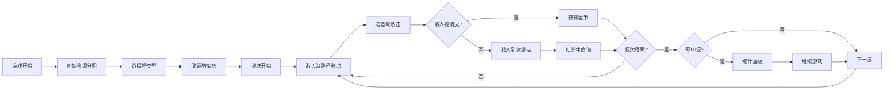

## 1. 产品概述

经典塔防游戏浏览器应用，解决传统塔防关卡固定、缺乏创意组合和实时策略反馈的问题。玩家通过放置和升级防御塔来阻止敌人沿路径抵达终点，考验策略规划和资源管理能力。

- 核心目标：提供流畅、有趣的塔防游戏体验，支持多种塔类型组合和波次挑战
- 目标用户：休闲游戏玩家、策略游戏爱好者
- 市场价值：浏览器即玩、无需安装，高质量的塔防游戏体验

## 2. 核心功能

### 2.1 功能模块

1. **游戏主界面**：地图渲染、敌人移动、塔放置与攻击、资源显示
2. **敌人系统**：多种敌人类型、波次生成、路径移动、生命值与血条
3. **防御塔系统**：三种塔类型、塔放置与升级、射程显示、攻击特效
4. **资源管理**：金币系统、生命值系统、波次统计
5. **波次统计面板**：每10波统计、暂停与继续、数据展示

### 2.2 页面详情

| 页面名称 | 模块名称 | 功能描述 |
|-----------|-------------|---------------------|
| 游戏主界面 | 地图区域 | 渲染网格地图、蜿蜒路径、草地与空地 |
| 游戏主界面 | 顶部资源栏 | 显示生命值、金币、当前波次数 |
| 游戏主界面 | 左侧塔选择面板 | 三种塔卡片、进入放置模式 |
| 游戏主界面 | 战斗系统 | 敌人移动、塔攻击、特效播放 |
| 波次统计面板 | 统计面板 | 消灭敌人数、金币收入、剩余生命、继续按钮 |

## 3. 核心流程

玩家进入游戏 → 查看初始资源 → 选择塔类型 → 在空地上放置防御塔 → 敌人波次开始 → 塔自动攻击敌人 → 击败敌人获得金币 → 升级或新建防御塔 → 每10波暂停统计 → 继续游戏直至胜利或失败

## 4. 用户界面设计

### 4.1 设计风格

- **主题**：中世纪奇幻风格暗色调
- **主背景**：深棕色 #1a0f0a
- **路径砖块**：灰色 #5a5a5a
- **草地**：深绿色 #2d5a27
- **建筑空地**：浅棕色 #8b7355
- **边框装饰**：深色 #2a1e14 / #3a2a1e
- **金币颜色**：金色
- **按钮渐变**：#00d4ff → #0066ff

**按钮样式**：
- 悬停时 transform scale 1.05
- transition 0.2s ease 过渡动画
- 统计面板继续按钮为渐变蓝

**字体**：
- 选择具有中世纪风格的字体
- 数字使用等宽字体增强游戏感

**布局**：
- 中央游戏地图占页面宽70%，高90vh
- 左侧塔选择面板宽250px
- 顶部资源栏半透明背景

### 4.2 页面设计概览

| 页面名称 | 模块名称 | UI 元素 |
|-----------|-------------|-------------|
| 游戏主界面 | 地图区域 | 网格、蜿蜒路径、草地、空地、装饰边框 |
| 游戏主界面 | 顶部资源栏 | 红色心形生命值、金色硬币金币、波次数字 |
| 游戏主界面 | 左侧塔面板 | 塔卡片（圆形图标+名称+花费）、折叠/展开 |
| 游戏主界面 | 战斗元素 | 敌人（圆/三角/方形）、血条、攻击特效 |
| 统计面板 | 弹窗 | 毛玻璃背景、圆角16px、渐变按钮 |

### 4.3 响应式

- 以桌面端为主要设计目标
- 游戏地图区域保持固定比例
- 支持窗口大小变化时自适应

### 4.4 动画与特效

- 金币数值变化时轻微弹跳动画（0.3秒）
- 攻击特效：箭矢细线、爆炸圆圈、蓝色涟漪（持续0.2秒）
- 按钮悬停缩放动画
- 塔射程范围半透明圆环
- 敌人血条绿色渐变到红色
