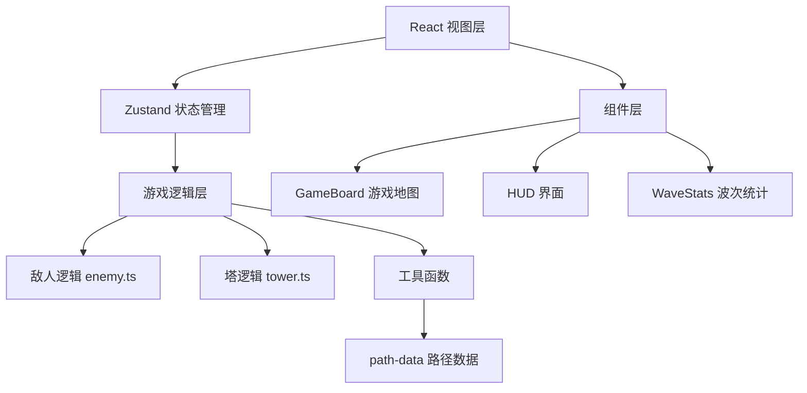

## 1. 架构设计



## 2. 技术描述

- **前端框架**：React 18 + TypeScript
- **构建工具**：Vite
- **状态管理**：Zustand
- **样式方案**：原生 CSS + CSS 变量
- **渲染方式**：Canvas 2D（地图与游戏元素）+ React DOM（UI 面板）
- **性能目标**：30个敌人同时在线时帧率稳定60fps

## 3. 项目结构

```
src/
├── game-logic/
│   ├── enemy.ts        # 敌人移动、波次生成、碰撞检测
│   └── tower.ts        # 塔放置、射击、升级逻辑
├── store/
│   └── game-store.ts   # Zustand 全局状态管理
├── components/
│   ├── game-board.tsx  # 游戏地图渲染与交互
│   └── hud.tsx         # 顶部资源栏与左侧塔选择面板
├── utils/
│   └── path-data.ts    # 路径点坐标与地图布局配置
├── App.tsx
├── main.tsx
└── index.css
```

## 4. 核心数据模型

### 4.1 敌人类型

| 类型 | 形状 | 颜色 | 速度 | 血量 | 金币奖励 |
|------|------|------|------|------|----------|
| 普通 | 圆形 | 红色 | 1.5格/秒 | 1x | 1金 |
| 快速 | 三角形 | 黄色 | 2.5格/秒 | 1x | 2金 |
| 重型 | 方形 | 深紫色 | 0.8格/秒 | 3x | 3金 |

### 4.2 塔类型

| 类型 | 颜色 | 射程 | 伤害 | 射速 | 特殊效果 | 升级加成 |
|------|------|------|------|------|----------|----------|
| 箭塔 | 绿色 | 3格 | 1 | 快 | - | +25%伤害/射速 |
| 炮塔 | 橙色 | 2.5格 | 3 | 中 | 范围伤害1.5格 | +25%伤害 |
| 魔法塔 | 蓝色 | 3.5格 | 0.5 | 中 | 减速50%，持续2秒 | +25%射速 |

### 4.3 常量定义

- `TILE_SIZE = 40`：1格 = 40像素
- `INITIAL_LIVES = 20`：初始生命值
- `ENEMY_DAMAGE = 2`：每个敌人抵达终点扣2点生命
- `WAVE_INTERVAL = 15000`：波次间隔15秒
- `ENEMIES_PER_WAVE_MIN = 5`：每波最少敌人数
- `ENEMIES_PER_WAVE_MAX = 10`：每波最多敌人数

## 5. 关键技术点

### 5.1 路径系统
- 使用格点坐标数组定义蜿蜒路径
- 提供 `gridToPixel()` 转换函数将格坐标映射到 Canvas 像素
- 敌人沿路径点插值移动

### 5.2 游戏循环
- 使用 `requestAnimationFrame` 实现60fps游戏循环
- 采用 delta time 确保不同设备上移动速度一致
- 逻辑更新与渲染分离

### 5.3 性能优化
- 使用 `React.memo` 包装 UI 组件避免不必要重渲染
- 使用 `useMemo` 缓存计算结果
- Canvas 批量渲染游戏元素
- 攻击特效使用对象池或快速创建/销毁

### 5.4 状态管理
- Zustand 集中管理：生命值、金币、波次、敌人列表、塔列表、选中塔类型
- 游戏逻辑纯函数化，便于测试和维护

### 5.5 内存安全
- 组件卸载时清理所有定时器（setInterval, setTimeout）
- 使用 `useEffect` 返回清理函数
- 攻击特效定时自动清除

## 6. 视觉与交互规范

### 6.1 Canvas 渲染
- 地图网格：草地背景 + 路径砖块 + 建筑空地
- 敌人：不同形状区分类型，头顶血条
- 塔：圆形底座，上方标识，攻击时播放特效
- 射程：选中/放置时显示半透明圆环

### 6.2 DOM UI
- 顶部资源栏：半透明背景，心形生命值，硬币金币，波次数
- 左侧面板：可折叠，塔卡片，点击进入放置模式
- 统计面板：毛玻璃效果，居中显示，渐变按钮

### 6.3 动画
- 金币弹跳：数值变化时触发 scale 动画
- 按钮悬停：scale 1.05 + transition 0.2s
- 攻击特效：箭矢细线、爆炸圆圈、蓝色涟漪，持续0.2秒
