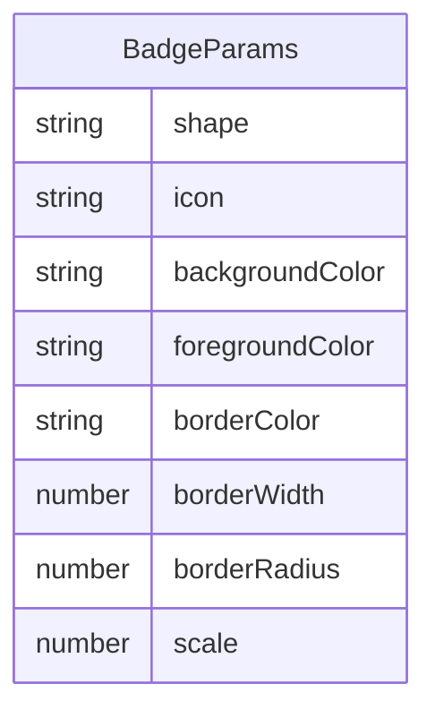

## 1. 架构设计

```mermaid
flowchart TD
    "前端 React + TypeScript" --> "Zustand 状态管理"
    "Zustand 状态管理" --> "SVG生成模块"
    "SVG生成模块" --> "预览渲染"
    "预览渲染" --> "导出(下载/复制)"
    "控制面板" --> "Zustand 状态管理"
```

纯前端架构，无后端服务。

## 2. 技术说明

- 前端：React 18 + TypeScript + Vite
- 状态管理：Zustand
- 初始化工具：vite-init (react-ts 模板)
- 后端：无
- 数据库：无
- CSS方案：CSS Modules / 内联样式（用户需求明确，不使用Tailwind）

## 3. 路由定义

| 路由 | 用途 |
|------|------|
| / | 徽章编辑器主页面 |

单页应用，无需路由。

## 4. API定义

不适用，纯前端项目。

## 5. 服务器架构图

不适用，无后端。

## 6. 数据模型

### 6.1 数据模型定义



### 6.2 数据定义

Zustand store 内存存储，无持久化需求：

- shape: 'circle' | 'roundedRect' | 'hexagon'
- icon: string (图标标识符)
- backgroundColor: string (hex色值)
- foregroundColor: string (hex色值)
- borderColor: string (hex色值)
- borderWidth: number (0-8)
- borderRadius: number (0-30)
- scale: number (80-150)

## 7. 文件结构

```
package.json
index.html
tsconfig.json
vite.config.js
src/
  App.tsx              — 根组件，左右布局+响应式切换
  store.ts             — Zustand store，所有徽章参数+actions
  main.tsx             — 入口
  modules/
    svgGenerator.ts    — 纯函数，参数→SVG字符串
  components/
    ControlPanel.tsx   — 左侧控制面板
    PreviewArea.tsx    — 右侧预览区+导出按钮
```
