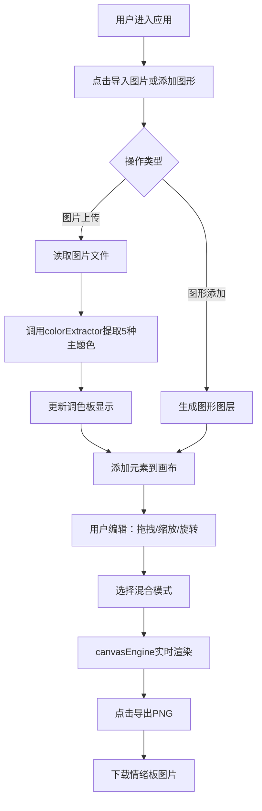
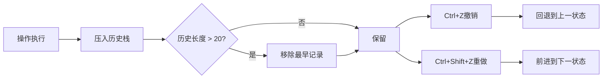

## 1. 产品概述

品牌情绪板视觉设计工具是一款面向创意设计师的在线可视化工具，帮助用户快速构建品牌视觉风格情绪板。通过拖拽图片、内置图形元素结合智能色彩提取功能，设计师可以高效地向客户传达品牌视觉方向。

- **目标用户**：品牌设计师、UI/UX设计师、创意总监
- **核心价值**：简化情绪板制作流程，提供专业级色彩提取与图形混合编辑能力

## 2. 核心功能

### 2.1 功能模块

1. **画布编辑器**：自由拖拽、缩放、旋转图层元素，支持多图层管理
2. **色彩提取系统**：基于K-means算法的智能色彩提取，支持手动编辑与命名
3. **工具栏系统**：图形导入、图片上传、导出、撤销/重做操作
4. **混合模式引擎**：支持6种图层混合模式实时预览
5. **历史记录系统**：最多20步操作的撤销/重做

### 2.2 页面详情

| 页面名称 | 模块名称 | 功能描述 |
|---------|---------|---------|
| 主编辑页 | 左侧工具栏 | 添加图形、导入图片、导出PNG、撤销/重做按钮组 |
| 主编辑页 | 中央画布 | 800x500px 工作区，支持图层拖拽、缩放、旋转、删除 |
| 主编辑页 | 右侧调色板 | 展示5种提取色，支持颜色选择器编辑、色值输入、命名 |
| 主编辑页 | 底部状态栏 | 显示旋转角度、历史记录位置 |

## 3. 核心流程

### 3.1 用户操作主流程

### 3.2 撤销/重做流程

## 4. 用户界面设计

### 4.1 设计风格
- **主色调**：浅色毛玻璃设计，渐变背景 #f5f7fa → #c3cfe2
- **画布区域**：白色 #ffffff，12px圆角，2px #e0e0e0边框，1px内阴影 #00000008
- **侧边栏**：半透明白色 rgba(255,255,255,0.7)，10px模糊，1px #ffffff80边框
- **控制点**：蓝色8px直径圆点，白色描边
- **旋转手柄**：绿色圆形，半径6px
- **交互过渡**：0.2s ease-out

### 4.2 页面设计概览

| 区域 | 模块 | UI元素 |
|-----|-----|-------|
| 左侧工具栏 (50px) | 工具按钮 | 多边形/相机/下载/左箭头/右箭头图标，悬停放大1.15倍+工具提示 |
| 中央画布 (800x500) | 编辑区 | 白色画布，图层元素，选中控制点，旋转手柄 |
| 右侧调色板 (250px) | 色彩面板 | 5个30x30px色块，色值输入框，命名文本框，拾色器弹窗 |
| 底部状态栏 | 信息栏 | 当前旋转角度（1度精度），历史位置如"历史：5 / 20" |

### 4.3 响应式设计
- **桌面端（≥1200px）**：三栏布局 - 左工具栏(50px) + 画布(800px) + 右调色板(250px)
- **移动端（<1200px）**：调色板变为底部固定面板(高度120px，水平滚动)，画布宽度自适应

### 4.4 组件间距
- 所有组件间统一间距：16px
- 色块内部间距：紧凑排列，文字标签紧贴色块下方
