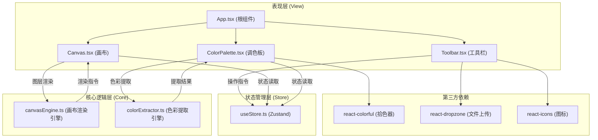

## 1. 架构设计



**数据流向说明：**
1. `Toolbar` → `useStore`: 用户操作（添加图形/导入图片/导出/撤销/重做）触发状态更新
2. `useStore` → `Canvas`: 图层列表变化时，Canvas 订阅并触发重渲染
3. `Canvas` → `canvasEngine`: 将图层配置传递给渲染引擎，获取 Canvas 绘制指令
4. `Canvas` → `colorExtractor`: 用户选定图片后，传递 ImageData 进行色彩提取
5. `colorExtractor` → `ColorPalette`: 提取的颜色样本通过 store 传递给调色板组件
6. `ColorPalette` → `useStore`: 用户编辑颜色/命名时，更新全局状态

## 2. 技术描述

- **前端框架**：React 18 + TypeScript
- **构建工具**：Vite
- **状态管理**：Zustand（轻量级，支持历史记录）
- **UI组件**：
  - react-colorful（拾色器，体积小性能好）
  - react-dropzone（拖拽上传）
  - react-icons（图标库）
- **图形渲染**：HTML5 Canvas 2D API
- **算法实现**：K-Means 聚类（色彩提取，纯 TypeScript 实现）

## 3. 模块与文件结构

```
src/
├── App.tsx                  # 根组件：布局容器，全局键盘事件
├── components/
│   ├── Toolbar.tsx          # 左侧工具栏：工具按钮、事件派发
│   ├── Canvas.tsx           # 主画布：Canvas元素、交互处理、图层渲染
│   └── ColorPalette.tsx     # 右侧调色板：色块展示、颜色编辑
├── core/
│   └── canvasEngine.ts      # 画布渲染核心：drawLayers函数
├── utils/
│   └── colorExtractor.ts    # 色彩提取核心：extractColors函数 (k-means)
└── store/
    └── useStore.ts          # Zustand全局状态：图层、颜色、历史记录
```

### 3.1 核心模块职责

| 文件 | 导出 | 职责 |
|-----|-----|-----|
| `src/core/canvasEngine.ts` | `drawLayers(ctx, layers)` | 接收图层配置数组，计算变换矩阵，执行Canvas绘制 |
| `src/utils/colorExtractor.ts` | `extractColors(imageData, k=5)` | K-Means聚类提取主色，返回HEX颜色数组 |
| `src/store/useStore.ts` | `useStore` Hook | 图层CRUD、历史栈管理、颜色样本、选中状态 |

## 4. 数据模型

### 4.1 图层数据结构

```typescript
interface Layer {
  id: string;                    // 唯一标识
  type: 'image' | 'circle' | 'star' | 'triangle' | 'wave';
  src?: string;                  // 图片类型专属：base64或URL
  x: number;                     // 中心点X坐标
  y: number;                     // 中心点Y坐标
  width: number;                 // 宽度（最小20px）
  height: number;                // 高度（最小20px）
  rotation: number;              // 旋转角度（度数）
  blendMode: GlobalCompositeOperation; // 混合模式
}
```

### 4.2 颜色样本数据结构

```typescript
interface ColorSwatch {
  id: string;
  hex: string;        // 6位大写HEX，如 "#FF5733"
  name: string;       // 命名，如 "主色"
}
```

### 4.3 全局状态结构

```typescript
interface AppState {
  layers: Layer[];
  selectedLayerId: string | null;
  selectedImageSrc: string | null;
  colorSwatches: ColorSwatch[];
  history: { layers: Layer[]; colorSwatches: ColorSwatch[] }[];
  historyIndex: number;
  // Actions
  addLayer: (layer: Layer) => void;
  updateLayer: (id: string, updates: Partial<Layer>) => void;
  deleteLayer: (id: string) => void;
  setSelectedLayer: (id: string | null) => void;
  setSelectedImage: (src: string | null) => void;
  setColorSwatches: (swatches: ColorSwatch[]) => void;
  updateColorSwatch: (id: string, updates: Partial<ColorSwatch>) => void;
  undo: () => void;
  redo: () => void;
  pushHistory: () => void;
}
```

### 4.4 混合模式映射

| 显示名称 | Canvas API值 | 说明文字 |
|---------|-------------|---------|
| 正常 | `source-over` | 正常：默认叠加 |
| 正片叠底 | `multiply` | 正片叠底：变暗 |
| 滤色 | `screen` | 滤色：变亮 |
| 叠加 | `overlay` | 叠加：对比度增强 |
| 变亮 | `lighter` | 变亮：加色 |
| 变暗 | `darken` | 变暗：取较暗值 |

## 5. 性能优化策略

### 5.1 画布渲染优化
- 使用 `requestAnimationFrame` 实现平滑渲染，目标帧率 ≥45fps
- 拖拽/缩放时采用离屏缓存，避免全量重绘
- 图层变换使用 Canvas `save()`/`restore()` + `transform()` 矩阵运算

### 5.2 色彩提取优化
- K-Means 初始中心采用 K-Means++ 策略加速收敛
- 500x500 像素图片先降采样至 100x100 再聚类（<500ms目标）
- 最大迭代次数限制为 20 次

### 5.3 历史记录优化
- 历史栈最大 20 条，超出时 FIFO 淘汰
- 使用浅拷贝 + 不可变更新，减少内存占用

## 6. 关键算法说明

### 6.1 K-Means 色彩提取流程
1. 从 ImageData 中提取所有像素的 RGB 值
2. 随机（或K-Means++）选取5个初始聚类中心
3. 迭代：
   - 将每个像素分配到最近的聚类中心（欧氏距离）
   - 重新计算每个聚类的中心（均值）
4. 达到收敛或最大迭代次数后停止
5. 将5个聚类中心转换为 HEX 格式返回

### 6.2 画布交互检测
- **点中检测**：将鼠标坐标逆变换（反旋转+反缩放）到图层本地坐标系，判断是否在图层矩形范围内
- **控制点命中**：8个控制点位置 = 四角 + 四边中点，命中半径 8px
- **旋转手柄**：位于图层顶部中心上方 20px 处，绿色半径 6px 圆
