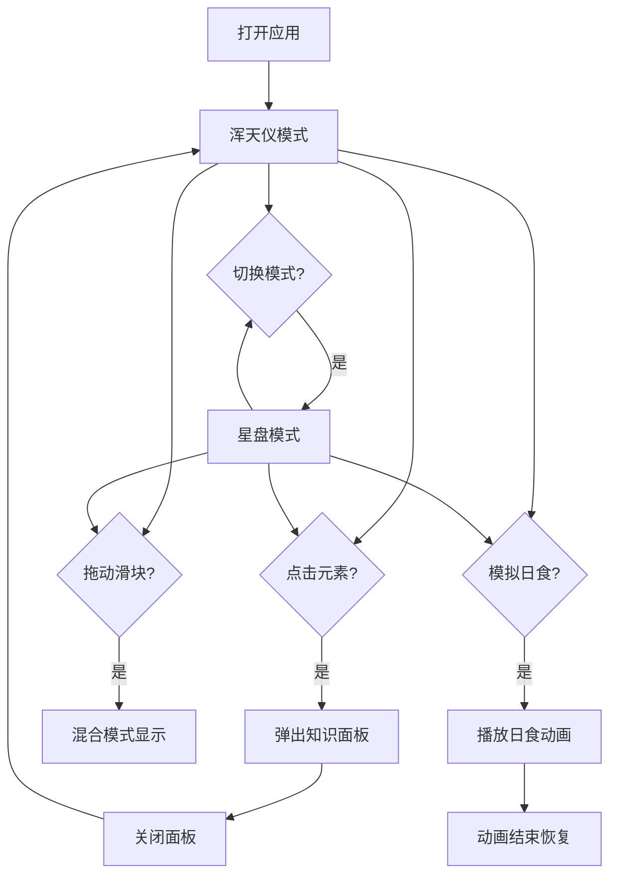

## 1. 产品概述

天文双仪是一款古代星空观测与天文仪器的互动教学应用，旨在帮助天文爱好者直观理解古代中国浑天仪和西方星盘的工作原理。通过3D可视化与2D交互结合的方式，让用户能够沉浸式体验古代天文仪器的精妙之处。

- 核心价值：将抽象的古代天文仪器原理转化为直观可交互的可视化体验
- 目标用户：天文爱好者、历史文化爱好者、学生及教育工作者

## 2. 核心功能

### 2.1 用户角色

| 角色 | 注册方式 | 核心权限 |
|------|----------|----------|
| 普通用户 | 无需注册 | 浏览所有功能、交互操作、查看知识信息 |

### 2.2 功能模块

1. **浑天仪模式**：3D可旋转浑天仪模型，铜环与星宿标记
2. **星盘模式**：2D扁平星盘，地平圈赤道圈与天区字母
3. **日食模拟**：两种模式下的天文现象动画演示
4. **知识弹出**：点击元素展示古籍风格的天文知识
5. **混合对比**：通过滑块混合两种模式，直观对比差异

### 2.3 页面详情

| 页面名称 | 模块名称 | 功能描述 |
|----------|----------|----------|
| 主页面 | 顶部导航 | 模式切换标签（浑天仪/星盘），标题展示 |
| 主页面 | 主展示区 | 3D浑天仪或2D星盘渲染区域 |
| 主页面 | 底部操作栏 | 日食模拟按钮、混合模式滑块 |
| 主页面 | 信息面板 | 点击元素弹出的毛玻璃知识面板 |

## 3. 核心流程

用户打开应用后默认展示浑天仪模式，可通过顶部标签切换模式。点击铜环或星宿可查看相关知识。使用底部滑块可混合两种模式进行对比。点击"模拟日食"按钮可观看动画效果。

## 4. 用户界面设计

### 4.1 设计风格

- **主色调**：深棕色到黑色渐变（#2c1810 到 #0a0a0a），金色点缀（#d4af37），黄铜色（#b8860b）
- **设计风格**：深色宫廷风，古典雅致，金属质感
- **按钮风格**：圆角矩形（8px圆角），金色渐变背景，悬停内发光效果
- **字体**：古风字体（标题），楷体（竖排古籍文字）
- **布局风格**：居中展示，顶部导航，底部操作栏
- **装饰元素**：顶部金色装饰条，毛玻璃信息面板

### 4.2 页面设计概览

| 页面名称 | 模块名称 | UI元素 |
|----------|----------|--------|
| 主页面 | 顶部装饰 | 金色装饰条、古风标题"天文双仪" |
| 主页面 | 模式标签 | 无样式链接，下划线展开动画 |
| 主页面 | 3D场景 | 黄铜色浑天仪、白色星宿点、可旋转 |
| 主页面 | 2D星盘 | 扁平圆盘、地平赤道圈、天区字母 |
| 主页面 | 操作栏 | 半透明背景、金色按钮、混合滑块 |
| 主页面 | 信息面板 | 毛玻璃效果、竖排文字、古籍风格 |

### 4.3 响应式

- 桌面端优先设计，移动端自适应
- 宽度小于768px时，操作栏垂直排列，按钮宽度100%
- 信息面板宽度调整为90%

### 4.4 3D场景指引

- **环境**：深色星空背景，从深蓝到黑色渐变
- **光照**：环境光 + 方向光，突出金属质感
- **相机**：透视相机，支持OrbitControls轨道控制
- **交互**：鼠标拖拽360度旋转
- **后处理**：辉光效果（星宿闪烁）
- **性能**：保持60FPS，模型面数精简

