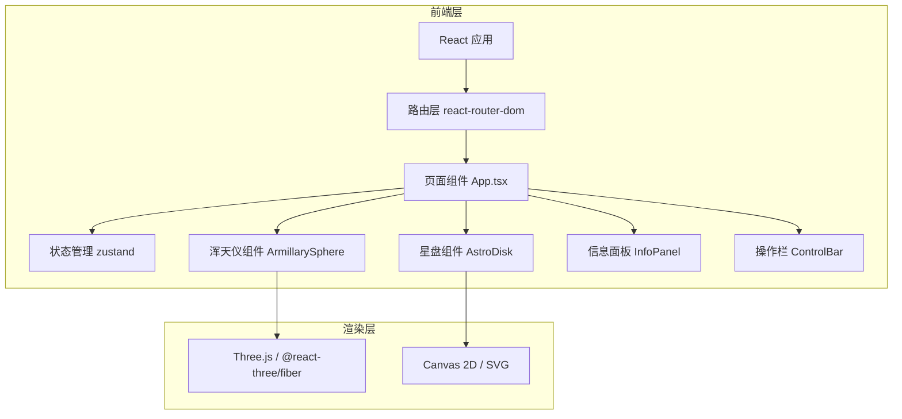

## 1. 架构设计



## 2. 技术说明

- **前端框架**：React 18 + TypeScript
- **构建工具**：Vite
- **3D渲染**：Three.js + @react-three/fiber + @react-three/drei
- **2D渲染**：Canvas 2D API
- **状态管理**：zustand
- **路由管理**：react-router-dom
- **样式方案**：CSS Modules / 内联样式（根据需要）
- **后端**：无（纯前端应用）
- **数据库**：无（硬编码星宿/天区数据）

## 3. 路由定义

| 路由 | 用途 |
|------|------|
| / | 默认重定向到浑天仪模式 |
| /armillary | 浑天仪模式页面 |
| /astrodisk | 星盘模式页面 |

## 4. 数据模型

### 4.1 星宿数据类型

```typescript
interface Constellation {
  id: number;
  name: string;        // 星宿名称
  azimuth: number;     // 方位角（度）
  elevation: number;   // 仰角（度）
  description: string; // 古籍记载
}
```

### 4.2 天区数据类型

```typescript
interface ZodiacSign {
  id: number;
  letter: string;      // 拉丁字母
  angle: number;       // 角度位置
  color: string;       // 颜色
  name: string;        // 名称
  description: string; // 描述
}
```

### 4.3 应用状态类型

```typescript
interface AppState {
  mode: 'armillary' | 'astrodisk';  // 当前模式
  mix: number;                       // 混合滑块值 0-1
  isEclipsing: boolean;              // 是否正在日食模拟
  panelData: PanelData | null;       // 弹出面板数据
  setMode: (mode: 'armillary' | 'astrodisk') => void;
  setMix: (value: number) => void;
  setEclipsing: (value: boolean) => void;
  openPanel: (data: PanelData) => void;
  closePanel: () => void;
}
```

## 5. 项目结构

```
src/
├── main.tsx              # React入口
├── App.tsx               # 主应用组件
├── store/
│   └── appStore.ts       # zustand全局状态
├── components/
│   ├── ArmillarySphere.tsx   # 3D浑天仪组件
│   ├── AstroDisk.tsx         # 2D星盘组件
│   ├── InfoPanel.tsx         # 信息面板组件
│   └── ControlBar.tsx        # 底部操作栏
├── data/
│   ├── constellations.ts  # 28星宿数据
│   └── zodiacSigns.ts     # 12天区数据
└── types/
    └── index.ts           # 类型定义
```

## 6. 性能优化策略

1. **3D性能**：
   - 使用InstancedMesh渲染多个铜环
   - 星宿点使用Points材质
   - 限制渲染帧率到60FPS
   - 日食动画使用requestAnimationFrame

2. **2D性能**：
   - Canvas离屏渲染优化
   - requestAnimationFrame动画循环
   - 脏矩形重绘

3. **交互响应**：
   - 滑块使用useRef + requestAnimationFrame节流
   - 状态更新批量处理

