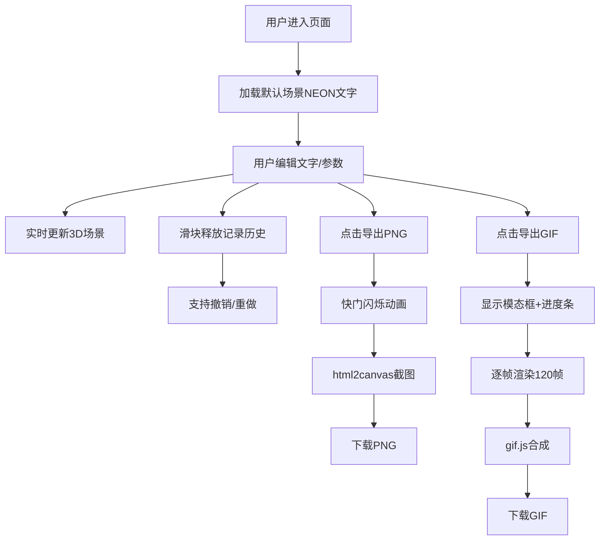

## 1. 产品概述

在线3D霓虹光效文字艺术工坊，让用户在三维场景中自由创建和编辑动态霓虹文字，支持调节颜色、厚度、扭曲程度和发光强度，并导出为动画GIF或静态PNG。

- 主要用途：创意设计、社交媒体内容生成、3D文字艺术创作
- 目标用户：设计师、内容创作者、艺术爱好者
- 产品价值：提供零门槛的3D霓虹文字创作体验，无需专业3D软件即可生成高质量霓虹效果

## 2. 核心功能

### 2.1 用户角色

| 角色 | 注册方式 | 核心权限 |
|------|----------|----------|
| 普通用户 | 无需注册 | 使用全部编辑和导出功能 |

### 2.2 功能模块

1. **3D场景渲染**：Three.js三维场景、霓虹文字生成、发光后处理
2. **文字编辑控制**：文本输入、颜色选择、参数调节滑块
3. **历史记录管理**：撤销/重做功能（10步）
4. **导出功能**：PNG静态截图、GIF动画导出
5. **交互界面**：控制面板、进度模态框、加载遮罩

### 2.3 页面详情

| 页面名称 | 模块名称 | 功能描述 |
|----------|----------|---------|
| 主页面 | 3D视口 | 展示3D霓虹文字场景，支持摄像机自动旋转 |
| 主页面 | 控制面板 | 文字编辑、颜色选择、参数调节、导出按钮 |
| 主页面 | 导出模态框 | GIF导出进度显示、操作禁用遮罩 |

## 3. 核心流程

## 4. 用户界面设计

### 4.1 设计风格

- **主色调**：深黑色(#0a0a0e)、深紫色(#1a0a2e)、青蓝色(#00ffff)、品红色(#ff00ff)
- **按钮风格**：渐变填充（#00d4ff到#0088ff），圆角16px，悬停上移2px
- **字体**：独特的赛博朋克风格字体，发光文字带光晕效果
- **布局**：左侧75% 3D视口，右侧320px控制面板
- **视觉效果**：毛玻璃效果、渐变滑块、发光边框、平滑过渡动画

### 4.2 页面设计概述

| 页面名称 | 模块名称 | UI元素 |
|----------|----------|--------|
| 主页面 | 3D视口 | 径向渐变背景、半透明网格地面、发光3D文字、Bloom后处理 |
| 主页面 | 控制面板 | 发光标题"霓虹工坊"、文本输入框、预设颜色块、CirclePicker调色盘、渐变滑块、撤销/重做按钮、导出按钮 |
| 主页面 | 导出模态框 | 毛玻璃背景、渐变色进度条、居中白色文字 |

### 4.3 响应式

- 桌面端优先设计，适配1280x720以上分辨率
- 控制面板可拖拽调整宽度（280px-400px）
- 触控设备优化滑块交互

### 4.4 3D场景设计

- **环境**：深黑到深紫径向渐变背景，半透明白色网格地面
- **灯光**：环境光+点光源，突出霓虹发光效果
- **摄像机**：默认位置(0, 2, 5)，绕Y轴每30秒旋转一周
- **构图**：文字悬浮于Y轴高度1单位，居中显示
- **交互**：参数实时更新，文字闪烁动画
- **后处理**：Bloom发光效果，emissive自发光材质
- **性能**：帧率45fps以上，120帧GIF导出≤15秒
