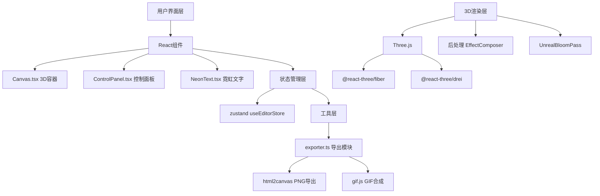

## 1. 架构设计



## 2. 技术描述

- **前端框架**：React@18 + TypeScript@5 + Vite@5
- **3D渲染**：Three@0.160 + @react-three/fiber@8.15 + @react-three/drei@9.92 + @react-three/postprocessing@2.15
- **状态管理**：Zustand@4.4
- **UI交互**：react-color@2.19（CirclePicker调色盘）
- **导出功能**：html2canvas@1.4、gif.js@0.2
- **初始化工具**：vite-init
- **后端**：无（纯前端应用）
- **数据库**：无

## 3. 目录结构

| 路径 | 用途 |
|------|------|
| src/components/Canvas.tsx | 3D场景容器，初始化渲染器、灯光、摄像机 |
| src/components/ControlPanel.tsx | 右侧浮动控制面板 |
| src/scenes/NeonText.tsx | 核心3D字模生成与发光效果 |
| src/store/useEditorStore.ts | Zustand状态管理 |
| src/utils/exporter.ts | 导出工具模块 |
| src/App.tsx | 主应用组件 |
| src/main.tsx | 应用入口 |
| src/index.css | 全局样式 |

## 4. 数据模型

### 4.1 编辑器状态

```typescript
interface EditorState {
  text: string;
  color: string;
  thickness: number;
  twist: number;
  glowIntensity: number;
  history: EditorState[];
  historyIndex: number;
}
```

### 4.2 导出配置

```typescript
interface ExportConfig {
  type: 'png' | 'gif';
  gifConfig?: {
    frames: number;
    fps: number;
    duration: number;
  };
}
```

## 5. 核心技术实现

### 5.1 3D霓虹文字生成
- 使用 `TextGeometry` + `ExtrudeGeometry` 生成3D字体
- `MeshStandardMaterial` 配置 `emissive` 自发光
- `UnrealBloomPass` 后处理实现霓虹光晕效果
- 每个字符独立旋转实现扭曲效果

### 5.2 性能优化
- 几何体复用与缓存
- 材质参数实时更新而非重建
- 历史记录限制10步防止内存溢出
- GIF导出使用离屏Canvas渲染

### 5.3 导出流程
- PNG：html2canvas捕获3D画布 → 转换为Blob → 触发下载
- GIF：逐帧渲染场景 → 收集ImageData → gif.js编码 → 导出

## 6. 关键依赖版本

| 包名 | 版本 |
|------|------|
| react | ^18.2.0 |
| react-dom | ^18.2.0 |
| three | ^0.160.0 |
| @react-three/fiber | ^8.15.12 |
| @react-three/drei | ^9.92.7 |
| @react-three/postprocessing | ^2.15.11 |
| zustand | ^4.4.7 |
| react-color | ^2.19.3 |
| html2canvas | ^1.4.1 |
| gif.js | ^0.2.0 |
| typescript | ^5.3.3 |
| vite | ^5.0.10 |
| @types/react | ^18.2.43 |
| @types/three | ^0.160.0 |
