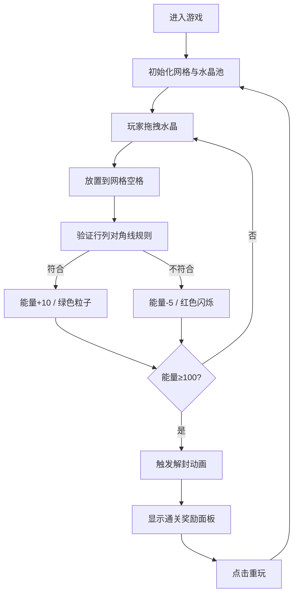

## 1. 产品概述

元素水晶排列谜题是一款古风魔法主题的数独类益智游戏。玩家通过拖拽不同元素的水晶到3x3网格中，使每行、每列及两条对角线上的水晶元素都不重复，最终能量条充满时触发解封动画，获得通关奖励。

- **目标用户**：喜欢益智解谜游戏的玩家，对古风魔法题材感兴趣的用户
- **产品价值**：提供轻松有趣的数独变体玩法，结合精美的视觉动画效果，带来沉浸式的解谜体验

## 2. 核心功能

### 2.1 功能模块

1. **游戏主界面**：3x3游戏网格、水晶池、能量条、控制按钮
2. **拖拽放置系统**：从水晶池拖拽水晶到网格空格
3. **规则验证系统**：实时检测行、列、对角线元素唯一性
4. **能量反馈系统**：能量条动态增减、粒子特效、警示闪烁
5. **提示与重置系统**：3次提示机会、一键重置游戏
6. **通关奖励系统**：解封动画、奖励面板、重玩功能

### 2.2 页面详情

| 页面名称 | 模块名称 | 功能描述 |
|---------|---------|----------|
| 游戏主页面 | 头部区域 | 游戏标题、重置按钮、提示按钮、能量数值显示 |
| 游戏主页面 | 能量条 | 金色渐变填充，实时反映能量值，弹簧动画过渡 |
| 游戏主页面 | 3x3网格 | 羊皮纸背景格子，放置水晶，拖拽目标区域 |
| 游戏主页面 | 水晶池 | 18颗水晶（6种各3颗），自动上下浮动，拖拽源区域 |
| 游戏主页面 | 通关面板 | 毛玻璃卡片，金色文字，步数统计，重玩按钮 |

## 3. 核心流程

玩家进入游戏 → 查看初始空网格和水晶池 → 从水晶池拖拽水晶到网格 → 系统验证放置是否符合规则 → 符合则能量+10（绿色粒子），不符合则能量-5（红色闪烁）→ 能量满100触发解封动画 → 显示通关奖励面板 → 点击重玩重置游戏

## 4. 用户界面设计

### 4.1 设计风格

- **设计主题**：古卷轴 / 魔法大陆 / 羊皮纸风格
- **主色调**：深棕色 #2f1a0e（背景）、金色 #ffd700（装饰/强调）
- **辅助色**：浅米色 #f5deb3（文字）、羊皮纸色 #d2b48c（网格背景）、木纹色 #8b4513（水晶池）
- **水晶颜色**：火红 #ff4500、冰蓝 #00bfff、雷电紫 #8a2be2、自然绿 #32cd32、暗影黑 #2f2f2f、圣光金 #ffd700
- **字体**：标题使用 "Cinzel Decorative" 衬线字体，正文使用优雅的无衬线字体
- **按钮样式**：圆形图标按钮，悬浮缩放反馈
- **卡片样式**：毛玻璃效果，金色边框，圆角24px
- **动画风格**：framer-motion 弹簧动画，粒子特效，发光光晕

### 4.2 页面设计概览

| 页面名称 | 模块名称 | UI元素 |
|---------|---------|--------|
| 游戏主页面 | 头部 | 标题文字(Cinzel Decorative/金色/粗体)、重置按钮(红色圆形/警告图标)、提示按钮(蓝色圆形/问号图标)、能量数值(金色) |
| 游戏主页面 | 能量条 | 深色背景#2f1a0e、金色渐变填充、spring动画(stiffness=200, damping=15) |
| 游戏主页面 | 3x3网格 | 羊皮纸色背景#d2b48c、格子120x120px、5px圆角、2px#8b4513边框、纸莎草纹理 |
| 游戏主页面 | 水晶组件 | 圆形/多边形水晶、对应元素颜色、8px金色外发光(悬浮时)、悬浮缩放动效 |
| 游戏主页面 | 水晶池 | 木纹色#8b4513圆角矩形托盘、水晶每隔2秒上下浮动(y轴-3到3循环) |
| 游戏主页面 | 通关面板 | 毛玻璃背景rgba(255,215,0,0.15)、12px模糊、1px#ffd700边框、圆角24px、金色大号文字 |

### 4.3 响应式设计

- **桌面端**（768px以上）：网格每格120px，水晶池单行显示
- **移动端**（768px以下）：网格每格80px，水晶池两行显示
- 所有交互元素支持触摸操作
- 布局居中对齐，自适应屏幕宽度

### 4.4 动效设计

- **水晶浮动**：y轴-3px到3px循环动画，2秒周期
- **能量条变化**：spring动画（stiffness 200, damping 15）
- **放置反馈**：正确时绿色上升粒子，错误时红色警示闪烁
- **解封特效**：全屏白色闪烁（0.3秒透明度0→0.5→0）、金色粒子爆炸（10个粒子从中心扩散，0.5秒消失）
- **提示高亮**：金色边框缓慢脉动动画
- **按钮交互**：悬浮scale放大、点击opacity变化
