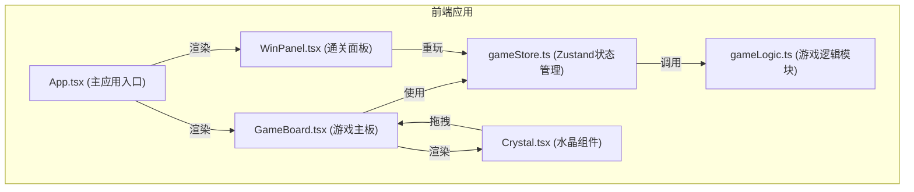

## 1. 架构设计



## 2. 技术栈说明

- **前端框架**：React 18 + TypeScript
- **构建工具**：Vite
- **状态管理**：Zustand
- **动画库**：Framer Motion
- **拖拽库**：react-beautiful-dnd
- **样式方案**：CSS Modules / 内联样式 (framer-motion)

## 3. 文件结构与调用关系

```
src/
├── App.tsx                      # 主应用组件
│   └── 调用: gameStore, GameBoard, WinPanel
├── store/
│   └── gameStore.ts             # Zustand状态管理
│       └── 调用: gameLogic 工具函数
├── components/
│   ├── GameBoard.tsx            # 游戏主板组件
│   │   ├── 子组件: Crystal
│   │   └── 调用: gameStore (placeCrystal, resetGame, useHint)
│   ├── Crystal.tsx              # 单个水晶组件
│   │   └── 接收: type, isDragging
│   └── WinPanel.tsx             # 通关奖励面板
│       └── 调用: gameStore (gameStatus, totalMoves, resetGame)
└── utils/
    └── gameLogic.ts             # 游戏逻辑模块
        ├── generateCrystals()   # 生成水晶池
        ├── validatePlacement()  # 验证放置规则
        ├── checkWinCondition()  # 检查胜利条件
        └── findHint()           # 查找提示位置
```

**数据流向**：
1. 用户拖拽 → GameBoard 捕获拖拽事件 → 调用 gameStore.placeCrystal
2. placeCrystal → 调用 gameLogic.validatePlacement 验证规则
3. 验证结果 → 更新 store 中的 energy、grid、gameStatus
4. store 状态变化 → App/GameBoard/WinPanel 重新渲染
5. 动画效果由 framer-motion 根据状态变化自动触发

## 4. 数据模型

### 4.1 水晶类型

```typescript
type CrystalType = 'fire' | 'ice' | 'thunder' | 'nature' | 'shadow' | 'holy';

interface CrystalConfig {
  type: CrystalType;
  name: string;      // 中文名称
  color: string;     // 十六进制颜色
  glowColor: string; // 发光颜色
}
```

### 4.2 游戏状态

```typescript
type GameStatus = 'playing' | 'won';

interface GameState {
  grid: (CrystalType | null)[];  // 9个位置，索引0-8对应3x3网格
  crystalPool: CrystalType[];     // 水晶池，18颗
  energy: number;                 // 能量值 0-100
  gameStatus: GameStatus;         // 游戏状态
  hintsRemaining: number;         // 剩余提示次数
  totalMoves: number;             // 总步数
  highlightedCell: number | null; // 高亮提示的格子索引
}
```

### 4.3 Store Actions

```typescript
interface GameActions {
  initGame: () => void;           // 初始化游戏
  placeCrystal: (cellIndex: number, poolIndex: number) => boolean; 
                                  // 放置水晶，返回是否成功
  removeCrystal: (cellIndex: number) => void; // 从网格移除水晶
  resetGame: () => void;          // 重置游戏
  useHint: () => void;            // 使用提示
  clearHighlight: () => void;     // 清除高亮
}
```

## 5. 核心算法

### 5.1 规则验证

- 每次放置水晶后，检查所在行、列、两条对角线（如果在对角线上）
- 行索引：row = Math.floor(index / 3)，行内元素：grid[row*3], grid[row*3+1], grid[row*3+2]
- 列索引：col = index % 3，列内元素：grid[col], grid[col+3], grid[col+6]
- 主对角线（左上到右下）：index % 4 === 0，元素：grid[0], grid[4], grid[8]
- 副对角线（右上到左下）：index % 2 === 0 && index !== 4 && index < 8，元素：grid[2], grid[4], grid[6]
- 验证非空元素是否有重复

### 5.2 提示算法

- 遍历所有空格子
- 对每个空格子，尝试放置每种水晶
- 使用规则验证找到一个合法放置
- 返回第一个找到的合法放置的位置和水晶类型

### 5.3 胜利条件

- 能量值 >= 100 时游戏胜利
- 触发解封动画和通关面板

## 6. 性能优化

- 使用 React.memo 包裹 Crystal 组件，避免不必要的重渲染
- 使用 useMemo 缓存派生数据（如水晶池分组）
- 使用 useCallback 缓存事件处理函数
- 拖拽操作使用 react-beautiful-dnd 优化性能
- 动画使用 framer-motion 的 GPU 加速属性（transform, opacity）
