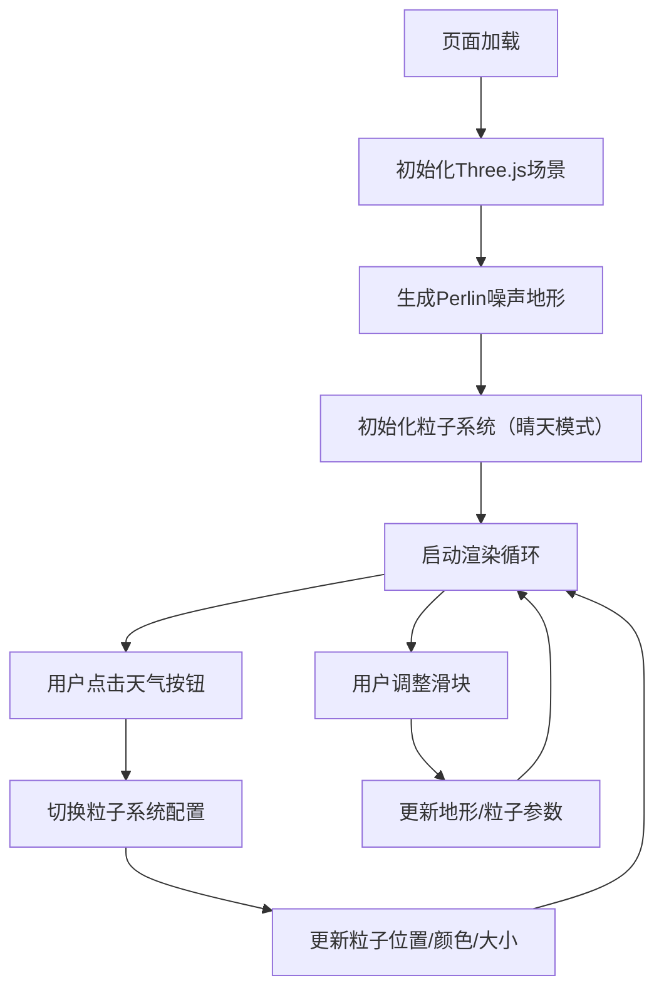

## 1. 产品概述

气象地形3D可视化是一个基于WebGL的交互式天气粒子系统演示平台，通过Three.js实现3D地理地形与动态天气效果的实时渲染。用户可以切换不同天气模式，观察粒子系统在地形上的动态表现，同时通过控制面板调整各项参数。

- 核心价值：提供沉浸式的3D天气可视化体验，展示粒子系统与地形交互的视觉效果
- 目标用户：对WebGL、3D可视化、粒子系统感兴趣的开发者和设计师

## 2. 核心功能

### 2.1 功能模块

1. **3D地形渲染**：基于Perlin噪声生成的动态地形，支持高度缩放和微风动画
2. **天气粒子系统**：四种天气模式（晴天、雷雨、暴雪、沙尘暴）的粒子效果
3. **交互控制面板**：天气模式切换按钮和参数调节滑块
4. **性能优化**：粒子数量控制、后台暂停渲染、帧率保证

### 2.3 页面详情

| 页面名称 | 模块名称 | 功能描述 |
|-----------|-------------|---------------------|
| 主页面 | 3D视口 | 占页面70%宽度，渲染地形和粒子系统，支持OrbitControls相机控制 |
| 主页面 | 天气模式按钮 | 右上角四个圆形按钮，点击切换天气模式，带弹性动画 |
| 主页面 | 应用标题 | 左上角"气象地形"标题，细黑字体加发光描边 |
| 主页面 | 底部控制面板 | 半透明毛玻璃效果，包含粒子密度、风力强度、地形高度缩放三个滑块 |

## 3. 核心流程

用户进入页面 → 默认加载晴天模式 → 3D地形和粒子系统渲染 → 用户点击天气按钮切换模式 → 粒子系统平滑过渡到新模式 → 用户拖动滑块调整参数 → 实时更新渲染效果

## 4. 用户界面设计

### 4.1 设计风格

- **主色调**：深色科技感背景，径向渐变从#0b0e1a到#07090f
- **强调色**：天蓝色#00bfff（标题发光），金色#ffd700（晴天），灰黑#2f2f2f（雷雨），白色#ffffff（暴雪），土黄#b8860b（沙尘暴）
- **地形配色**：低处绿色#3a5a27，高处岩石色#8b7d6b
- **按钮风格**：圆形，直径48px，点击放大1.1倍，0.3秒弹性动画
- **字体**：细黑字体，带发光描边效果
- **毛玻璃效果**：底部控制面板使用rgba(13, 17, 23, 0.8)背景，8px模糊，1px #ffffff10边框，圆角16px
- **滑块风格**：深色渐变轨道(#333 to #555)，圆形滑块按钮（直径20px，渐变白色#fff到#ddd），滑动时放大1.2倍并显示数值提示

### 4.2 页面设计概述

| 页面名称 | 模块名称 | UI元素 |
|-----------|-------------|-------------|
| 主页面 | 3D视口 | 70%宽度，100%高度，Three.js渲染区域，OrbitControls交互 |
| 主页面 | 标题区域 | 左上角，"气象地形"文字，细黑字体，#00bfff发光描边 |
| 主页面 | 天气按钮组 | 右上角，四个圆形按钮垂直排列，各代表一种天气模式 |
| 主页面 | 控制面板 | 底部悬浮，三个滑块带标签和数值显示 |

### 4.3 响应式

- 桌面端优先设计，3D视口占70%宽度
- 移动端适配：3D视口占100%宽度，控制面板改为底部抽屉式
- 触摸优化：支持触摸旋转相机，按钮和滑块增加触控区域

### 4.4 3D场景指导

- **环境光**：AmbientLight(0x404040, 0.5) + DirectionalLight(0xffffff, 1)
- **闪电效果**：雷雨模式下随机生成白色折线，持续0.2秒
- **水面效果**：雷雨模式下地表现实半透明蓝色平面，反射率0.3，带涟漪动画
- **相机设置**：PerspectiveCamera，fov 60，初始位置(0, 10, 20)，看向原点
- **地形**：64x64分辨率，20x20单位尺寸，ShaderMaterial根据高度着色
- **粒子**：PointsMaterial + 圆形渐变模糊纹理，总数≤5000，每帧更新位置
- **后处理**：无额外后处理，保持原生WebGL性能
- **性能预算**：任何模式下帧率≥55fps，粒子更新使用BufferAttribute，requestAnimationFrame驱动
