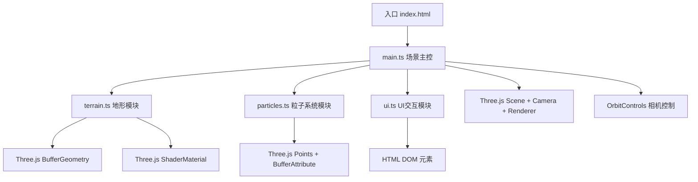

## 1. 架构设计



## 2. 技术描述

- **前端框架**：原生 TypeScript + Three.js，无额外UI框架
- **构建工具**：Vite 5.x
- **3D引擎**：Three.js 0.160.x
- **类型定义**：@types/three
- **模块架构**：
  - `main.ts`：场景初始化、渲染循环、模块整合
  - `terrain.ts`：Perlin噪声地形生成、ShaderMaterial、高度图管理
  - `particles.ts`：粒子系统管理、天气模式切换、粒子更新
  - `ui.ts`：DOM控制面板创建、事件绑定、参数传递
- **性能策略**：
  - 粒子使用BufferAttribute存储位置/颜色/大小
  - 每帧只更新一次粒子数据
  - Page Visibility API检测页面可见性，后台时暂停渲染
  - 粒子总数限制在5000以内

## 3. 路由定义

| 路由 | 用途 |
|-------|---------|
| / | 主页面，3D可视化场景 |

## 4. 数据模型

### 4.1 类型定义

```typescript
// 天气模式枚举
enum WeatherMode {
  SUNNY = 'sunny',
  RAIN = 'rain',
  SNOW = 'snow',
  SANDSTORM = 'sandstorm'
}

// 粒子配置接口
interface ParticleConfig {
  count: number;
  color: number;
  size: number;
  speed: number;
  opacity: number;
}

// 天气配置映射
type WeatherConfig = Record<WeatherMode, ParticleConfig>;

// 控制面板参数
interface ControlParams {
  particleDensity: number;
  windStrength: number;
  terrainScale: number;
}
```

### 4.2 模块接口

#### terrain.ts
```typescript
class Terrain {
  constructor(scene: THREE.Scene);
  updateScale(scale: number): void;
  update(time: number, windStrength: number): void;
  dispose(): void;
}
```

#### particles.ts
```typescript
class ParticleSystem {
  constructor(scene: THREE.Scene);
  switchWeather(mode: WeatherMode): void;
  updateParams(params: Partial<ControlParams>): void;
  update(time: number, windStrength: number): void;
  dispose(): void;
}
```

#### ui.ts
```typescript
class UIManager {
  constructor(
    onWeatherChange: (mode: WeatherMode) => void,
    onParamsChange: (params: Partial<ControlParams>) => void
  );
  setActiveWeather(mode: WeatherMode): void;
  updateParamsDisplay(params: ControlParams): void;
}
```
