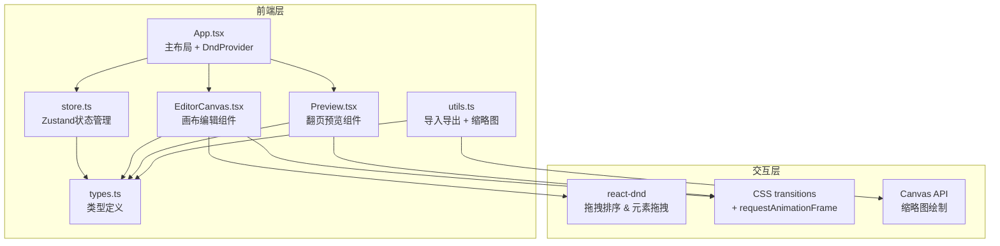

## 1. 架构设计



## 2. 技术说明

- **前端**：React 18 + TypeScript + Vite
- **UI库**：Ant Design（仅Button、Modal、Slider组件）
- **状态管理**：Zustand
- **拖拽交互**：react-dnd + react-dnd-html5-backend
- **动画**：CSS transitions（翻页、元素过渡）+ requestAnimationFrame（拖拽变换）
- **画布绘制**：原生Canvas API（封面缩略图生成）
- **字体**：Google Fonts（Noto Serif SC、ZCOOL QingKe HuangYou、Ma Shan Zheng、ZCOOL XiaoWei、Dancing Script）
- **ID生成**：uuid
- **后端**：无（纯前端应用）
- **数据库**：无（JSON文件本地存储）

## 3. 路由定义

| 路由 | 用途 |
|------|------|
| / | 编辑器主界面（页面面板 + 画布编辑 + 工具栏） |

（预览模式为全屏覆盖层，不使用独立路由）

## 4. 文件结构

```
├── package.json
├── index.html
├── vite.config.ts
├── tsconfig.json
└── src/
    ├── types.ts        # Magazine, Page, Element等接口类型
    ├── store.ts        # Zustand store，管理页面列表、当前页、编辑状态
    ├── App.tsx         # 主布局（DndProvider + 左侧面板 + 编辑区 + 工具栏）
    ├── EditorCanvas.tsx # 画布组件（渲染元素、拖拽变换、点击选中）
    ├── Preview.tsx     # 全屏翻页预览组件
    └── utils.ts        # JSON导入导出、封面缩略图Canvas绘制
```

## 5. 核心数据模型

### 5.1 类型定义

```typescript
interface MagazineElement {
  id: string;
  type: 'text' | 'image' | 'rect';
  x: number;          // 画布内相对位置
  y: number;
  width: number;
  height: number;
  rotation: number;    // 角度
  zIndex: number;
  // 文字块属性
  content?: string;
  fontFamily?: string;
  fontSize?: number;
  color?: string;
  // 图片属性
  src?: string;
  // 矩形色块属性
  fillColor?: string;
}

interface Page {
  id: string;
  title: string;
  elements: MagazineElement[];
  isCover: boolean;
  isToc: boolean;
  order: number;
}

interface Magazine {
  id: string;
  name: string;
  author: string;
  pages: Page[];
  coverPageId: string | null;
}
```

### 5.2 状态结构（Zustand Store）

```typescript
interface MagazineStore {
  magazine: Magazine;
  currentPageId: string | null;
  selectedElementId: string | null;
  isPreviewMode: boolean;
  // 操作方法
  addPage: () => void;
  removePage: (id: string) => void;
  movePage: (fromIndex: number, toIndex: number) => void;
  setCurrentPage: (id: string) => void;
  addElement: (pageId: string, element: MagazineElement) => void;
  updateElement: (pageId: string, elementId: string, updates: Partial<MagazineElement>) => void;
  removeElement: (pageId: string, elementId: string) => void;
  selectElement: (id: string | null) => void;
  setCoverPage: (pageId: string) => void;
  generateToc: () => void;
  setPreviewMode: (mode: boolean) => void;
  importMagazine: (data: Magazine) => void;
  updateMagazineInfo: (name: string, author: string) => void;
}
```
