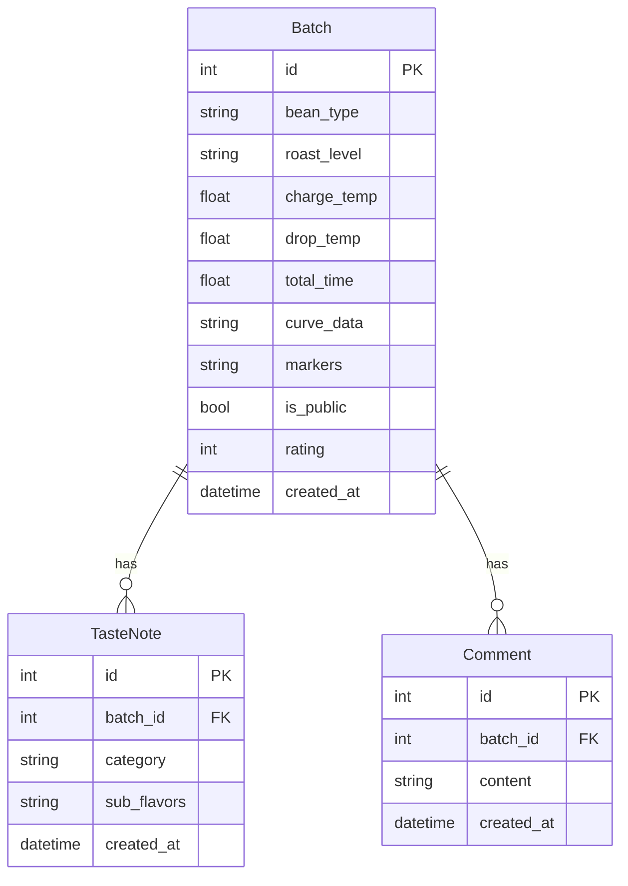

## 1. 架构设计

```mermaid
graph TB
    subgraph "前端 (React 18 + TypeScript + Vite)"
        A[页面组件] --> B[Zustand Store]
        A --> C[API Client (Axios)]
        B --> D[状态管理]
    end
    subgraph "后端 (FastAPI + Python)"
        E[API Routes] --> F[CRUD 操作]
        F --> G[SQLAlchemy ORM]
        G --> H[SQLite 数据库]
    end
    C -->|HTTP请求| E
    E -->|JSON响应| C
```

## 2. 技术说明

- **前端**：React@18 + TypeScript + Vite + Chart.js + react-chartjs-2 + Zustand + react-router-dom + Axios
- **初始化工具**：Vite (react-ts template)
- **后端**：FastAPI + Uvicorn + SQLAlchemy + Pydantic
- **数据库**：SQLite（文件存储，存储批次、品鉴笔记和评论）
- **图表**：Chart.js + react-chartjs-2 实现实时温度曲线
- **状态管理**：Zustand 管理批次数据与风味标签

## 3. 路由定义

| 路由 | 用途 |
|------|------|
| / | 首页，导航入口 |
| /batch/new | 新建烘焙批次，实时曲线模拟 |
| /batch/:id | 批次详情，完整曲线与品鉴历史 |
| /taste | 风味品鉴页面，风味轮盘交互 |
| /community | 社区页面，公开批次卡片列表 |
| /community/:id | 社区批次详情，完整信息与评论 |

## 4. API 定义

### 4.1 批次相关 API

| 方法 | 路径 | 描述 | 请求体 | 响应体 |
|------|------|------|--------|--------|
| POST | /api/batches | 创建批次 | BatchCreate | BatchResponse |
| GET | /api/batches/{id} | 获取批次详情 | - | BatchResponse |
| GET | /api/batches | 获取批次列表 | Query: skip, limit | List[BatchResponse] |
| POST | /api/batches/{id}/clone | 克隆批次 | - | BatchResponse |

### 4.2 品鉴笔记 API

| 方法 | 路径 | 描述 | 请求体 | 响应体 |
|------|------|------|--------|--------|
| POST | /api/taste-notes | 创建品鉴笔记 | TasteNoteCreate | TasteNoteResponse |
| GET | /api/batches/{id}/taste-notes | 获取批次品鉴笔记 | - | List[TasteNoteResponse] |

### 4.3 社区相关 API

| 方法 | 路径 | 描述 | 请求体 | 响应体 |
|------|------|------|--------|--------|
| GET | /api/community | 获取公开批次列表 | Query: bean_type, roast_level, page, page_size | PaginatedBatches |
| GET | /api/community/{id} | 获取公开批次详情 | - | PublicBatchDetail |

### 4.4 评论相关 API

| 方法 | 路径 | 描述 | 请求体 | 响应体 |
|------|------|------|--------|--------|
| POST | /api/comments | 发表评论 | CommentCreate | CommentResponse |
| GET | /api/batches/{id}/comments | 获取批次评论 | - | List[CommentResponse] |

### 4.5 TypeScript 类型定义

```typescript
interface Batch {
  id: number;
  bean_type: string;
  roast_level: string;
  charge_temp: number;
  drop_temp: number;
  total_time: number;
  curve_data: CurvePoint[];
  markers: Marker[];
  is_public: boolean;
  rating: number;
  created_at: string;
}

interface CurvePoint {
  time: number;
  bean_temp: number;
  env_temp: number;
  ror: number;
  phase: number;
}

interface Marker {
  time: number;
  label: string;
}

interface TasteNote {
  id: number;
  batch_id: number;
  category: string;
  sub_flavors: string[];
  created_at: string;
}

interface Comment {
  id: number;
  batch_id: number;
  content: string;
  created_at: string;
}

interface PublicBatch {
  id: number;
  bean_type: string;
  roast_level: string;
  total_time: number;
  flavor_tags: string[];
  rating: number;
  created_at: string;
}
```

## 5. 服务端架构图


## 6. 数据模型

### 6.1 数据模型定义



### 6.2 数据定义语言

```sql
CREATE TABLE batches (
    id INTEGER PRIMARY KEY AUTOINCREMENT,
    bean_type VARCHAR(50) NOT NULL,
    roast_level VARCHAR(20) NOT NULL,
    charge_temp FLOAT NOT NULL,
    drop_temp FLOAT NOT NULL,
    total_time FLOAT NOT NULL,
    curve_data TEXT NOT NULL,
    markers TEXT NOT NULL DEFAULT '[]',
    is_public BOOLEAN NOT NULL DEFAULT 1,
    rating INTEGER NOT NULL DEFAULT 3,
    created_at DATETIME NOT NULL DEFAULT CURRENT_TIMESTAMP
);

CREATE TABLE taste_notes (
    id INTEGER PRIMARY KEY AUTOINCREMENT,
    batch_id INTEGER NOT NULL,
    category VARCHAR(50) NOT NULL,
    sub_flavors TEXT NOT NULL DEFAULT '[]',
    created_at DATETIME NOT NULL DEFAULT CURRENT_TIMESTAMP,
    FOREIGN KEY (batch_id) REFERENCES batches(id)
);

CREATE TABLE comments (
    id INTEGER PRIMARY KEY AUTOINCREMENT,
    batch_id INTEGER NOT NULL,
    content VARCHAR(200) NOT NULL,
    created_at DATETIME NOT NULL DEFAULT CURRENT_TIMESTAMP,
    FOREIGN KEY (batch_id) REFERENCES batches(id)
);
```
