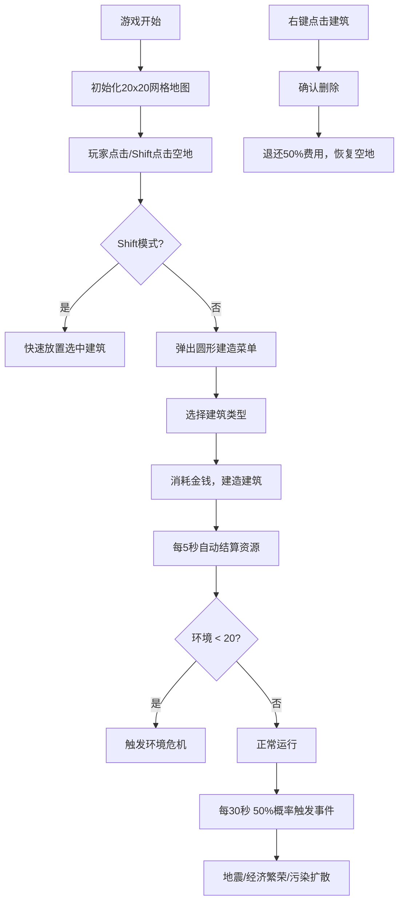

## 1. 产品概述
像素风城市模拟经营游戏，玩家在20x20网格地图上规划建造住宅、商业和工业建筑，通过管理人口、金钱、幸福度和环境四项核心资源，实现城市的可持续发展。

- 核心玩法：策略性城市规划与资源管理，平衡经济发展与环境保护
- 目标用户：喜欢模拟经营类游戏的休闲玩家
- 产品价值：提供轻松有趣的城市建设体验，培养资源规划与平衡思维

## 2. 核心功能

### 2.1 功能模块
1. **地图建造系统**：20x20网格地图，支持四种建筑类型（住宅、商业、工业、空地），圆形建造菜单，快速建造模式
2. **资源管理系统**：人口、金钱、幸福度、环境四项资源的自动结算与动态平衡
3. **随机事件系统**：地震、经济繁荣、污染扩散等随机事件影响城市发展
4. **统计面板系统**：城市名称、资源趋势图、城市等级展示
5. **建筑操作功能**：右键删除建筑并退还50%建造费用

### 2.2 页面详情
| 页面名称 | 模块名称 | 功能描述 |
|-----------|-------------|---------------------|
| 游戏主界面 | 地图网格 | 20x20网格，支持点击建造，hover高亮效果 |
| 游戏主界面 | 建造菜单 | 圆形毛玻璃菜单，四种建筑选择图标 |
| 游戏主界面 | 资源面板 | 四项资源数值显示，变化动画，趋势箭头 |
| 游戏主界面 | 统计面板 | 城市名称、趋势折线图、城市等级 |
| 游戏主界面 | 事件通知 | 底部滑入事件通知卡片，自动消失 |

## 3. 核心流程
玩家进入游戏后，初始地图左右边界为道路，中央有初始空地。玩家通过点击空地弹出建造菜单选择建筑类型，或按住Shift快速建造。每5秒自动结算一次资源，建筑产生对应产出。每30秒有50%概率触发随机事件。环境低于20时触发环境危机。玩家可右键删除建筑退还部分费用。

## 4. 用户界面设计

### 4.1 设计风格
- 深色像素风主题，主背景为深蓝灰(#1a1a2e)到紫黑(#16213e)的径向渐变
- 建筑颜色：住宅#6a994e（绿色）、商业#bc4749（红色）、工业#457b9d（蓝色）、空地#a8dadc（灰色）
- 毛玻璃效果：rgba(30,30,40,0.9)背景配合8px模糊
- 统一圆角12px，像素风格图标
- 字体：像素风格字体配合清晰的无衬线字体

### 4.2 页面设计概述
| 页面名称 | 模块名称 | UI元素 |
|-----------|-------------|-------------|
| 游戏主界面 | 地图网格 | 20x20白色半透明网格线，建筑色块填充，hover白色外发光边框 |
| 游戏主界面 | 建造菜单 | 直径150px圆形毛玻璃菜单，四个32x32像素图标按钮 |
| 游戏主界面 | 资源面板 | 四项资源并排显示，数值跳动动画，趋势箭头指示增减 |
| 游戏主界面 | 统计面板 | 右侧固定350px宽，深色半透明背景，折线图展示5次结算历史 |
| 游戏主界面 | 事件通知 | 底部中央弹出，红/绿色背景，白色文字，滑入淡出动画 |

### 4.3 响应式
- 桌面端（1200px以上）：地图与统计面板并排显示
- 平板端（1000-1200px）：地图自适应宽度，面板稍窄
- 移动端（1000px以下）：统计面板折叠为底部工具栏，可展开查看详情

### 4.4 动画效果
- 数值变化：逐帧跳变动画，颜色渐变
- 建筑放置：缩放出现动画
- 事件通知：底部滑入，3秒后淡出
- 环境危机：建筑格子红色光晕闪烁（1秒周期）
- 经济繁荣：商业建筑金色边框闪烁
- 城市等级提升：金色光环扩散动画
- 污染扩散：蓝色烟雾扩散动画
