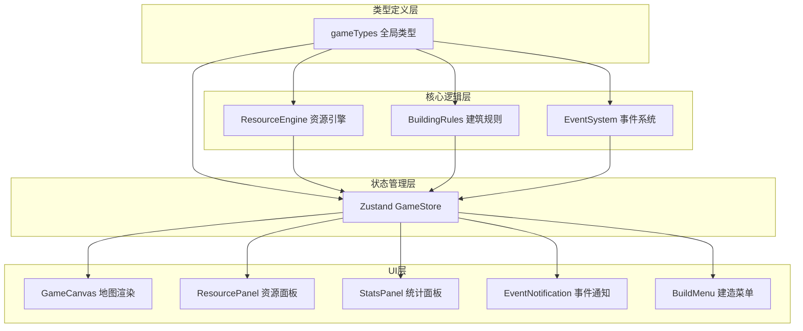

## 1. 架构设计
纯前端React应用，采用分层架构设计，核心逻辑与UI渲染分离。



## 2. 技术描述
- 前端框架：React 18 + TypeScript
- 构建工具：Vite
- 状态管理：Zustand + Immer
- 样式方案：CSS Modules + 原生CSS动画
- 图表绘制：原生Canvas API
- 无后端依赖，纯前端运行

## 3. 项目结构
```
d:\P\tasks\auto41
├── package.json
├── index.html
├── tsconfig.json
├── vite.config.js
└── src/
    ├── types/
    │   └── gameTypes.ts          # 全局类型定义
    ├── core/
    │   ├── resourceEngine.ts     # 资源计算引擎
    │   ├── buildingRules.ts      # 建筑规则定义
    │   └── eventSystem.ts        # 随机事件系统
    ├── store/
    │   └── gameStore.ts          # Zustand状态管理
    ├── components/
    │   ├── GameCanvas.tsx        # 地图网格渲染
    │   ├── ResourcePanel.tsx     # 资源显示面板
    │   ├── StatsPanel.tsx        # 统计面板（趋势图）
    │   ├── EventNotification.tsx # 事件通知组件
    │   └── BuildMenu.tsx         # 圆形建造菜单
    ├── hooks/
    │   ├── useGameLoop.ts        # 游戏循环Hook
    │   └── useAnimation.ts       # 动画相关Hook
    ├── App.tsx                   # 主应用组件
    ├── main.tsx                  # 入口文件
    └── index.css                 # 全局样式
```

## 4. 数据模型

### 4.1 类型定义
```typescript
// 建筑类型
type BuildingType = 'empty' | 'residential' | 'commercial' | 'industrial' | 'road';

// 资源状态
interface Resources {
  population: number;
  money: number;
  happiness: number;
  environment: number;
}

// 地图格子
interface GridCell {
  x: number;
  y: number;
  building: BuildingType;
  isHighlighted?: boolean;
}

// 游戏事件
interface GameEvent {
  id: string;
  type: 'earthquake' | 'prosperity' | 'pollution';
  name: string;
  description: string;
  isPositive: boolean;
  duration?: number;
  timestamp: number;
}

// 建筑规则
interface BuildingConfig {
  type: BuildingType;
  name: string;
  cost: number;
  color: string;
  production: Partial<Resources>;
  consumption: Partial<Resources>;
}

// 游戏状态
interface GameState {
  grid: GridCell[][];
  resources: Resources;
  resourceHistory: Resources[];
  events: GameEvent[];
  cityName: string;
  selectedBuilding: BuildingType | null;
  isShiftPressed: boolean;
  environmentalCrisis: boolean;
  prosperityBoost: boolean;
  buildMenu: { visible: boolean; x: number; y: number; cellX: number; cellY: number } | null;
}
```

### 4.2 核心配置常量
```typescript
// 建筑配置
const BUILDING_CONFIGS: Record<BuildingType, BuildingConfig> = {
  residential: {
    type: 'residential',
    name: '住宅',
    cost: 100,
    color: '#6a994e',
    production: { population: 10, money: 5 },
    consumption: {}
  },
  commercial: {
    type: 'commercial',
    name: '商业',
    cost: 200,
    color: '#bc4749',
    production: { money: 20, happiness: 2 },
    consumption: {}
  },
  industrial: {
    type: 'industrial',
    name: '工业',
    cost: 300,
    color: '#457b9d',
    production: { money: 30 },
    consumption: { environment: -5, happiness: -1 }
  },
  empty: {
    type: 'empty',
    name: '空地',
    cost: 0,
    color: 'transparent',
    production: {},
    consumption: {}
  },
  road: {
    type: 'road',
    name: '道路',
    cost: 0,
    color: '#333',
    production: {},
    consumption: {}
  }
};

// 游戏常量
const GRID_SIZE = 20;
const SETTLE_INTERVAL = 5000; // 5秒结算
const EVENT_INTERVAL = 30000; // 30秒事件
const CRISIS_DURATION = 30000; // 危机持续30秒
const PROSPERITY_DURATION = 20000; // 繁荣持续20秒
const HISTORY_LENGTH = 5; // 历史记录长度
```

## 5. 核心模块设计

### 5.1 ResourceEngine - 资源引擎
- 负责每5秒结算一次资源
- 计算各建筑的产出与消耗
- 处理环境危机的50%减产效果
- 处理经济繁荣的商业翻倍效果
- 限制数值范围（环境0-100）
- 记录资源历史用于趋势图

### 5.2 BuildingRules - 建筑规则
- 定义各建筑类型的建造成本和产出
- 验证建造条件（金钱充足、相邻已有建筑或道路）
- 处理删除建筑的50%退款逻辑
- 提供升级路径定义（预留扩展）

### 5.3 EventSystem - 事件系统
- 每30秒50%概率触发随机事件
- 事件类型：地震、经济繁荣、污染扩散
- 处理事件效果（摧毁建筑、产出翻倍、污染格子）
- 管理事件持续时间和过期清理

### 5.4 GameStore - 状态管理
- 使用Zustand + Immer管理全局状态
- 封装地图操作（建造、删除）
- 封装资源更新操作
- 封装事件触发和处理
- 提供状态选择器优化渲染性能

### 5.5 GameCanvas - 地图渲染
- 使用Canvas渲染20x20网格
- 每帧30fps更新渲染
- 处理鼠标hover高亮效果
- 处理点击建造和右键删除
- 实现建筑格子的动画效果（闪烁、光晕等）

### 5.6 StatsPanel - 统计面板
- 展示城市名称（随机生成四字中文名）
- 绘制四项资源的趋势折线图（Canvas绘制）
- 展示城市等级（村庄/城镇/城市/都市）
- 等级变化时播放金色光环动画

## 6. 性能优化
- 使用Canvas批量渲染网格，避免DOM操作开销
- Zustand状态分片，只订阅必要的状态切片
- useCallback/useMemo优化重渲染
- requestAnimationFrame控制30fps帧率
- 事件节流/防抖处理用户输入
- 动画使用CSS transform和opacity，触发GPU加速
