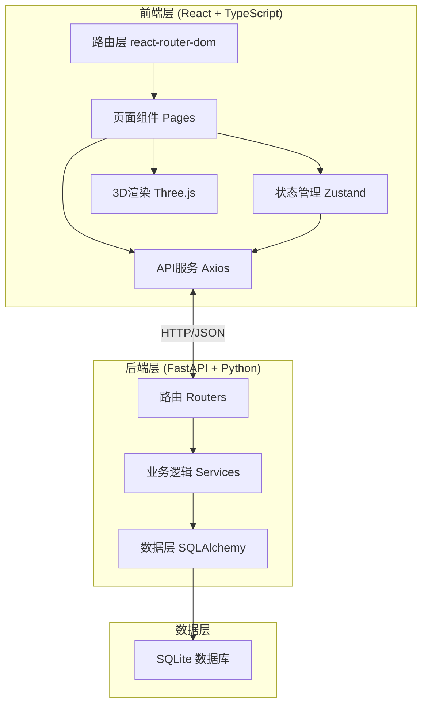
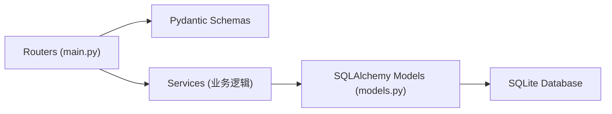
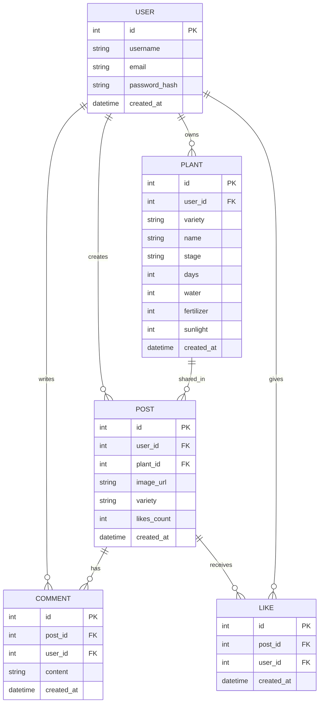

## 1. 架构设计



## 2. 技术说明

- **前端**：React@18 + TypeScript + Vite + Zustand + Three.js
- **初始化工具**：Vite (react-ts模板)
- **后端**：FastAPI + Uvicorn
- **数据库**：SQLite (SQLAlchemy ORM)
- **前端路由**：react-router-dom
- **HTTP客户端**：axios
- **图标**：lucide-react

## 3. 路由定义

| 路由 | 用途 |
|------|------|
| / | 登录注册页面 |
| /home | 首页花园网格页面 |
| /plant/:id | 单株养护页面 |
| /community | 社区广场页面 |

## 4. API 定义

### TypeScript 类型定义

```typescript
interface User {
  id: number;
  username: string;
  email: string;
  avatar?: string;
  created_at: string;
}

interface Plant {
  id: number;
  user_id: number;
  variety: 'pothos' | 'cactus' | 'sunflower' | 'succulent';
  name: string;
  stage: 'sprout' | 'growing' | 'flowering' | 'wilting';
  days: number;
  water: number;
  fertilizer: number;
  sunlight: number;
  created_at: string;
}

interface Post {
  id: number;
  user_id: number;
  plant_id: number;
  image_url: string;
  variety: string;
  likes: number;
  liked_by_me: boolean;
  username: string;
  comments: Comment[];
  created_at: string;
}

interface Comment {
  id: number;
  post_id: number;
  user_id: number;
  username: string;
  content: string;
  created_at: string;
}
```

### API 接口

- `POST /api/auth/register` - 用户注册
- `POST /api/auth/login` - 用户登录
- `GET /api/plants` - 获取用户植物列表
- `POST /api/plants` - 创建新植物
- `GET /api/plants/:id` - 获取单株详情
- `PUT /api/plants/:id` - 更新植物状态
- `POST /api/plants/:id/water` - 浇水
- `POST /api/plants/:id/fertilize` - 施肥
- `POST /api/plants/:id/sunlight` - 光照
- `GET /api/posts` - 获取社区帖子列表
- `POST /api/posts` - 创建分享帖子
- `POST /api/posts/:id/like` - 点赞
- `POST /api/posts/:id/comment` - 评论

## 5. 后端架构图



## 6. 数据模型

### 6.1 ER图



### 6.2 DDL 语句

```sql
CREATE TABLE users (
    id INTEGER PRIMARY KEY AUTOINCREMENT,
    username VARCHAR(50) UNIQUE NOT NULL,
    email VARCHAR(100) UNIQUE NOT NULL,
    password_hash VARCHAR(255) NOT NULL,
    created_at DATETIME DEFAULT CURRENT_TIMESTAMP
);

CREATE TABLE plants (
    id INTEGER PRIMARY KEY AUTOINCREMENT,
    user_id INTEGER NOT NULL REFERENCES users(id),
    variety VARCHAR(20) NOT NULL,
    name VARCHAR(50) NOT NULL,
    stage VARCHAR(20) DEFAULT 'sprout',
    days INTEGER DEFAULT 0,
    water INTEGER DEFAULT 50,
    fertilizer INTEGER DEFAULT 30,
    sunlight INTEGER DEFAULT 40,
    created_at DATETIME DEFAULT CURRENT_TIMESTAMP
);

CREATE TABLE posts (
    id INTEGER PRIMARY KEY AUTOINCREMENT,
    user_id INTEGER NOT NULL REFERENCES users(id),
    plant_id INTEGER REFERENCES plants(id),
    image_url TEXT NOT NULL,
    variety VARCHAR(20) NOT NULL,
    likes_count INTEGER DEFAULT 0,
    created_at DATETIME DEFAULT CURRENT_TIMESTAMP
);

CREATE TABLE comments (
    id INTEGER PRIMARY KEY AUTOINCREMENT,
    post_id INTEGER NOT NULL REFERENCES posts(id),
    user_id INTEGER NOT NULL REFERENCES users(id),
    content VARCHAR(50) NOT NULL,
    created_at DATETIME DEFAULT CURRENT_TIMESTAMP
);

CREATE TABLE likes (
    id INTEGER PRIMARY KEY AUTOINCREMENT,
    post_id INTEGER NOT NULL REFERENCES posts(id),
    user_id INTEGER NOT NULL REFERENCES users(id),
    created_at DATETIME DEFAULT CURRENT_TIMESTAMP,
    UNIQUE(post_id, user_id)
);
```
