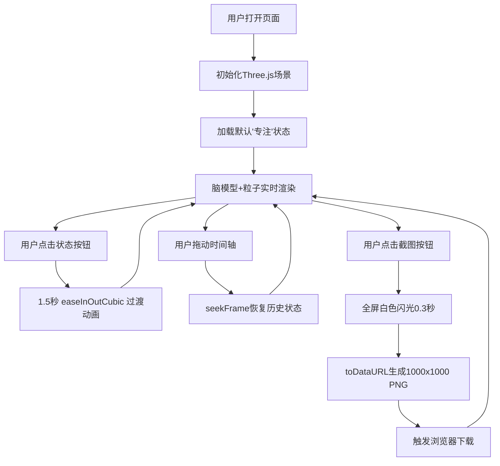

## 1. 产品概述

NeuroWave 是一个面向神经科学研究与科普教育的在线3D脑电波活动模拟器，通过实时渲染的3D脑半球模型与动态粒子系统，直观展示不同认知状态下的脑波频段变化。

- 目标用户：神经科学研究者、教育工作者、对脑科学感兴趣的公众
- 核心价值：将抽象的脑电波数据转化为可交互、可回放的3D视觉体验，降低认知门槛

## 2. 核心功能

### 2.1 用户角色
本应用为单用户前端应用，无角色区分。

### 2.2 功能模块
1. **3D脑半球模型**：左右半球分离渲染，表面波纹动态响应脑波强度
2. **粒子神经系统**：5000个半透明粒子模拟神经元放电，运动模式随状态变化
3. **认知状态切换**：四种预设状态（专注/放松/睡眠/兴奋）一键切换，1.5秒平滑过渡
4. **时间轴回放**：60秒历史记录，支持0.5秒步进的回放与进度拖动
5. **截图保存**：一键捕获渲染画面并下载1000x1000 PNG图片

### 2.3 页面详情
| 页面名称 | 模块名称 | 功能描述 |
|----------|----------|----------|
| 主页面 | 3D脑模型渲染区 | Three.js全屏渲染，支持相机自动旋转观察 |
| 主页面 | 状态切换栏 | 底部中央四个状态按钮，带脉冲动画反馈 |
| 主页面 | 时间轴控制 | 状态按钮上方400px滑块，实时显示播放进度 |
| 主页面 | 截图按钮 | 右上角圆形按钮，点击触发闪光动画与下载 |
| 主页面 | 标题标识 | 左上角NeuroWave品牌文字，白色描边+蓝色发光 |

## 3. 核心流程

用户打开页面 → 默认加载"专注"状态，脑模型与粒子系统开始实时动画 → 点击其他状态按钮（如放松）→ 触发1.5秒颜色+强度平滑过渡 → 拖动时间轴滑块 → 脑模型与粒子系统跳转到对应历史帧 → 点击截图按钮 → 全屏闪光0.3秒 → 自动下载1000x1000 PNG图片

## 4. 用户界面设计

### 4.1 设计风格
- **主色调**：深邃太空蓝径向渐变背景（#080c1a → #020408）
- **状态色**：专注蓝#00aaff、放松绿#00ff88、睡眠紫#aa00ff、兴奋红#ff4400
- **按钮风格**：圆角8px，未选中半透明灰(#ffffff20)，选中填充状态色+1.5倍脉冲缩放
- **字体**：细黑无衬线字体，标题带白色描边与蓝色#00bbff发光
- **整体基调**：科技感、深邃、高精度医疗级可视化风格

### 4.2 页面设计概述
| 页面名称 | 模块名称 | UI元素 |
|----------|----------|--------|
| 主页面 | 标题 | 左上角NeuroWave，text-stroke+蓝色text-shadow发光 |
| 主页面 | 3D画布 | 全屏WebGL渲染，z-index:0 |
| 主页面 | 截图按钮 | 右上角40x40px圆形，相机图标，点击闪光动画 |
| 主页面 | 时间轴 | 底部400px宽，轨道蓝紫渐变(#0099ff→#aa00ff)，滑块白色10px圆形带悬停发光 |
| 主页面 | 状态按钮组 | 时间轴下方水平排列，80x36px每个，圆角8px |

### 4.3 响应式
- **大屏幕（>1200px）**：按钮间距30px，时间轴400px
- **中等屏幕（768-1200px）**：按钮间距15px，时间轴350px
- **小屏幕（<768px）**：按钮两行两列排列，时间轴280px

### 4.4 3D场景指导
- **环境**：无HDRI，纯深色背景，点光源+半球光模拟全局照明
- **光照**：主方向光（白色，强度0.8）+ 半球光（天蓝/深蓝，强度0.4）+ 两盏补光颜色随状态变化
- **相机**：PerspectiveCamera，fov 45，初始距离脑模型半径4倍，允许轨道控制交互
- **材质**：脑模型使用自定义ShaderMaterial，顶点位移模拟波纹，片元着色器混合状态色与渐变
- **粒子系统**：Points + ShaderMaterial，5000粒子GPU侧运动，0.3透明度与状态色叠加
- **后处理**：轻微Bloom发光效果（通过shader自发光+additive blending模拟）
- **性能预算**：单帧总draw call <5，粒子更新<8ms，FPS维持>50
