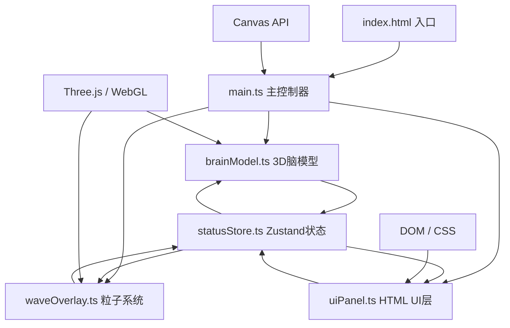

## 1. 架构设计

本项目为纯前端单页应用，采用模块化分层架构，状态集中管理，数据单向流动。



**数据流向说明**：
1. 用户操作UI（按钮/滑块/截图）→ uiPanel.ts 触发 statusStore action
2. statusStore 更新 currentStatus / intensityMap / timelineProgress
3. main.ts renderLoop 每帧订阅 store 状态
4. 将状态变更传入 brainModel.updateFreqBand() 与 waveOverlay.setWaveIntensity()
5. Three.js 渲染最终画面到 canvas

## 2. 技术描述
- **前端框架**：无UI框架，原生TypeScript + DOM操作
- **3D引擎**：three@^0.160.0 + @types/three
- **构建工具**：vite@^5.0.0
- **语言**：TypeScript@^5.3.0（严格模式，noUnusedLocals / noUnusedParameters 开启）
- **状态管理**：zustand@^4.4.0
- **渲染**：WebGL1/2 自动适配，自定义 GLSL Shader
- **后端**：无，纯前端应用
- **初始化方式**：按用户要求手动创建所有文件，不使用脚手架模板

## 3. 文件结构

```
.
├── package.json
├── vite.config.js
├── tsconfig.json
├── index.html
└── src/
    ├── main.ts          主入口：场景初始化+渲染循环+模块桥接
    ├── brainModel.ts    脑半球模型：SphereGeometry左右分割+ShaderMaterial波纹
    ├── waveOverlay.ts   粒子系统：5000 Points，运动模式随状态切换
    ├── uiPanel.ts       HTML覆盖层：按钮/滑块/截图/样式注入
    └── statusStore.ts   Zustand：状态/强度/时间轴/历史记录管理
```

| 文件 | 核心类/方法 | 行数估算 | 职责 |
|------|------------|----------|------|
| statusStore.ts | useStatusStore / setStatus / seekFrame / takeScreenshot | ~130 | 全局状态与历史记录 |
| brainModel.ts | BrainModel / constructor / updateFreqBand / update | ~180 | 3D脑半球+Shader波纹 |
| waveOverlay.ts | WaveOverlay / constructor / setWaveIntensity / update | ~160 | 5000粒子神经元系统 |
| uiPanel.ts | UIPanel / constructor / bindEvents / flashScreenshot | ~200 | DOM UI创建与事件 |
| main.ts | createApp / renderLoop / resizeHandler | ~120 | 场景初始化与主循环 |

## 4. 核心类型与API定义

```typescript
// ===== 认知状态枚举 =====
type CognitiveStatus = 'focus' | 'relax' | 'sleep' | 'excited';

// ===== 频段强度映射 =====
interface IntensityMap {
  alpha: number;   // 0.3 - 1.0
  beta: number;
  theta: number;
  delta: number;
}

// ===== 状态颜色映射 =====
const STATUS_COLORS: Record<CognitiveStatus, string> = {
  focus:   '#00aaff',
  relax:   '#00ff88',
  sleep:   '#aa00ff',
  excited: '#ff4400',
};

// ===== 历史记录帧 =====
interface HistoryFrame {
  index: number;          // 0 - 119
  timestamp: number;      // 秒
  status: CognitiveStatus;
  color: string;          // hex
  intensity: number;      // 0.3 - 1.0
}

// ===== Zustand Store 接口 =====
interface StatusState {
  currentStatus: CognitiveStatus;
  intensityMap: IntensityMap;
  intensity: number;               // 实时综合强度（平滑过渡中）
  targetIntensity: number;
  currentColor: string;            // 实时颜色hex（平滑过渡中）
  targetColor: string;
  transitionStart: number;         // 过渡开始时间戳（ms）
  transitionDuration: number;      // 1500ms
  isTransitioning: boolean;
  timelineProgress: number;        // 0 - 60 秒
  isSeeking: boolean;
  history: HistoryFrame[];         // 最多120条
  screenshotQueue: string[];       // DataURL队列

  // actions
  setStatus: (s: CognitiveStatus) => void;
  updateTimeline: (seconds: number) => void;
  resetTimeline: () => void;
  seekFrame: (index: number) => void;
  recordFrame: () => void;
  pushScreenshot: (dataUrl: string) => void;
  tickTransition: (now: number) => void;  // 每帧推进过渡
}
```

## 5. 关键算法与Shader设计

### 5.1 缓动函数
```typescript
const easeInOutCubic = (t: number) =>
  t < 0.5 ? 4*t*t*t : 1 - Math.pow(-2*t + 2, 3) / 2;
```

### 5.2 颜色插值（hex → hex）
```typescript
function lerpColor(hexA: string, hexB: string, t: number): string {
  const [r1,g1,b1] = hexToRgb(hexA), [r2,g2,b2] = hexToRgb(hexB);
  const r = Math.round(r1 + (r2-r1)*t), g = Math.round(g1 + (g2-g1)*t), b = Math.round(b1 + (b2-b1)*t);
  return rgbToHex(r,g,b);
}
```

### 5.3 脑模型顶点Shader（波纹位移）
```glsl
// vertex shader 核心片段
uniform float uTime;
uniform float uIntensity;
uniform vec3  uColor;

varying vec3 vNormal;
varying float vWave;

void main() {
  vNormal = normalize(normalMatrix * normal);
  float wave = sin(position.x * 8.0 + uTime * 2.0)
             * sin(position.y * 6.0 + uTime * 1.5)
             * sin(position.z * 10.0 + uTime * 3.0);
  float displacement = wave * uIntensity * 0.08;
  vec3 newPosition = position + normal * displacement;
  vWave = wave * 0.5 + 0.5;
  gl_Position = projectionMatrix * modelViewMatrix * vec4(newPosition, 1.0);
}
```

### 5.4 粒子运动模式（CPU端计算，每帧写入BufferAttribute）
| 状态 | 运动算法 |
|------|----------|
| focus（专注） | 圆周运动：`pos.x += cos(phase)*0.05; pos.y += sin(phase)*0.05; phase += dt*2.0` |
| relax（放松） | 布朗运动：`pos += (random3()-0.5) * 0.02` |
| sleep（睡眠） | 脉冲闪烁：位置微抖动 `+= noise*0.003`，gl_PointSize 按 `sin(uTime*2+seed)*0.5+0.5` 脉动 |
| excited（兴奋） | 高速直线：`pos += velocity * dt * 0.5`，边界超出后绕回对侧 |

## 6. 截图实现流程
1. 点击按钮 → uiPanel 触发全屏白色叠加层（opacity 0→1→0，300ms）
2. 调用 `renderer.setSize(1000, 1000, false)` 临时调整尺寸
3. 强制渲染一帧 → `renderer.render(scene, camera)`
4. `canvas.toDataURL('image/png')` 取出数据
5. 恢复原始 renderer 尺寸
6. 创建隐藏 `<a download="neurwave-ts.png">` 触发下载
7. 将 dataUrl 推入 store.screenshotQueue 留档

## 7. 性能约束保障
- **粒子更新批量化**：使用 Float32Array + 单次 `attribute.needsUpdate = true`，避免逐粒子setAttribute
- **过渡动画非阻塞**：每帧在requestAnimationFrame内基于时间戳推进，不使用setInterval
- **Shader优化**：波纹计算使用嵌套sin近似，无纹理采样，无分支
- **历史记录定长**：最多120条（60s/0.5s），超出采用环形数组覆盖
- **截图节流**：使用尺寸临时切换+单次render，避免连续调用导致卡顿
