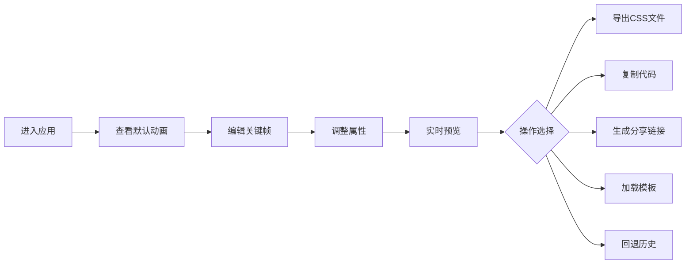
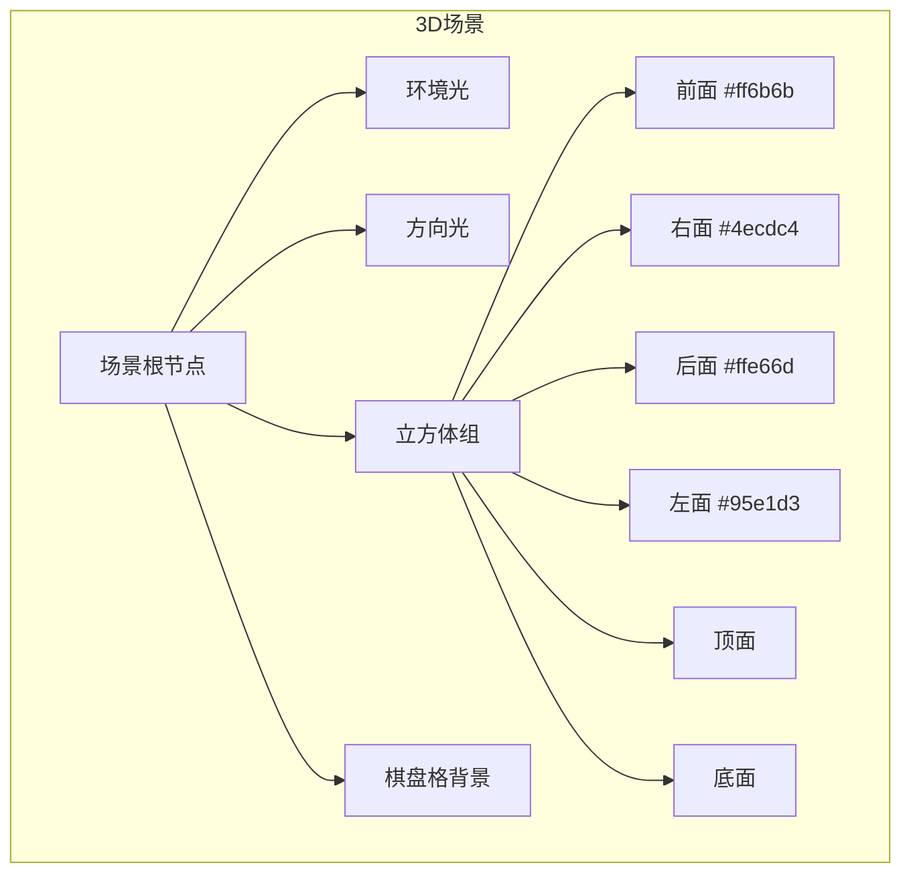

## 1. 产品概述

动效工坊是一款面向前端开发者的在线CSS动画关键帧编辑工具，解决了开发者在多设备/浏览器间调试、预览和分享复杂CSS动画时缺乏轻量级协作工具的问题。

- 核心目标：提供可视化的关键帧编辑、实时预览、一键导出和分享功能
- 目标用户：前端开发工程师、UI设计师、动效设计师
- 市场价值：提升CSS动画开发效率，简化团队协作流程

## 2. 核心 Features

### 2.1 用户角色

| 角色 | 注册方式 | 核心权限 |
|------|----------|----------|
| 普通用户 | 无需注册 | 使用全部编辑、预览、导出、分享功能 |

### 2.2 功能模块

1. **编辑器面板**：关键帧时间轴、CSS属性输入区、代码预览区
2. **预览面板**：3D立方体动画预览、速度调节、循环计数
3. **模板库面板**：5个内置动画模板一键加载
4. **历史记录**：最近10次编辑快照，支持回退
5. **导出与分享**：CSS文件导出、代码复制、URL短链接分享

### 2.3 页面详情

| 页面名称 | 模块名称 | 功能描述 |
|----------|----------|----------|
| 首页 | 顶部导航栏 | 应用名称、导出/复制/分享按钮 |
| 首页 | 编辑工作区 | 左右两列布局，左编辑器右预览 |
| 首页 | 关键帧时间轴 | 水平滑块条，添加/删除关键帧，最小间距5% |
| 首页 | 属性编辑区 | transform、opacity、filter、border-radius属性调整 |
| 首页 | 代码预览区 | Prism.js语法高亮，实时显示@keyframes规则 |
| 首页 | 动画预览区 | 3D彩色立方体，棋盘格背景，运动模糊效果 |
| 首页 | 速度控制区 | 0.25x/0.5x/1x/2x/4x倍速切换，循环计数显示 |
| 首页 | 模板库面板 | 弹跳、抖动、闪烁、旋转、渐变5个内置模板 |
| 首页 | 历史记录区 | 最近10次快照缩略图，点击回退 |

## 3. 核心流程

### 3.1 动画编辑流程

用户进入应用 → 查看默认动画预览 → 在时间轴上添加/删除关键帧 → 调整每个关键帧的CSS属性 → 实时查看预览效果和代码 → 选择速度播放 → 导出CSS/复制代码/生成分享链接

### 3.2 模板使用流程

用户打开右侧模板库 → 浏览5个内置模板 → 点击任意模板 → 自动加载关键帧数据到编辑器 → 预览效果 → 可继续编辑修改

### 3.3 分享流程

用户点击分享按钮 → 前端编码动画数据为URL参数 → Web Crypto API生成哈希码 → 调用后端存储 → 生成短链接 → 复制到剪贴板

## 4. 用户界面设计

### 4.1 设计风格

- **主色调**：深色主题，径向渐变背景 #1a1a2e → #16213e
- **强调色**：荧光蓝 #00b4d8（滑块、按钮边框聚焦态），hover时 #00d4ff
- **辅助色**：立方体四面颜色 #ff6b6b、#4ecdc4、#ffe66d、#95e1d3
- **按钮样式**：圆角8px，背景#00b4d8，hover时亮度提升
- **字体**：细黑体，白色文字，标签文字#8a8a8a（12px）
- **布局风格**：卡片式，中心900x600px工作区，左右两列布局
- **视觉效果**：滑块发光阴影、运动模糊滤镜、棋盘格半透明纹理

### 4.2 页面设计概述

| 页面名称 | 模块名称 | UI元素 |
|----------|----------|--------|
| 首页 | 顶部导航栏 | 高度60px，背景#0a0a23，左侧"动效工坊"文字，右侧三个功能按钮 |
| 首页 | 编辑面板 | 宽度450px，关键帧时间轴（背景#0f3460），属性行高40px，输入框背景#16213e |
| 首页 | 预览面板 | 宽度450px，圆角12px，背景#121212，棋盘格纹理，3D立方体居中 |
| 首页 | 速度控制 | 5个倍速按钮，循环计数器 |
| 首页 | 模板库 | 右侧面板，5个模板卡片 |
| 首页 | 历史记录 | 底部缩略图列表，10个快照 |

### 4.3 响应式

- **桌面优先**：1280px以上保持左右两列布局
- **自适应**：低于1280px时折叠为单列布局
- **触控优化**：滑块和按钮尺寸适合触控操作

### 4.4 3D场景设计

- **环境**：深色背景，棋盘格半透明纹理地板
- **光照**：环境光 + 方向光，突出立方体立体感
- **相机**：固定透视视角，略微俯视
- **动效**：立方体持续旋转 + 当前关键帧动画叠加，运动模糊滤镜
- **后处理**：轻微辉光效果，增强科技感

