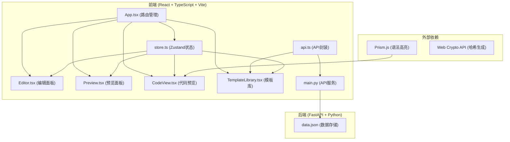
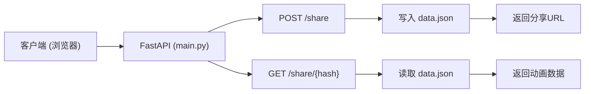
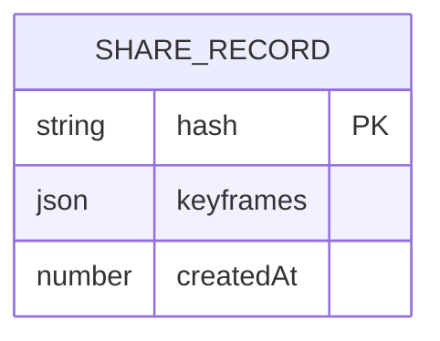

## 1. 架构设计



## 2. 技术描述

### 2.1 前端技术栈
- **框架**: React 18 + TypeScript
- **构建工具**: Vite 5
- **状态管理**: Zustand 4
- **路由**: React Router DOM 6
- **HTTP客户端**: Axios
- **语法高亮**: Prism.js
- **样式方案**: 原生CSS + CSS变量

### 2.2 后端技术栈
- **Web框架**: FastAPI 0.100+
- **ASGI服务器**: Uvicorn
- **数据存储**: 本地JSON文件 (data.json)
- **依赖管理**: pip + requirements.txt

### 2.3 项目初始化
- 前端: `npm create vite@latest . -- --template react-ts`
- 后端: 手动创建FastAPI项目结构

## 3. 路由定义

| 路由 | 组件 | 功能描述 |
|------|------|----------|
| `/` | App.tsx | 主编辑器页面，包含所有功能模块 |
| `/share/:hash` | App.tsx + useEffect | 根据URL哈希加载分享的动画数据 |

## 4. API 定义

### 4.1 TypeScript 类型定义

```typescript
interface KeyframeProperties {
  transform: string;
  opacity: number;
  filter: string;
  borderRadius: number;
}

interface Keyframe {
  id: string;
  percent: number;
  properties: KeyframeProperties;
}

interface HistorySnapshot {
  id: string;
  timestamp: number;
  keyframes: Keyframe[];
  thumbnail: string; // base64 image
}

interface AnimationState {
  keyframes: Keyframe[];
  speed: number;
  loopCount: number;
  history: HistorySnapshot[];
  currentKeyframeId: string | null;
}

interface ShareRequest {
  hash: string;
  keyframes: Keyframe[];
  createdAt: number;
}

interface ShareResponse {
  hash: string;
  url: string;
  keyframes: Keyframe[];
}
```

### 4.2 REST API 接口

| 方法 | 路径 | 请求体 | 响应 | 描述 |
|------|------|--------|------|------|
| POST | `/share` | `{ hash: string, keyframes: Keyframe[] }` | `{ hash: string, url: string }` | 创建分享链接 |
| GET | `/share/{hash}` | - | `{ hash: string, keyframes: Keyframe[] }` | 获取分享的动画数据 |

### 4.3 错误响应格式

```typescript
interface ErrorResponse {
  detail: string;
  code: number;
}
```

## 5. 服务器架构图



### 5.1 后端核心模块

| 模块 | 文件 | 职责 |
|------|------|------|
| 应用入口 | `backend/main.py` | FastAPI实例创建、CORS配置、路由注册 |
| 数据模型 | `backend/main.py` | Pydantic模型定义 |
| 数据访问 | `backend/main.py` | JSON文件读写操作 |
| API控制器 | `backend/main.py` | 分享接口业务逻辑 |

## 6. 数据模型

### 6.1 数据模型定义



### 6.2 data.json 格式

```json
{
  "shares": {
    "a1b2c3d4": {
      "hash": "a1b2c3d4",
      "keyframes": [
        {
          "id": "kf1",
          "percent": 0,
          "properties": {
            "transform": "translateY(0px)",
            "opacity": 1,
            "filter": "blur(0px)",
            "borderRadius": 0
          }
        }
      ],
      "createdAt": 1718928000000
    }
  }
}
```

### 6.3 Zustand Store 状态

```typescript
interface Store {
  // 状态
  keyframes: Keyframe[];
  speed: number;
  loopCount: number;
  history: HistorySnapshot[];
  currentKeyframeId: string | null;
  animationName: string;
  
  // 操作
  addKeyframe: (percent: number) => void;
  removeKeyframe: (id: string) => void;
  updateKeyframe: (id: string, properties: Partial<KeyframeProperties>) => void;
  updateKeyframePercent: (id: string, percent: number) => void;
  setCurrentKeyframe: (id: string | null) => void;
  setSpeed: (speed: number) => void;
  incrementLoopCount: () => void;
  saveToHistory: (thumbnail: string) => void;
  loadFromHistory: (index: number) => void;
  loadTemplate: (template: Keyframe[]) => void;
  generateCSS: () => string;
  resetAnimation: () => void;
}
```

## 7. 性能指标要求

| 指标 | 目标值 | 实现策略 |
|------|--------|----------|
| 语法高亮延迟 | ≤ 100ms | 使用Prism.js轻量级tokenizer，debounce处理 |
| 动画帧率 | ≥ 60fps | CSS硬件加速，will-change提示，requestAnimationFrame |
| URL生成时间 | ≤ 300ms | Web Crypto API异步处理，后端快速读写 |
| 关键帧响应 | 实时 | Zustand局部更新，避免全量重渲染 |
| 历史快照存储 | 限制10条 | FIFO淘汰策略，Canvas缩略图压缩 |

## 8. 文件结构

```
auto45/
├── package.json
├── index.html
├── vite.config.js
├── tsconfig.json
├── src/
│   ├── App.tsx
│   ├── main.tsx
│   ├── index.css
│   ├── store.ts
│   ├── api.ts
│   ├── components/
│   │   ├── Editor.tsx
│   │   ├── Preview.tsx
│   │   ├── CodeView.tsx
│   │   └── TemplateLibrary.tsx
│   └── types/
│       └── index.ts
└── backend/
    ├── main.py
    ├── requirements.txt
    └── data.json
```
