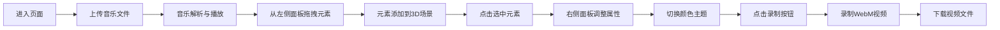

## 1. 产品概述

3D音乐可视化场景编辑器 —— 用户上传纯音乐后，通过拖拽配置可视化元素，自由搭建与音乐节拍同步的3D视觉秀，并可录制为WebM视频。

- **核心价值**：让音乐可视化创作民主化，无需专业3D技能即可生成震撼的音乐视觉效果
- **目标用户**：音乐爱好者、内容创作者、VJ艺术家
- **使用场景**：个人音乐欣赏视觉化、短视频素材制作、现场演出背景

## 2. 核心功能

### 2.1 功能模块

1. **左侧元素面板**：展示可拖拽的可视化元素类型
2. **3D场景视口**：中央渲染区域，展示和交互3D可视化元素
3. **右侧属性编辑面板**：选中元素后显示，调整元素参数
4. **顶部工具栏**：音乐播放控制、主题切换、录制功能
5. **音频分析引擎**：解析音乐频谱和时域数据
6. **场景录制模块**：将3D场景录制为WebM视频

### 2.3 页面详情

| 页面名称 | 模块名称 | 功能描述 |
|---------|---------|---------|
| 主编辑器 | 左侧元素面板 | 4种可视化元素（跳动柱体、旋转粒子星系、起伏波形球体、闪烁光墙），支持拖拽添加 |
| 主编辑器 | 3D场景视口 | 占页面80%宽度，支持OrbitControls交互，元素可点击选中 |
| 主编辑器 | 右侧属性面板 | 元素专属参数滑块，删除按钮，同步按钮 |
| 主编辑器 | 顶部工具栏 | 播放/暂停、进度条、主题切换（3种）、录制按钮 |
| 主编辑器 | 背景星空 | 500个粒子的低密度星空，缓慢旋转 |

## 3. 核心流程

**主要用户流程**：
1. 用户进入页面，看到深空渐变背景和中央3D视口
2. 上传MP3/WAV音乐文件（不超过2分钟）
3. 从左侧毛玻璃面板拖拽可视化元素到场景中
4. 元素自动绑定音乐频谱数据，随音乐节奏变化
5. 点击元素选中，右侧滑出属性编辑面板
6. 调整元素参数（数量、大小、速度、灵敏度等）
7. 切换全局颜色主题，所有元素颜色同步更新
8. 点击录制按钮，录制当前场景动画
9. 停止录制后自动下载WebM视频

## 4. 用户界面设计

### 4.1 设计风格

- **设计调性**：赛博朋克未来感，深空科技风
- **主背景**：深空渐变 #0a0a1a → #1a0a2e
- **三种颜色主题**：
  - 赛博朋克霓虹：洋红#ff00ff、青#00ffff、黄#ffff00
  - 极光蓝绿：深蓝#0000ff、浅绿#00ff88、淡蓝#88ffff
  - 熔岩红橙：红#ff3300、橙#ff8800、黄#ffcc00
- **材质质感**：自发光emissive 0.3，粗糙度roughness 0.4，半透明外发光
- **动效**：所有UI过渡0.3秒，主题切换0.6秒缓动渐变

### 4.2 UI组件规格

| 组件 | 规格描述 |
|-----|---------|
| 左侧元素面板 | 宽280px，背景rgba(10,10,26,0.8)，模糊16px，圆角12px，毛玻璃效果 |
| 右侧属性面板 | 宽300px，白色背景，浅灰#e0e0e0边框，柔和阴影rgba(0,0,0,0.15) |
| 顶部工具栏 | 高60px，背景rgba(0,0,0,0.5)，模糊8px，底部1px白色半透明线 |
| 元素缩略图 | 悬停放大1.1倍，浅色外发光 |
| 进度条 | 轨道浅灰色，填充主色渐变，滑块白色圆形带1px浅色边 |
| 录制按钮 | 圆形红色录影图标，录制时闪动 |
| 删除按钮 | 圆形红色图标，带X符号 |

### 4.3 3D场景规格

| 项目 | 参数 |
|-----|-----|
| 环境光 | 强度0.2 |
| 平行光 | 强度0.5，颜色随主题变化，随节奏轻微摆动 |
| 背景星空 | 500粒子，大小0.02，白到浅蓝渐变，缓慢旋转 |
| 元素材质 | MeshStandardMaterial，emissive 0.3，roughness 0.4 |
| 顶点数限制 | 每个元素≤5000顶点 |
| 目标帧率 | ≥45 FPS |

### 4.4 可视化元素行为

| 元素类型 | 音乐响应方式 | 参数控制 |
|---------|-------------|---------|
| 跳动柱体 | 低频鼓点驱动上下跳动，幅度0.5-2单位 | 柱体数量、高度范围、颜色 |
| 旋转粒子星系 | 中高频驱动粒子颜色和旋转速度 | 粒子数量、旋转速度、大小 |
| 起伏波形球体 | 整体音量驱动球面起伏 | 波形细分、起伏幅度、旋转 |
| 闪烁光墙 | 节拍触发RGB色彩渐变闪烁 | 闪烁频率、墙尺寸、透明度 |

### 4.5 响应式

- 桌面端优先设计
- 3D视口自适应窗口大小
- 左侧和右侧面板固定宽度
